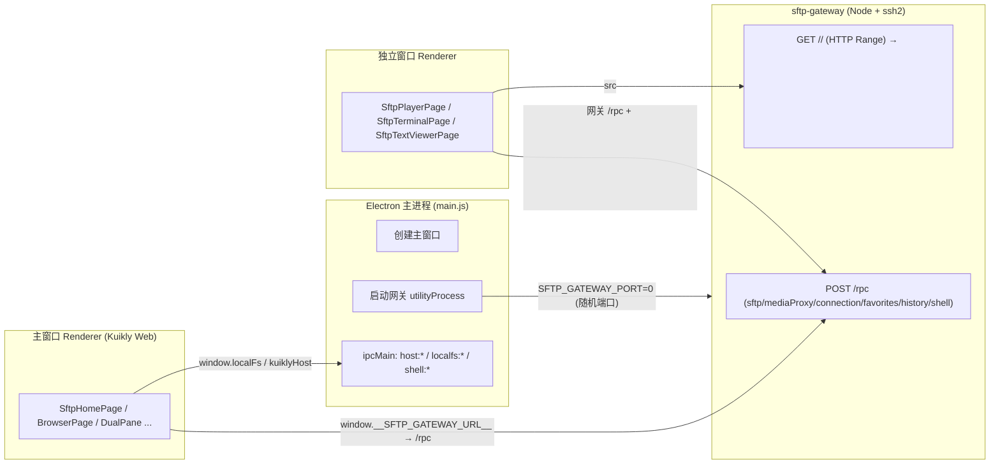

# Kuikly SFTP 桌面端（Electron）架构

> **为什么有这篇**：KuiklyUI 主线是「一份 KMP 代码六端运行」，很多模型只看到
> `core/`+`demo/`+`core-render-*`，会**忽略桌面端其实是一个 Electron 壳**（`electron/`），
> 并且 Web/桌面的 SFTP 能力靠 **Node 网关 `sftp-gateway/`** 代持。任何「六端」的说法都包含它。
> 涉及 Electron 的改动**必须跑对应 Electron 用例**（见 §10），测试/打包前先清理残留客户端（§9）。

---

## 1. 一句话定位

桌面端 = **Electron 主进程 + Kuikly Web 渲染器（renderer）+ Node SFTP 网关（utilityProcess）**。

- 渲染层就是 Kuikly 的 **Web 产物**（`nativevue2.js` = demo bundle、`h5App.js` = 宿主、`lib/xterm.js`），
  **与浏览器 H5 完全同一份**，页面/commonMain 零改动。
- 浏览器不能建原始 TCP/SSH，所以 SSH/SFTP/本地 shell 全部由 **`sftp-gateway/`（Node + ssh2）** 代持。
- Electron 只提供 **宿主能力**（本地文件、剪贴板、独立窗口、通知、打包网关），
  页面通过 `BridgeModule`（模块名 `HRBridgeModule`）的 `supportsXxx()` 探测后调用。

---

## 2. 目录与文件地图

| 路径 | 职责 |
|---|---|
| `electron/main.js` | 主进程：创建窗口、启动网关 utilityProcess、注册 `ipcMain`（`host:*` / `localfs:*` / `shell:*`） |
| `electron/preload.js` | 预加载：`contextBridge` 暴露 `window.kuiklyHost` / `window.localFs` / `window.__SFTP_GATEWAY_URL__` |
| `electron/electron-builder.yml` | 打包配置：appId/productName、`files`、`extraResources`（把 `sftp-gateway` 放进 `Resources/gateway`）、dmg |
| `electron/scripts/build-web.mjs` | 构建 Web 产物（debug/release 两种：`:demo:packLocalJsBundle*` + `:h5App:jsBrowser*Webpack`） |
| `electron/scripts/sync-resources.mjs` | 把产物同步到 `electron/resources/`（解压 `nativevue2.zip`、拷 `h5App.js`/`index.html`/`lib/`） |
| `electron/scripts/pretest-kill.js` | `pretest`/`posttest`/`dist` 钩子：先 kill 上次残留客户端（§9） |
| `electron/resources/` | 运行/打包用资源（`index.html`、`nativevue2.js`、`h5App.js`、`lib/`），构建产物，**勿手改** |
| `electron/dist/` | 打包输出：`mac/Kuikly SFTP.app`、`Kuikly SFTP-0.1.0.dmg` |
| `electron/test/*.mjs` | CDP 自动化用例：`smoke / dual-pane / player-window / text-viewer / terminal / features` |
| `electron/test/artifacts/` | 用例截图（关键路径留证） |
| `sftp-gateway/server.js` | Node 网关：`POST /rpc {module,method,params}` + `GET /<token>/<file>`（HTTP Range）；模块 `sftp/mediaProxy/connection/favorites/history/shell` |
| `h5App/src/jsMain/.../KRBridgeModule.kt` | **Web/桌面宿主桥**：把 `HRBridgeModule` 的方法转发到 `window.*`（能力表见 §7） |
| `h5App/src/jsMain/resources/index.html` | 入口 HTML；相对路径引用 `nativevue2.js` / `h5App.js` / `lib/` |
| `h5App/src/jsMain/resources/lib/xterm.js` + `kr-terminal.js` | 终端渲染（MIT vendor）；`window.__krTerm` |
| `core-render-web/base/.../KRVideoView.kt` | Web `<video>` 组件（含 `seekTo`、`buffered`、`playbackRate` 换源回设、全屏） |
| `demo/.../pages/sftp/` | SFTP 业务页面（commonMain，六端共享；桌面端同样跑这些页） |

> 关键：`electron/resources/` 是**产物目录**，源头在 `demo/build/.../nativevue2.zip` 与 `h5App/build/...`。
> 改代码后必须 `build:web`（或 `build:web:release`）+ `sync` 才会进 Electron。

---

## 3. 进程与窗口模型



要点：

- **网关由主进程 fork**：`utilityProcess.fork(sftp-gateway, { SFTP_GATEWAY_PORT: '0', SFTP_GATEWAY_DATA_DIR, SFTP_GATEWAY_LOCAL_ROOT })`，
  端口由 OS 分配，回传后经 preload 的 `additionalArguments: ['--gateway=...']` 注入 `window.__SFTP_GATEWAY_URL__`。
- **打包版网关路径**：`extraResources` 把 `sftp-gateway` 放到 `Resources/gateway`；`main.js` 按 `app.isPackaged` 解析入口。
- **独立窗口**：播放/终端是新 `BrowserWindow`，query 带 `standalone=1`（只有它允许「返回=关窗」）。
  **文本/Markdown 查看器改为页内路由**（查看与修改同界面，不再开窗）。
- **测试用的「外部网关」**：跑用例前执行 `cd electron && npm run gateway`（端口由实例计算，见 §13），用于直连 SFTP 造远端夹具；
  它和**应用自带网关是两套数据目录**（见 §11 坑 4）。

---

## 4. 启动与页面加载链路

1. `app.whenReady()` → `startGateway()`（失败则回退默认 `http://127.0.0.1:18090`）→ `createWindow()`。
2. `mainWindow.loadFile(resources/index.html, { query: { page_name: 'SftpHomePage' } })`。
3. `preload.js` 注入 `window.kuiklyHost` / `window.localFs` / `window.__SFTP_GATEWAY_URL__`。
4. `index.html` 加载 `nativevue2.js`（KSP 页面注册 + 业务）、`h5App.js`（宿主事件桥）、`lib/xterm.js`。
5. 页面按 `page_name` 渲染；`KuiklyRouter`（h5App）负责路由、SPA 缓存、宿主事件桥、resize 下发。
6. **首帧非空白**：`main.js` 在 `did-finish-load` 后派发一次 `resize`，触发 Kuikly 重新 layout（防 `#root` 高 0 空白窗）。

---

## 5. 两个「网关 URL」不要混

| | 应用自带网关 | 测试外部网关 |
|---|---|---|
| 启动 | `main.js` utilityProcess（随机端口，preload 注入） | `cd electron && npm run gateway`（实例端口，见 §13） |
| 数据目录 | `userData/gateway-data`（打包版） | `.kr-test/gateway-data-<instance>`（已 gitignore） |
| 出现在 | 页面 `window.__SFTP_GATEWAY_URL__` | 测试脚本里的 `rpc(...)` |
| 用途 | 真实业务（连接/浏览/播放/终端/缓存） | 造远端夹具、直连验证 |

**页面内断言必须用 `window.__SFTP_GATEWAY_URL__`**，不能假设 18090（两套数据，曾导致「历史/收藏造了数据页面看不到」）。

---

## 6. preload 暴露的宿主 API（`window.*`）

| 全局 | 来源 | 说明 |
|---|---|---|
| `window.__SFTP_GATEWAY_URL__` | preload `contextBridge` | 应用网关 URL（H5 模块默认取它） |
| `window.kuiklyHost` | preload | `openPlayerWindow(query)` / `closeWindow()` / `saveFile(payload)` / `notify(payload)` / `getInfo()` |
| `window.localFs` | preload | 本地文件：`home/homeSync/list/stat/mkdir/rename/remove/readFile/writeFile`（根=用户主目录，越界拒绝） |
| `window.__krTerm` | `lib/kr-terminal.js` | xterm 封装：`mount/write/resize/dispose/setVisible/text/lastId/send/focus` |
| `window.__kuiklySendEvent__(event,data)` | `lib/kr-terminal.js` | 宿主→页面事件：`terminal_input` / `sftp_player_key` / `sftp_controls_activity` / `sftp_fullscreen_changed` |

`kr-terminal.js` 的 `onData → __kuiklySendEvent__('terminal_input')`，页面用 `addPagerEventObserver(IPagerEventObserver)` 接收。

---

## 7. 宿主能力桥（`HRBridgeModule` 在 h5App 的实现）

页面统一通过 commonMain 的 `BridgeModule`（模块名 `HRBridgeModule`）探测与调用；**未实现端必须 `supportsXxx()=false` → 入口隐藏，绝不调用未实现原生方法/伪报成功**。

| 能力 | 探测 | 方法 | Web/桌面实现 | 其它端 |
|---|---|---|---|---|
| 独立窗口播放 | `supportsPlayerWindow()` | `openPlayerWindow(query)` | `window.kuiklyHost.openPlayerWindow` → 新 `BrowserWindow(standalone=1)` | Android/iOS/macOS/OHOS/MiniApp `false` → 回退页内路由 |
| 终端 | `supportsTerminal()` | — | `true`（网关 `shell` 模块） | Android JSch / iOS+macOS NMSSH / OHOS libssh2；MiniApp false |
| 终端渲染 | `supportsXterm()` | `xtermMount/Write/Resize/Dispose/SetVisible` | `window.__krTerm` | native false → 回退共享网格 |
| 剪贴板 | `supportsClipboard()` | `copyToClipboard(text)` | `navigator.clipboard`（回退 textarea+execCommand） | 各端原生剪贴板 |
| 缓存根 | `cacheRoot()` | `clearCache()` | `<home>/.kuikly_cache`；删除目录 | 各端沙盒缓存目录 |
| 本地文件 | `supportsLocalFs()` | `lfHome/lfList/lfMkdir/lfRename/lfRemove` | `window.localFs` | Android `filesDir/local`、iOS/macOS `Documents/local`、OHOS 待办 |
| 存临时文件 | — | `saveTempFile(name,base64)` | 写 `<home>/...`（Markdown 保存/上传用） | native 走 `FileModule` 沙盒 |

> 详细方法名见 `h5App/src/jsMain/kotlin/module/KRBridgeModule.kt`（`when(method)` 全量）。

---

## 8. 独立窗口（播放 / 终端 / Markdown 查看器）

- **打开**：页面调 `BridgeModule.openPlayerWindow(query)`；`query` 至少含 `page_name`（**宿主不会补**，页内路由由 RouterModule 补）+ 业务参数。`main.js` 复制为 `standalone=1` 并 `loadFile`。
- **上限**：播放窗口有 `MAX_PLAYER_WINDOWS`（多开同播，逐个关闭）。
- **关闭**：`KRRouterModule.closePage()` 仅在 `standalone=1` 时执行「关窗」，否则会误关整个应用；
  页面返回键 / 顶部自动隐藏标题栏的「<」都走它。
- **窗口内 UI**：视频/终端充满窗口，顶部标题栏与底部控制条**同为悬浮层**，几秒无操作自动隐藏，点击画面重新显示（见 §11 坑 8）。
- **Markdown 查看器**（2026-09）：浏览页点 `.md` 时 `SftpViewerLauncher.openViewerPage()` 走同一 `openPlayerWindow`
  在独立窗口打开 `SftpViewerDispatcherPage`（返回键关窗，主窗口留在文件列表）；**仅 Markdown** ——
  其它文本类型（txt/html/代码）仍页内路由。非桌面/Web 宿主 `supportsPlayerWindow()=false` 时回退页内。
  用例：`npm run test:text`（T1 target +1、T5 关窗回主窗口列表）。

---

## 9. 构建 / 打包 / 安装 / 清理

> **② 打包 + ③ 覆盖安装仅 `zhaojian` 分支执行**（见 `AGENTS.md` §3.1 规则 11 / §14.1）。
> 其它分支（feature/agent/`.kilo/worktrees/*`）**只验证**：① debug web 构建 + 跑受影响用例 + 编译通过即可，
> **不构建 dmg、不覆盖安装 `/Applications`**；需新构建时先把成果同步到 `zhaojian`，由 `zhaojian` 侧统一打包安装。

```bash
cd electron
# ① 开发：构建 Web 产物（debug）+ 同步 + 启动
npm run build:web            # :demo:packLocalJsBundleDebug + :h5App:jsBrowserDevelopmentWebpack
npm run sync                 # 产物 → electron/resources
npm run start                # = sync + env -u ELECTRON_RUN_AS_NODE electron .

# ② 打包 dmg：**默认 debug 产物（快）**，够本机验证与覆盖安装
npm run build:web && npm run dist   # debug → dist/mac/Kuikly SFTP.app + dist/Kuikly SFTP-0.1.0.dmg
# 仅正式发版才用（慢，且仅 zhaojian 分支）：npm run dist:release = build:web:release + sync(release) + electron-builder

# ③ 覆盖安装（先优雅退出旧实例，ditto 保留符号链接与签名）
osascript -e 'quit app "Kuikly SFTP"'
rm -rf "/Applications/Kuikly SFTP.app"
ditto "dist/mac/Kuikly SFTP.app" "/Applications/Kuikly SFTP.app"
xattr -dr com.apple.quarantine "/Applications/Kuikly SFTP.app"
env -u ELECTRON_RUN_AS_NODE open "/Applications/Kuikly SFTP.app"
```

- **必须 `env -u ELECTRON_RUN_AS_NODE`**：VS Code / Kilo 会泄漏该变量，导致 Electron 退化成纯 Node（主进程直接 `exit(1)`）。
- **`KUIKLY_WEB_MODE=release`** 才取 release 产物；debug 产物带调试开销。
- **`pretest-kill.js` 已挂在 `pretest` / `pretest:*` / `posttest` / `dist` / `dist:release`**：按**本实例 userData 标记**
  `ud-<instance>` 精准 kill 残留 Electron（**不动外部网关**，见 §13）。
- 打包版资源在 `Contents/Resources/app.asar`（`resources/**`）与其旁的 `Resources/gateway`（`extraResources`）。

---

## 10. 测试体系（Electron 必测）

**驱动方式**：Node ≥22 + CDP 直驱 Electron（无 Playwright）。每个脚本 `spawn electron . --remote-debugging-port=PORT` → `/json/list` → WebSocket `Runtime/Page/Network/Input`。

| 套件 | 命令 | 覆盖 |
|---|---|---|
| 冒烟 | `npm test` | 首帧非空白、播放、seek、切集自播、续播、resize（S0–S10） |
| 双栏 | `npm run test:dual` | 本地↔远端 CRUD/传输/越界拒绝（D0–D25） |
| 独立窗口 | `npm run test:player` | 多开同播、逐个关闭、自动隐藏控制条后点画面再返回（P0–P5） |
| 文本查看器 | `npm run test:text` | Markdown 渲染/目录/换行/字号/纯文本行号（T0–T6） |
| 终端 | `npm run test:term` | 本地/远程终端、真实输入+回车、whoami（T1–T7） |
| 功能 | `npm run test:features` | 收藏/历史/设置/复制路径/缓存/更多入口（F1–F25） |

约定：

- 全局**看门狗**（超时 `SIGKILL` 子进程）；每个 `rpc` 带 `AbortController` 超时；`waitFor`/CDP `ev` 均有上限；逐条打印耗时。
- 关键路径用 `Page.captureScreenshot` 存 `electron/test/artifacts/`。
- **不要用 CDP `Input.dispatchKeyEvent` 发合成按键**（macOS 会弹「听写」系统弹窗并阻塞输入）；改用 `Input.insertText` + DOM `KeyboardEvent`。
- 播放/终端内容是 canvas，DOM 取不到文本：用 `window.__krTerm.text(...)`、`document.querySelector('video')` 等读取。

---

## 11. 关键不变量 / 踩坑（勿回退）

1. **`ELECTRON_RUN_AS_NODE` 必须去掉**再启动（§9）。否则 `require('electron')` 只返回路径、`ipcMain` 为 undefined。
2. **`dist:release` 必须先 `build:web:release`**：它只 `sync` 会把**陈旧 release 产物**打进包（新代码进不去，曾导致「新功能在安装版没有」）。
3. **首帧 `#root` 高 0 → 空白窗**：`main.js` 加载后派发 `resize` nudge；另见 `AGENTS.md §13.1.3` 的 core resize 修复。
4. **应用网关 ≠ 测试外部网关**：两套数据目录/端口；页面断言用 `window.__SFTP_GATEWAY_URL__`，不要假设 18090（并行时端口=18090+slot*100，见 §13）。
5. **toast 必须 `pointer-events:none`**（`h5App/utils/Ui.kt`）：否则盖住其下可点元素（终端/缓存悬浮条）。
6. **独立窗口 URL 必须 `standalone=1`**：否则返回键会关整个应用；宿主开窗**必须显式带 `page_name`**。
7. **窗口 resize 链路**（已修）：resize 监听必须在 `installHostEventBridges()`（SPA 前）；core 尺寸变化也要 `markDirty+layoutIfNeed`（见 `AGENTS.md §13.1.3`）。
8. **控制栏/标题自动隐藏**：顶部标题与底部控制条共享 `controlsVisible`，几秒无操作隐藏；续播对话框等全屏浮层会**拦截点击**，测试需先关掉它再点画面。
9. **Web `KRVideoView` 换源会重置 `playbackRate`/`currentTime`**：需 `pendingRate`/`pendingSeek` 在 `setVideoSrc`/`loadeddata` 回设（切集倍速/续播依赖）。
10. **测试/打包前清理残留客户端**：`node scripts/pretest-kill.js`（**按实例精准清理**，见 §13），否则多实例占满 CPU、互相抢调试端口。禁止全局 `pkill`。
11. **网关绝对路径写入**要向上找最近存在祖先目录做校验（新建多级目录否则被 `LOCAL_PATH_DENIED` 误拒）。
12. **Web 浮层（终端/缓存/选集/设置/续播）必须放在内容区之后 + `positionAbsolute`**，且不与工具条按钮同名。

---

## 12. 新增一个 Electron 宿主能力（步骤）

1. commonMain `BridgeModule`：加 `supportsXxx()`（同步探测）+ 业务方法（`callNativeMethod`/`syncToNativeMethod`）+ 常量。
2. `h5App` 的 `KRBridgeModule`：实现同名方法（转发到 `window.*` / 直接 JS）。
3. 其它端：实现同名方法并把 `supportsXxx()` 置 true；**未实现的端返回 false**（页面据此隐藏入口）。
4. 页面：用 `supportsXxx()` 门控入口，不直接调未实现方法。
5. 需要新宿主全局 → `preload.js` + `main.js` 加 `ipcMain`；独立窗口 → `shell:open-*-window`。
6. **补 Electron 用例**（`electron/test/`）并在 `devDocs/kuikly-app-features-test-plan.md` 登记。
7. `npm run build:web && npm run sync && npm run start` 验证；发布走 §9。

---

## 13. 并行 worktree 测试隔离（`electron/test/env.mjs`）

多个 Agent Manager worktree 同时开发/跑测试时，**构建产物本身按 worktree 隔离**（`electron/resources`、
`demo`/`h5App/build`、`electron/test/artifacts`），但**运行期资源是全局共享的**，必须靠实例标识隔离。

**唯一事实来源：`electron/test/env.mjs`**（所有套件 `import` 它，禁止再写死端口/路径）：

| 资源 | 取值 | 隔离方式 |
|---|---|---|
| 实例标识 | `KR_INSTANCE`（默认仓库/worktree 目录名） | 主 clone（`.git` 是目录）slot=0（端口同历史）；linked worktree slot=1~99 |
| CDP 端口 | `cdpPort('smoke'\|'dual'\|'player'\|'text'\|'terminal'\|'features')` | 基址 9330~9380 + slot*100；启动用 `cdpArgs(...)` |
| Electron userData | `.kr-test/ud-<instance>` | `--user-data-dir=...` + `KR_USER_DATA_DIR`，隔离连接库/收藏/播放历史/内嵌网关数据 |
| 本地文件根 | `.kr-test/local-<instance>` | `KR_LOCAL_ROOT` → `main.js` 的 `localfs:*` 根；缓存/临时文件随之隔离 |
| 外部网关 | `npm run gateway` | 端口 18090+slot*100，与套件 `GATEWAY_URL` 同源 |
| 远端夹具 | `kr_<instance>_*` 等 | 同一台测试机上多 worktree 并行不互删 |

**标准用法**：

```bash
cd electron
npm run sync                 # 构建产物（每个 worktree 各自一份）
npm run gateway              # 终端 A：本实例外部网关（打印实例与端口）
npm test                     # 终端 B：本实例测试（自动用本实例端口/userData/本地根）
```

**主进程配合**（`main.js`）：窗口标题 `Kuikly SFTP [<instance>]`（多应用一眼区分）；`KR_USER_DATA_DIR`
→ `app.setPath('userData')`；`KR_LOCAL_ROOT` → `localfs:*` 根。

**清理**：`node scripts/pretest-kill.js` 只杀带 `ud-<instance>` 标记的 Electron（**不杀外部网关**，否则套件 fixture 会 ECONNREFUSED）；
**禁止**无差别 `pkill -f "Kuikly SFTP.app"` / `pkill -f "remote-debugging-port="` / `osascript quit`（会误杀其它 worktree）。

**全局动作串行**：`npm run dist*` / 覆盖安装 `/Applications/Kuikly SFTP.app` / 发布推送，**仅在 `zhaojian` 分支执行**（其它分支只验证，见 §3.1 规则 11），一次只在一个 worktree 执行。

---

## 14. 相关文档

- `AGENTS.md §13.1.3`（Web/桌面 SFTP + 网关 + resize）、`§13.1.4`（双栏）、`§13.1.5`（终端）、`§13.1.6`（缓存）、`§13.1.7`（复制路径）、`§14.1`（固定交付流程）。
- `devDocs/sftp-development-progress.md §0`（当前进度快照，含 Electron/跨端矩阵）。
- `devDocs/kuikly-app-features-test-plan.md`（F1–F25 + 必须冒烟清单）。
- `devDocs/kuikly-dual-pane-test-plan.md`（D0–D25）、`devDocs/sftp-test-plan.md`（分层 L0–L5）。
- `docs/SFTP-实现详解.md`（从架构到各端实现的完整走读）。
