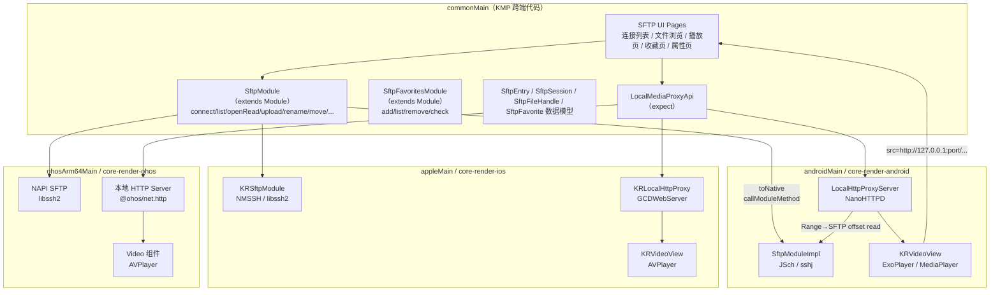
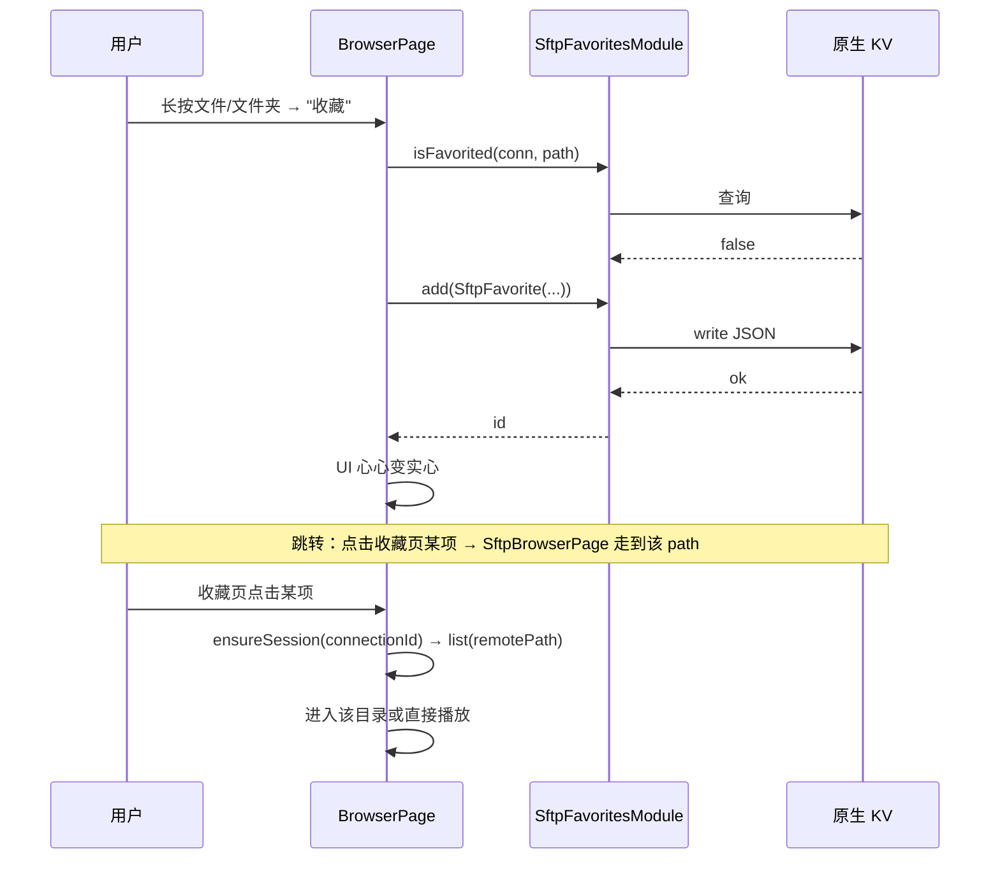
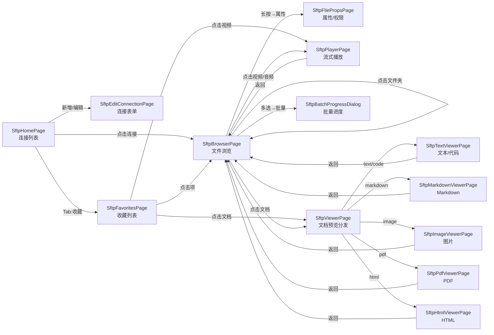
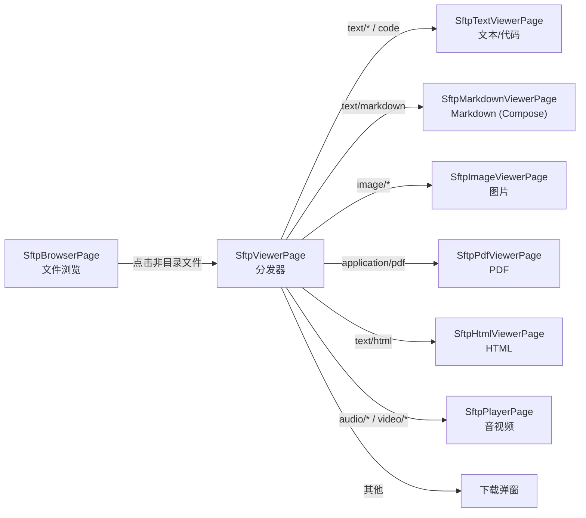
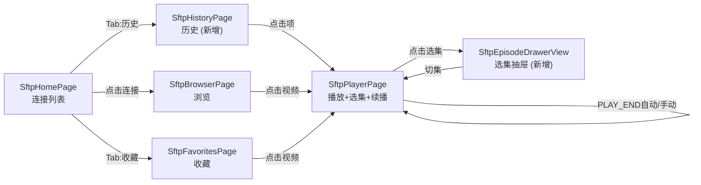
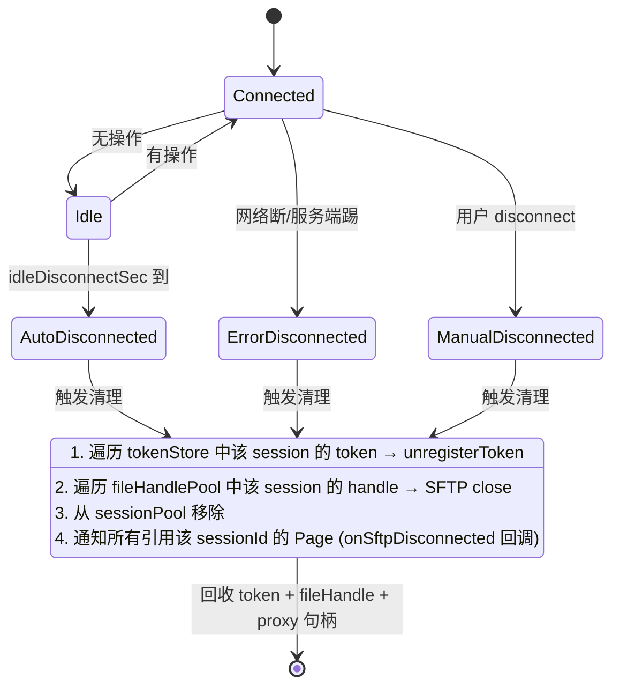

# 基于 KuiklyUI 的跨平台 SFTP 客户端技术落地方案

> status: draft — 设计方案，分阶段在独立 change 中实现
>
> 适用项目：KuiklyUI（Tencent 开源 Kotlin Multiplatform 跨端 UI 框架）
> 目标平台：Android / iOS / macOS / HarmonyOS / Web（受限）

---

## 1. 背景与目标

> 想快速了解「一份代码怎么跨六端」与「各端真实可用性」，直接看 **§23 跨平台架构**。


### 1.1 需求

- 在 KuiklyUI 之上开发一个 **SFTP 客户端**，业务代码（UI、状态、连接管理）**一份代码跨平台运行**。
- **完整的文件管理能力**：浏览 / 新建文件夹 / 上传 / 下载 / 重命名 / 移动 / 复制 / 删除 / 修改权限 / 查看属性 / 批量多选操作。
- **收藏功能**：对**文件**和**文件夹**均可收藏，收藏项跨会话持久化，支持快速跳转与离线索引。
- **流式视频播放**：点击视频文件即可播放，边下载边播放，支持 seek、倍速、暂停、进度条。
- **多端覆盖**：Android / iOS / macOS / HarmonyOS 必须支持；Web/MiniApp 通过后端网关降级支持。
- 复用 KuiklyUI 已有的 `VideoView` 组件与 `Module` 桥模式，避免重造轮子。

### 1.2 非目标（Non-goals）

- 不实现完整的 SSH 终端（shell channel）能力，本期只覆盖 SFTP 子系统。
- 不实现 SCP / FTP / WebDAV 协议，仅 SFTP（SSH File Transfer Protocol）。
- 不在 Web/MiniApp 平台直接发起 SSH（浏览器沙箱限制），见 §5.6。
- 不在本方案内做端到端加密的密钥管理 UI（仅复用宿主 Keystore/Keychain）。

### 1.3 为什么基于 KuiklyUI

| 维度 | KuiklyUI 提供 | SFTP 客户端复用点 |
|------|--------------|------------------|
| 跨端 | KMP 一份代码六端运行 | 连接管理、UI、状态机一次开发 |
| Module 桥 | `Module` + `toNative` / `syncToNativeMethod`（支持 ByteArray） | SFTP 原生协议库通过 Module 暴露给 JS |
| 原生渲染 | `VideoView` + `IKRVideoViewAdapter`（每端注册播放器实现） | 流式播放复用现有 VideoView，只需改 `src` |
| 网络/IO | `NetworkModule`、`FileModule` 已验证 KMP 网络库可用 | 项目已使用 `io.ktor:ktor-client-core` 跨端 |
| 包体 | AOT 模式 Android ~300KB、iOS ~1.2MB | 原生 SSH 库静态链接，可控 |

---

## 2. 总体架构



### 2.1 分层职责

1. **commonMain（KMP 共享）**
   - `SftpModule extends Module`：对外暴露 `connect / list / stat / openRead / read / seek / close / upload / download / rename / move / copy / mkdir / rm / chmod / chown / setMtime / batchTask` 等异步方法，覆盖完整文件管理。所有 IO 通过 `asyncToNativeMethod` 走原生通道，避免阻塞 JS 线程。
   - `SftpFavoritesModule extends Module`：收藏能力（文件 + 文件夹），跨会话持久化，调用端原生存储（EncryptedSharedPreferences / Keychain / Huks）。
   - `SftpSession`、`SftpEntry`、`SftpFileHandle`、`SftpConnectParam`、`SftpFavorite`、`SftpBatchTask` 等纯数据类。
   - `SftpVideoSource`：把 `host:port + remotePath` 包装成 Kuikly `VideoView.src` 可直接消费的 URL（由本地代理生成）。
   - UI Pages：`SftpHomePage`（连接列表）、`SftpBrowserPage`（文件浏览 + 批量多选）、`SftpPlayerPage`（流式播放）、`SftpFavoritesPage`（收藏列表）、`SftpEditConnectionPage`（连接表单）、`SftpFilePropsPage`（属性/权限编辑）。

2. **原生渲染层（每端一个）**
   - **SftpModule 原生实现**：实现 SSH 握手、密钥交换、SFTP 子系统、`open / read / seek / write`，注册到 `moduleExport("KRSftpModule") { ... }`。
   - **本地 HTTP 代理**：监听 `127.0.0.1:<random-port>`，把 HTTP `Range: bytes=a-b` 转成 SFTP `lseek + read`，写到 response 输出流。VideoView 用 `http://127.0.0.1:port/<token>/<filename>` 播放。

3. **VideoView 适配**
   - 复用 `VideoView`（`core/src/commonMain/.../views/VideoView.kt`），不改 DSL。
   - 业务侧只需 `Video { attr.src("http://127.0.0.1:port/...") }`。
   - 平台宿主工程中已有 `IKRVideoViewAdapter`（Android）/ `KRVideoView.registerVideoViewCreator`（iOS），原生播放器无需改动。

---

## 3. 跨平台 SFTP 模块设计

### 3.1 commonMain 公共接口

```kotlin
// core/src/commonMain/kotlin/com/tencent/kuikly/core/module/sftp/SftpModule.kt
package com.tencent.kuikly.core.module.sftp

class SftpModule : Module() {
    override fun moduleName(): String = MODULE_NAME

    /** 建立连接，返回 sessionId（字符串） */
    fun connect(param: SftpConnectParam, callback: (sessionId: String?, error: String?) -> Unit)

    /** 列目录，返回 SftpEntry 列表；includeHidden=false 过滤 . 开头；offset/limit 支持分页（默认 10000 上限） */
    fun list(
        sessionId: String, remotePath: String,
        includeHidden: Boolean = true, offset: Int = 0, limit: Int = 10000,
        callback: (entries: List<SftpEntry>, hasMore: Boolean, error: String?) -> Unit
    )

    /** 获取文件属性（大小、mtime、权限）；followSymlink=true 跟随符号链接（默认 true，与 ls -lL 一致） */
    fun stat(sessionId: String, remotePath: String, followSymlink: Boolean = true, callback: (SftpEntry?, error: String?) -> Unit)

    /** 打开文件用于流式读，返回 fileHandleId */
    fun openRead(sessionId: String, remotePath: String, callback: (fileHandleId: String?, error: String?) -> Unit)

    /** 在 fileHandle 上 seek 到 offset，并读 length 字节，返回 ByteArray */
    fun read(fileHandleId: String, offset: Long, length: Int, callback: (ByteArray?, error: String?) -> Unit)

    /** 关闭 fileHandle */
    fun close(fileHandleId: String, callback: ((error: String?) -> Unit)? = null)

    /** 断开 session */
    fun disconnect(sessionId: String, callback: ((error: String?) -> Unit)? = null)

    /** 重命名（同目录改名，newPath 为完整路径含文件名） */
    fun rename(sessionId: String, oldPath: String, newPath: String, callback: (success: Boolean, error: String?) -> Unit)

    /** 移动（跨目录搬迁，destDir 为目标目录不含文件名；底层优先 rename，跨设备回退 copy+rm） */
    fun move(sessionId: String, srcPath: String, destDir: String, callback: (success: Boolean, error: String?) -> Unit)

    /** 复制文件或目录（递归复制，best-effort 不回滚，失败项随回包返回） */
    fun copy(sessionId: String, srcPath: String, destPath: String, callback: (result: SftpCopyResult, error: String?) -> Unit)

    /** 修改权限（Unix 权限位，如 0o755） */
    fun chmod(sessionId: String, remotePath: String, mode: Int, callback: (success: Boolean, error: String?) -> Unit)

    /** 修改 owner / group（需服务器授权） */
    fun chown(sessionId: String, remotePath: String, uid: Int, gid: Int, callback: (success: Boolean, error: String?) -> Unit)

    /** 修改 mtime / atime（epoch 秒） */
    fun setMtime(sessionId: String, remotePath: String, mtime: Long, atime: Long, callback: (success: Boolean, error: String?) -> Unit)

    /** 批量任务（多选后统一执行：删除/移动/复制/下载），取消后已执行项不回滚 */
    fun batchTask(task: SftpBatchTask, callback: (progress: Float, success: Boolean, error: String?) -> Unit)

    /** 下载整个文件到 App 沙盒，返回本地路径；offset 支持断点续传，overwrite 控制覆盖策略 */
    fun download(
        sessionId: String, remotePath: String, localName: String,
        offset: Long = 0L, overwrite: OverwriteMode = OverwriteMode.OVERWRITE,
        callback: (progress: Float, path: String?, error: String?) -> Unit
    )

    /** 上传本地文件到远端；offset 支持断点续传，overwrite 控制覆盖策略 */
    fun upload(
        sessionId: String, localPath: String, remotePath: String,
        offset: Long = 0L, overwrite: OverwriteMode = OverwriteMode.OVERWRITE,
        callback: (progress: Float, success: Boolean, error: String?) -> Unit
    )

    /** 创建目录（recursive=true 递归建父目录） */
    fun mkdir(sessionId: String, remotePath: String, recursive: Boolean = true, callback: (success: Boolean, error: String?) -> Unit)
    /** 删除文件或目录（recursive=true 递归删非空目录；非空且 recursive=false 返回 DIR_NOT_EMPTY） */
    fun rm(sessionId: String, remotePath: String, recursive: Boolean = false, callback: (success: Boolean, error: String?) -> Unit)

    companion object {
        const val MODULE_NAME = "KRSftpModule"
    }
}

data class SftpConnectParam(
    val host: String,
    val port: Int = 22,
    val user: String,
    val password: String? = null,
    val privateKey: String? = null,   // PEM/OPENSSH 私钥文本
    val passphrase: String? = null,
    val knownHosts: String? = null,   // 已知主机指纹，留空表示首次自动接受（弱模式，需 UI 确认）
    val authMethod: AuthMethod = AuthMethod.PASSWORD,
    // —— §21.1.1 扩展 ——
    val connectTimeoutMs: Int = 15000,
    val readTimeoutMs: Int = 30000,
    val keepAliveIntervalSec: Int = 15,
    val idleDisconnectSec: Int = 1800,   // 0 = 永不
    val serverEncoding: String = "UTF-8",
    val compression: Boolean = false,
    val maxConcurrentChannels: Int = 4
)

enum class AuthMethod { PASSWORD, PUBLIC_KEY, AGENT }
enum class OverwriteMode { OVERWRITE, SKIP, FAIL, RENAME_APPEND_SUFFIX }

data class SftpCopyResult(val success: Boolean, val copiedCount: Int, val failedCount: Int, val errors: List<String> = emptyList())

data class SftpEntry(
    val name: String,
    val path: String,
    val isDir: Boolean,
    val size: Long,
    val mtime: Long,        // epoch 秒
    val permission: String, // "rwxr-xr-x"
    val uid: Int = -1,
    val gid: Int = -1,
    val owner: String? = null,
    val group: String? = null,
    val mimeHint: String? = null,       // 由 commonMain MimeExtMap 按扩展名推断（§21.2.11）
    // —— §21.2.1 扩展 ——
    val isSymlink: Boolean = false,
    val symlinkTarget: String? = null,
    val followsTarget: Boolean = false   // list 默认 false；stat(follow=true) 时为 true
)

/**
 * 收藏项：可指向一个文件或文件夹。
 * 由 (connectionId + remotePath) 唯一标识，本地持久化。
 */
data class SftpFavorite(
    val id: String,               // UUID
    val connectionId: String,     // 关联 SftpConnection.id
    val connectionLabel: String,  // 冗余记录连接别名，便于收藏页展示
    val remotePath: String,       // 远端绝对路径
    val name: String,             // 文件/文件夹名
    val isDir: Boolean,
    val size: Long = 0L,
    val mtime: Long = 0L,
    val starredAt: Long,           // epoch 毫秒（收藏时间）
    val note: String? = null,     // 可选备注
    val iconOverride: String? = null // 可选自定义图标 key
)

/** 批量任务描述（多选后统一调度） */
sealed class SftpBatchTask {
    abstract val sessionId: String
    abstract val items: List<String>   // remotePath 列表

    data class Delete(override val sessionId: String, override val items: List<String>) : SftpBatchTask()
    data class Move(override val sessionId: String, override val items: List<String>, val destDir: String) : SftpBatchTask()
    data class Copy(override val sessionId: String, override val items: List<String>, val destDir: String) : SftpBatchTask()
    data class Download(
        override val sessionId: String,
        override val items: List<String>,
        val localDir: String   // 本地保存目录（App 沙盒内）
    ) : SftpBatchTask()
}
```

### 3.2 与 Native 通信约定

- 所有方法走 `asyncToNativeMethod(methodName, JSONObject/ByteArray, callback)`（见 `Module.kt:111-144`）。
- `read` 走**原子通道** `syncToNativeMethod(methodName, args: Array<Any>, callback)`，第二个参数为 `ByteArray`，回包也是 `ByteArray`，避免 base64 编码的内存/性能开销（参考 `NetworkModule.httpRequestBinary`）。
- session 与 fileHandle 用 UUID 字符串在 commonMain 与原生侧映射；原生侧持有 `ConcurrentHashMap<String, SftpSession>` / `<String, SftpFileHandle>`。
- 错误结构化：Kotlin 签名中 `error: String?` 实际是 JSON 字符串，内容为 `{code: Int, msg: String, detail: String?}`，`code` 取自 §21.7.1 `SftpErrorCode` 枚举，`msg` 为 i18n key，`detail` 为调试信息不展示给用户。commonMain 侧提供 `SftpError.fromJson(error)` 解析工具。

### 3.3 注册位置

- commonMain：在 `ModuleConst` 中新增 `const val SFTP = "KRSftpModule"` 与 `const val SFTP_FAVORITES = "KRSftpFavoritesModule"`。
- Android：`KuiklyRenderViewBaseDelegator.registerModule` 增加两行：
  ```kotlin
  moduleExport(KRSftpModule.MODULE_NAME) { KRSftpModule() }
  moduleExport(KRSftpFavoritesModule.MODULE_NAME) { KRSftpFavoritesModule() }
  ```
- iOS/macOS：`KuiklyRenderViewControllerBaseDelegator` 的 module 注册表新增 `KRSftpModule` 与 `KRSftpFavoritesModule`。
- HarmonyOS：`core-render-ohos` C++ 侧模块注册表新增（收藏走原生 KV，见 §3.4）。

### 3.4 收藏功能（SftpFavoritesModule）

收藏是独立于 `SftpModule` 的轻量模块，负责**本地持久化**收藏项，不依赖任何远端 session。文件与文件夹统一用 `SftpFavorite` 描述，差异仅在 `isDir`。

```kotlin
// core/src/commonMain/kotlin/com/tencent/kuikly/core/module/sftp/SftpFavoritesModule.kt
class SftpFavoritesModule : Module() {
    override fun moduleName(): String = MODULE_NAME

    /** 新增收藏（重复 (connectionId+remotePath) 不重复入库，返回已有 id） */
    fun add(item: SftpFavorite, callback: (id: String?, error: String?) -> Unit)

    /** 删除收藏 */
    fun remove(id: String, callback: (success: Boolean) -> Unit)

    /** 查询全部收藏，可按 connectionId 过滤；sortBy/sortOrder 见 §21.4.3 */
    fun list(
        connectionId: String? = null,
        sortBy: SftpFavoriteSortBy = SftpFavoriteSortBy.STARRED_AT,
        sortOrder: SortOrder = SortOrder.DESC,
        callback: (List<SftpFavorite>) -> Unit
    )

    /** 检查某路径是否已收藏，用于 UI 心心状态同步 */
    fun isFavorited(connectionId: String, remotePath: String, callback: (Boolean) -> Unit)

    /** 修改备注 / 图标 */
    fun update(id: String, note: String?, iconOverride: String?, callback: (success: Boolean) -> Unit)

    /** 按名称模糊搜索 */
    fun search(keyword: String, callback: (List<SftpFavorite>) -> Unit)

    /** 删除某连接下所有收藏（删连接时联动，§21.4.5） */
    fun removeByConnection(connectionId: String, callback: (success: Boolean, removedCount: Int) -> Unit)

    companion object { const val MODULE_NAME = "KRSftpFavoritesModule" }
}

enum class SftpFavoriteSortBy { STARRED_AT, NAME, CONNECTION_LABEL, MTIME }
enum class SortOrder { ASC, DESC }
```

#### 3.4.1 持久化策略（每端原生）

| 端 | 存储 | 路径/Key | 说明 |
|----|------|---------|------|
| Android | `EncryptedSharedPreferences` | `kuikly_sftp_favorites` | 复用 `SharedPreferencesModule`，宿主用 `EncryptedSharedPreferences` 包装，避免明文 |
| iOS / macOS | Keychain / `NSUserDefaults` + 加密 | `com.tencent.kuikly.sftp.favorites` | Keychain 存 JSON blob；或 AES-GCM 后入 NSUserDefaults |
| HarmonyOS | `@ohos.data.preferences` + `@ohos.security.huks` | `sftp_favorites` | Huks 托管密钥，preferences 存密文 |
| Web/MiniApp | `localStorage` / `wx.setStorageSync` | `sftp_favorites` | 明文即可（用户本机）；后端网关场景不入库 |

序列化格式：JSON 数组，每条 `SftpFavorite` 为一个对象。读写走原生 KV，commonMain 只感知 `add/remove/list/isFavorited` 的回包结构。

#### 3.4.2 收藏交互流程



#### 3.4.3 收藏失效处理

收藏指向的远端路径可能被移动 / 删除 / 重命名。策略：
- 收藏页点击进入时，先 `SftpModule.stat(sessionId, remotePath)`：
  - 成功 → 正常进入。
  - 失败（`no such file`）→ UI 提示「该收藏已失效」，提供「删除收藏」或「重新连接后重试」按钮。
- 可选高级：收藏新增时同步记录 `size+mtime`，每次进入收藏页后台校验一次，失效项用灰色角标标记。

### 3.5 文件管理完整能力清单

| 分类 | 方法 | 说明 |
|------|------|------|
| 浏览 | `list` / `stat` | 目录列表（支持 `includeHidden`/`offset`/`limit` 分页）/ 单项属性（支持 `followSymlink`） |
| 读流 | `openRead` / `read` / `close` | 流式读（视频/大文件） |
| 下载 | `download` | 远端文件 → App 沙盒；支持 `offset` 断点续传 + `overwrite` 策略 + `progress` 回调 + 磁盘空间检查（§21.2.6/§21.2.10） |
| 上传 | `upload` | App 本地文件 → 远端；同上支持 `offset` / `overwrite` / `progress` |
| 新建 | `mkdir` | 创建目录（`recursive=true` 递归建父目录，默认 true） |
| 删除 | `rm` | 删除文件或目录（`recursive=true` 递归删非空目录；非空且 `recursive=false` 返回 `DIR_NOT_EMPTY`） |
| 改名 | `rename` | 同目录改名，`newPath` 为完整路径含文件名 |
| 搬运 | `move` | 跨目录移动（`destDir` 不含文件名；底层优先 rename，跨设备回退 copy+rm） |
| 复制 | `copy` | 递归复制文件或目录；best-effort 不回滚，失败项随 `SftpCopyResult.errors` 返回 |
| 权限 | `chmod` | 修改 Unix 权限位；失败按 §21.2.7 错误码（`PERMISSION_DENIED`/`NO_SUCH_FILE`） |
| 属主 | `chown` | 修改 owner/group；多数 SFTP 禁止非 root 改 owner，返回 `OPERATION_NOT_PERMITTED` |
| 时间 | `setMtime` | 修改 mtime/atime |
| 批量 | `batchTask` | 多选后一次性执行 Delete/Move/Copy/Download，带进度回调；取消后已执行项不回滚（§21.2.8） |
| 属性 | `stat`（完整版） | 含 uid/gid/owner/group/perm/mtime/isSymlink/symlinkTarget，供属性页展示与编辑 |
| 链接 | `stat(followSymlink=true)` | 符号链接跟随探测真实文件大小（§21.2.1） |

> **符号链接**：`list` 默认返回 symlink 本身（`isSymlink=true`，`isDir=false`）；`stat(followSymlink=true)` 跟随；播放/下载走 stat(follow=true) 避免链接到目录出错。

> **远端文件名编码**：`SftpConnectParam.serverEncoding` 控制原生侧 SFTP 客户端编码（默认 UTF-8，老服务器可设 GBK，§21.2.9）。

---

## 4. 各平台原生实现

### 4.1 Android（`core-render-android/.../module/KRSftpModule.kt`）

**库选型**：[JSch 0.2.x](https://github.com/mwiede/jsch)（JVM 纯 Java SSH/SFTP，社区活跃分支，支持 OPENSSH 新私钥格式）或 [sshj](https://github.com/hierynomus/sshj)（API 更现代）。
**推荐**：JSch 0.2.x —— 成熟、零原生依赖、与 Android 兼容好；后续若需要更多算法可换 sshj。

```kotlin
class KRSftpModule : KuiklyRenderBaseModule() {
    override fun call(method: String, params: String?, callback: KuiklyRenderCallback?): Any? {
        return when (method) {
            "connect" -> onSubThread { connect(params, callback) }
            "list"    -> onSubThread { list(params, callback) }
            "stat"    -> onSubThread { stat(params, callback) }
            "openRead"-> onSubThread { openRead(params, callback) }
            "download"-> onSubThread { download(params, callback) }
            // read 走原子通道，见下面的 call(args, Any?) 重载
            else -> super.call(method, params, callback)
        }
    }
    override fun call(method: String, params: Any?, callback: KuiklyRenderCallback?): Any? {
        when (method) {
            "read" -> {
                val args = params as Array<*>
                val handleId = args[0] as String
                val offset = (args[1] as Number).toLong()
                val length = (args[2] as Number).toInt()
                onSubThread {
                    val bytes = handles[handleId]!!.read(offset, length)
                    callback?.invoke(arrayOf(mapOf("success" to 1), bytes))
                }
            }
            else -> return super.call(method, params, callback)
        }
        return null
    }
    // session / handle 管理
    private val sessions = ConcurrentHashMap<String, JSchSession>()
    private val handles = ConcurrentHashMap<String, SftpFileHandle>()
    // ...
}
```

要点：
- 所有 IO 在 `KuiklyRenderAdapterManager.krThreadAdapter?.executeOnSubThread { }` 子线程跑（参考 `KRNetworkModule.call`）。
- Channel 用 `ChannelSftp`，read 时先 `setPosition(offset)` 再 `get(remotePath, OutputStream, monitor, mode)` 或直接 `read(buf, offset, length)`。
- 私钥缓存放 `Context.getFilesDir()/kuikly-sftp/keys/`，文件名用 sessionId 的哈希。

### 4.2 iOS / macOS（`core-render-ios/Extension/Modules/KRSftpModule.{h,m}`）

**库选型**：[NMSSH](https://github.com/NMSSH/NMSSH)（Obj-C 封装 libssh2，iOS/macOS 均支持），或直接用 libssh2 + cinterop。
**推荐**：NMSSH —— API 友好、维护稳定、Pod 集成方便（`demo.podspec` 已经走 cocoapods）。

```objc
@implementation KRSftpModule
- (void)connect:(NSDictionary *)args {
    NSDictionary *p = args[KR_PARAM_KEY];
    KuiklyRenderCallback cb = args[KR_CALLBACK_KEY];
    NSString *sid = [[NSUUID UUID] UUIDString];
    NMSHPSession *s = [[NMSHPSession alloc] connectToHost:p[@"host"]
                                                    port:[p[@"port"] intValue]
                                                withUsername:p[@"user"]];
    if (p[@"password"]) [s authenticateByPassword:p[@"password"]];
    else if (p[@"privateKey"]) [s authenticateByPrivateKey:p[@"privateKey"]
                                              passphrase:p[@"passphrase"]];
    if (!s.connected) { cb(@{@"error": s.lastError ?: @"connect failed"}); return; }
    self.sessions[sid] = s;
    cb(@{@"sessionId": sid});
}
- (void)read:(NSArray *)args callback:(KuiklyRenderCallback)cb {
    NSString *handleId = args[0];
    long long offset = [args[1] longLongValue];
    int length = [args[2] intValue];
    SftpFileHandle *h = self.handles[handleId];
    dispatch_async(self.ioQueue, ^{
        NSData *d = [h readAtOffset:offset length:length];
        cb(@[ @{@"success": @(1)}, d ]);
    });
}
@end
```

要点：
- 集成：`iosApp/Podfile` + `macApp/Podfile` 增加 `pod 'NMSSH', '~> 0.1.0'`（或其 2.x 分支）。
- 子线程 IO：`dispatch_queue` 专用 serial queue，避免阻塞主线程与 JS 线程。
- macOS 复用 `appleMain`，与 iOS 共享实现（参考 `core/src/appleMain/...`）。

### 4.3 HarmonyOS（`core-render-ohos`）

**库选型**：libssh2（C 库），通过 NAPI 暴露给 ArkTS。HarmonyOS NDK 支持 CMake，可交叉编译 libssh2 + OpenSSL/zlib 到 `arm64-v8a`。

实现路径：
1. 在 `core-render-ohos/cpp/thirdparty/libssh2` 预编译 `libssh2.a` + `libssl.a` + `libcrypto.a` + `libz.a`。
2. 在 `cpp/sftp/` 写 `sftp_wrapper.cpp` —— C 接口：`sftp_connect / list / open_read / read / seek / close`。
3. NAPI 模块 `napi_init.cpp` 注册到 ArkTS，作为 Kuikly Ohos 的 `KRSftpModule` 原生实现。
4. C++ 侧维持 `std::unordered_map<std::string, LIBSSH2_SESSION*>` 与 `std::unordered_map<std::string, LIBSSH2_HANDLE*>`。

HarmonyOS 权限：`ohos.permission.INTERNET`（已默认含），无需额外权限申请。

### 4.4 Web / MiniApp（受限）

浏览器沙箱不能直接发起 SSH/TCP。两种妥协方案：
- **A. 后端中继**：自建 WebSocket→SFTP 网关（Node `ssh2`），Web 客户端把 `SftpConnectParam` 发给网关，网关代理所有 SFTP 操作并转发数据。流式播放同 §5.4 走 Range 代理。
- **B. 不支持**：`SftpModule` 在 jsMain 直接回 `{"error":"not supported on web"}`。

**推荐**：本期采用 **B**，在 Web/MiniApp 的 `SftpModule.jsImpl` 返回 `not_supported`；后续若需要 Web 端，再加网关。理由：SFTP 客户端天然是端能力场景，Web 价值低且引入安全面更大。

---

## 5. 流式视频播放方案

### 5.1 核心挑战

- 原生视频播放器（ExoPlayer / AVPlayer / HarmonyOS AVPlayer）都接受 **HTTP URL**，并使用 `Range` 请求做 seek 与缓冲。
- SFTP 协议本身**不支持 HTTP Range**，但支持 `lseek + read(offset, length)`，与 Range 语义一致。
- 不能让播放器直接连 SFTP，需要一个本地适配层。

### 5.2 推荐方案：本地 HTTP 代理（每端原生）

每端在 App 内启动一个 `127.0.0.1:<port>` 的 HTTP 服务：

```
GET /<token>/<encoded-filename> HTTP/1.1
Range: bytes=1048576-2097151
   ↓ 代理层
SFTP: lseek(handle, 1048576); read(1048576 bytes);
   ↓
HTTP/1.1 206 Partial Content
Content-Range: bytes 1048576-2097151/<totalSize>
Content-Type: video/mp4
```

优点：
- VideoView 无需任何改动，`src = "http://127.0.0.1:port/<token>/x.mp4"` 即可。
- 播放器自带的 seek / 缓冲 / 自适应码率（HLS/DASH 可后续扩展）全部可用。
- 同一 session 可复用多个 fileHandle，支持多播放实例。

实现细节：

| 端 | 代理库 | 备注 |
|----|--------|------|
| Android | [NanoHTTPD](https://github.com/NanoHTTPD/nanohttpd) | 轻量、纯 Java、易嵌入 |
| iOS/macOS | [GCDWebServer](https://github.com/swisspol/GCDWebServer) | 基于 GCD，CocoaPods 友好 |
| HarmonyOS | `@ohos.net.http` + 自写 server，或 `libmicrohttpd` 静态链接 | C++ 侧实现 |

代理层伪代码（所有端通用逻辑）：

```
onRequest(req):
    token = parseToken(req.path)
    session, remotePath, totalSize = tokenStore[token]
    range = req.header["Range"]  // "bytes=a-b" 或 "bytes=a-"
    (start, end) = parseRange(range, totalSize)
    if fileHandlePool[token] == null:
        handle = sftp.openRead(session, remotePath)
        fileHandlePool[token] = handle
    handle = fileHandlePool[token]
    handle.seek(start)
    remaining = end - start + 1
    resp.status = 206
    resp.header["Content-Range"] = "bytes $start-$end/$totalSize"
    resp.header["Content-Length"] = remaining
    resp.header["Content-Type"] = guessMime(remotePath)
    while remaining > 0:
        chunk = min(remaining, 64 * 1024)
        bytes = handle.read(chunk)
        resp.write(bytes)
        remaining -= chunk
```

### 5.3 与 Kuikly VideoView 集成

复用 `core/src/commonMain/kotlin/com/tencent/kuikly/core/views/VideoView.kt`，**无需修改 DSL**。播放页：

```kotlin
class SftpPlayerPage : Pager() {
    override fun body(): ViewBuilder {
        return {
            Video {
                attr {
                    src(videoUrl)            // http://127.0.0.1:port/<token>/x.mp4
                    resizeModeToContain()
                    playControl(VideoPlayControl.PLAY)
                }
                event {
                    playStateDidChanged { state, ext -> /* 更新 UI */ }
                    playTimeDidChanged { cur, total -> /* 进度条 */ }
                    firstFrameDidDisplay { /* 隐藏 loading */ }
                }
            }
        }
    }
}
```

`videoUrl` 通过 `SftpMediaUrlBuilder` 生成：

```kotlin
// commonMain
object SftpMediaUrlBuilder {
    fun build(sessionId: String, remotePath: String, totalSize: Long, mime: String): String {
        // 由各端 LocalMediaProxyApi.actual 返回 port
        val port = LocalMediaProxyApi.startOrGetPort()
        val token = LocalMediaProxyApi.registerToken(sessionId, remotePath, totalSize)
        return "http://127.0.0.1:$port/$token/${UrlUtil.encode(remotePath.substringAfterLast('/'))}"
    }
}
expect object LocalMediaProxyApi {
    fun startOrGetPort(): Int
    fun registerToken(sessionId: String, remotePath: String, totalSize: Long): String
    fun unregisterToken(token: String)
}
```

### 5.4 关键优化

- **并发连接**：代理层为每个 token 维护一个 fileHandle；播放器可能并发发起 2~3 个 Range（预读 + seek），用 `fileHandlePool` 池化，或为每次请求临时 `openRead` 后 `close`（简单但稍慢，首次握手 ~50ms）。
- **预读窗口**：Android ExoPlayer 默认缓冲 50s/50MB；代理层可设置 `X-BUFFERED` 头提示播放器，或保持默认。
- **MIME 推断**：用扩展名映射（§21.2.11 `MimeExtMap`，`.mp4→video/mp4`, `.mkv→video/x-matroska`, `.mov→video/quicktime`），错误 MIME 会导致 iOS AVPlayer 拒绝播放。
- **总时长探测**：`stat` 拿到 size，但视频时长需播放器自己解析；代理可选解析容器元数据（§21.3.8）：
  - mp4/mov：`mvhd` box 的 `timescale + duration`
  - mkv：`Segment Info` 的 `Duration` + `TimecodeScale`
  - flv：`onMetaData` script tag
  - avi：`avihd` chunk
  - ts：无元数据，靠播放器首帧后估算
  - 首响应头附加 `X-Duration: <ms>`（解析成功才发）
- **断开回收**：Pager `onDestroy` 时调用 `LocalMediaProxyApi.unregisterToken(token)` + `SftpModule.close(handleId)`；session 异常断开走 §21.1.3 清理状态机兜底，避免 fd 泄漏。
- **端口冲突 fallback**：`startOrGetPort` 从 18080 起 +1 重试至 18089（10 次），全失败抛 `PROXY_START_FAILED`（§21.3.1）。
- **代理生命周期**：App 级单例，懒启动（首次 `registerToken` 触发），App 退出 `stop()`（§21.3.2）。
- **Token TTL**：默认 2 小时，每次 read 续期；过期返回 410 Gone，UI 重新 `stat + registerToken`（§21.3.3）。
- **SFTP 通道断开**：代理 read 失败返回 `502 Bad Gateway` + `X-Sftp-Error` 头，播放器触发 `onError`，UI 启动 §21.1.4 自动重连（§21.3.4）。
- **多播放实例**：最多 3 个并发 token，超过拒绝并 UI 提示（§21.3.6）。
- **编码不支持**：`playStateDidChanged(ERROR)` 的 `ext` 含 `RENDERER_INIT_FAILED`/`NETWORK_ERROR`/`DECODE_ERROR`，UI 分支提示（§21.3.5）。
- **首帧超时**：10s 未触发 `firstFrameDidDisplay` → UI 切 ERROR 态提示「加载超时」（§21.3.9）。
- **纯音频**：`mimeHint.startsWith("audio/")` 时切换 `SftpAudioPlayerPage` 布局（§21.3.10）。

### 5.5 备选方案：自定义 DataSource（不推荐）

- Android：实现 `DataSource` 接口，`open` 时建立 SFTP `openRead`，`read` 时调用 SFTP `read`，注册到 ExoPlayer `DefaultDataSourceFactory`。
- iOS：实现 `AVAssetResourceLoaderDelegate`，拦截 `AVURLAsset` 的 `customScheme`（如 `sftp://`）。
- 缺点：每端要改 VideoView 适配（Android `IKRVideoViewAdapter` 实现里换 ExoPlayer 实例化参数；iOS `KRVideoView.registerVideoViewCreator` 里换 AVURLAsset），侵入大，且 Kuikly 已有 VideoView 不接受 `sftp://`。
- 仅在「不允许开本地端口」或「需要严格沙箱」时采用。

### 5.6 Web 端说明

Web 端若按 §4.4-A 中继方案，本地代理替换为「浏览器→WebSocket 网关→SFTP」，网关把 Range 请求转成 SFTP 读。VideoView 在 Web 端走 `core-render-web` 的 video 实现，URL 仍可走网关的 HTTP 端点。

---

## 6. UI 页面设计

所有页面用 Kuikly **自研 DSL**（`Pager + body()`），与 `demo/` 现有风格一致。

| 页面 | 路径 | 说明 |
|------|------|------|
| `SftpHomePage` | `demo/src/commonMain/.../sftp/SftpHomePage.kt` | 连接列表，新增/编辑/删除连接（host/port/user/auth），顶部 Tab 含「收藏」入口 |
| `SftpBrowserPage` | `.../sftp/SftpBrowserPage.kt` | 文件浏览：`List`/`PageList`，每行右上角「心心」按钮可一键收藏/取消；长按菜单（下载/上传/删除/重命名/移动/复制/属性/收藏）；顶部工具栏「多选」进入批量模式 |
| `SftpPlayerPage` | `.../sftp/SftpPlayerPage.kt` | 流式播放：`Video` + 自定义进度条/倍速/静音按钮 + "收藏本片"快捷按钮 |
| `SftpFavoritesPage` | `.../sftp/SftpFavoritesPage.kt` | 收藏列表：按连接分组/全部；过滤「仅文件夹 / 仅文件 / 视频」；点击进入浏览页或直接播放；右侧滑动删除 |
| `SftpEditConnectionPage` | `.../sftp/SftpEditConnectionPage.kt` | 表单：host/port/user/password/privateKey/knownHosts，私钥从相册/文件选择（端能力） |
| `SftpFilePropsPage` | `.../sftp/SftpFilePropsPage.kt` | 属性页：展示 size/mtime/perm/owner/group，支持 chmod（八进制 + 复选） / chown / setMtime / rename |
| `SftpBatchProgressDialog` | `.../sftp/SftpBatchProgressDialog.kt` | 批量任务进度弹窗：进度条 + 当前文件名 + 取消按钮 |

页面注册用 `@Page("sftp_home")` 注解，KSP 会自动生成入口（见 `core-ksp`）。在 `androidApp` 路由表里加 `sftp_home` 路由即可打开。

状态管理用 `ReactiveObserver`（`core/.../reactive/ReactiveObserver.kt`）：当前 `sessionId`、当前 `remotePath`、`entryList: ObservableList<SftpEntry>`、`favoriteIds: MutableSet<String>`、播放 `state` 等均为 observable property，UI 自动刷新。

### 6.1 点击视频即播放的交互

文件浏览页点击文件行后，按 `mimeHint` 分派：
- 视频（`video/*`）→ `SftpModule.stat` 拿 size → `LocalMediaProxyApi.registerToken` → 拼出 `http://127.0.0.1:port/<token>/<name>` → 跳转 `SftpPlayerPage`，`VideoView.src = 该 URL`，`playControl = PLAY`。
- 图片/音频等 → 后续迭代可复用同代理（ `ImageView`/`AudioView`）。
- 其他 → 「下载到本地 / 打开方式」二选一。

零额外开发：VideoView 与本地代理都已就绪，点击即播放、可拖动 seek、可倍速。

---

## 7. 数据模型与 API 完整清单

### 7.1 SftpModule 方法表

| method | 入参 | 出参 | 通道 |
|--------|------|------|------|
| `connect` | `SftpConnectParam` | `{sessionId}` / `{error}` | JSON async |
| `disconnect` | `{sessionId}` | `{success}` / `{error}` | JSON async |
| `list` | `{sessionId, remotePath, includeHidden, offset, limit}` | `{entries[], hasMore}` / `{error}` | JSON async |
| `stat` | `{sessionId, remotePath, followSymlink}` | `SftpEntry` / `{error}` | JSON async |
| `openRead` | `{sessionId, remotePath}` | `{fileHandleId}` / `{error}` | JSON async |
| `read` | `[fileHandleId, offset, length]` | `[{success}, ByteArray]` | **原子 ByteArray** async |
| `close` | `{fileHandleId}` | `{success}` | JSON async |
| `download` | `{sessionId, remotePath, localName, offset, overwrite}` | `{progress, path}` / `{error}` | JSON async（多次进度回调） |
| `upload` | `{sessionId, localPath, remotePath, offset, overwrite}` | `{progress, success}` / `{error}` | JSON async（多次进度回调） |
| `mkdir` | `{sessionId, remotePath, recursive}` | `{success}` / `{error}` | JSON async |
| `rm` | `{sessionId, remotePath, recursive}` | `{success}` / `{error}` | JSON async |
| `rename` | `{sessionId, oldPath, newPath}` | `{success}` / `{error}` | JSON async |
| `move` | `{sessionId, srcPath, destDir}` | `{success}` / `{error}` | JSON async |
| `copy` | `{sessionId, srcPath, destPath}` | `SftpCopyResult` / `{error}` | JSON async |
| `chmod` | `{sessionId, remotePath, mode}` | `{success}` / `{error}` | JSON async |
| `chown` | `{sessionId, remotePath, uid, gid}` | `{success}` / `{error}` | JSON async |
| `setMtime` | `{sessionId, remotePath, mtime, atime}` | `{success}` / `{error}` | JSON async |
| `batchTask` | `SftpBatchTask` | `{progress, success, error, current}` 多次回调 | JSON async（keepCallbackAlive） |

> `error` 字段结构化：`{code: Int, msg: String, detail: String?}`，`code` 取自 §21.7.1 `SftpErrorCode` 枚举，`msg` 为 i18n key（§21.8.9），`detail` 为调试信息不展示给用户。

### 7.2 SftpFavoritesModule 方法表

| method | 入参 | 出参 | 通道 |
|--------|------|------|------|
| `add` | `SftpFavorite` | `{id}` / `{error}` | JSON async |
| `remove` | `{id}` | `{success}` | JSON async |
| `removeByConnection` | `{connectionId}` | `{success, removedCount}` | JSON async（§21.4.5 删连接联动） |
| `list` | `{connectionId?, sortBy, sortOrder}` | `[SftpFavorite...]` | JSON async |
| `isFavorited` | `{connectionId, remotePath}` | `{id?}` | JSON sync |
| `update` | `{id, note?, iconOverride?}` | `{success}` | JSON async |
| `search` | `{keyword}` | `[SftpFavorite...]` | JSON async |

### 7.3 LocalMediaProxyApi 方法表（`expect/actual`）

| 方法 | 说明 |
|------|------|
| `startOrGetPort(): Int` | 启动本地 HTTP 代理，返回端口（懒启动；端口冲突从 18080 +1 重试至 18089，§21.3.1） |
| `registerToken(sessionId, remotePath, totalSize): String` | 注册播放 token，返回 token；TTL 2 小时，每次 read 续期（§21.3.3） |
| `unregisterToken(token)` | 注销 token，释放 fileHandle |
| `stop()` | App 退出时关闭代理 |

### 7.4 统一错误码

见 §21.7.1 `SftpErrorCode` 枚举（1001-9999 分段：连接/文件/协议/预览/代理/通用）。

### 7.5 方法级超时

见 §21.7.2 超时表（connect 15s / list 30s / stat 10s / read 30s / download&upload 无超时靠 progress 判活 / 等等）。

---

## 8. 依赖与构建

### 8.1 新增依赖

| 端 | 依赖 | 集成方式 |
|----|------|----------|
| Android | `com.github.mwiede:jsch:0.2.x` | `core-render-android/build.gradle.kts` `implementation` |
| Android | `org.nanohttpd:nanohttpd:2.3.1` | 同上 |
| iOS/macOS | `NMSSH (~> 0.1.0)` | `demo.podspec` + `iosApp/Podfile` + `macApp/Podfile` |
| iOS/macOS | `GCDWebServer (~> 3.5)` | 同上 |
| HarmonyOS | libssh2 + openssl + zlib 静态库 | 预编译入 `core-render-ohos/cpp/thirdparty/` |
| HarmonyOS | `libmicrohttpd`（可选）或自写 http server | 同上 |
| commonMain | 无新增（复用 `core`） | — |

### 8.2 构建产物

- Android：`core-render-android` 输出 aar 不变，新增 Sftp 相关类约 80KB（含 JSch ~400KB 单独 dep）。
- iOS：`demo.framework` 增加 NMSSH/GCDWebServer 符号约 1.5MB。
- HarmonyOS：`libshared.so` 增加 libssh2 相关约 800KB。

### 8.3 包体控制

- JSch 可裁剪未用算法（`cipher`, `mac`, `compression`），仅保留 `aes256-ctr/hmac-sha2-256/none`。
- libssh2 编译开启 `LIBSSH2_NO_ZLIB` 关闭压缩（视频文件本就压缩，无收益）。
- 各端按 Release 混淆/R8 剔除未用反射。

---

## 9. 安全考虑

1. **密钥存储**：私钥/密码禁止落明文到磁盘。Android 用 `EncryptedSharedPreferences`（`SharedPreferencesModule` 已有），iOS 用 Keychain，HarmonyOS 用 `@ohos.security.huks`。
2. **Known Hosts**：首次连接默认拒绝，UI 提供「指纹确认」页（显示 `SHA256:xxxx`），确认后存入 known_hosts 白名单。严禁默认 accept all。每端存储位置见 §21.1.6。
3. **本地代理**：只监听 `127.0.0.1`，禁止 `0.0.0.0`；token 用 128-bit 随机串，避免被同设备其他 App 请求。
4. **传输加密**：SFTP 本身是 SSH 加密通道；本地代理→播放器是本机 loopback，无需额外加密。
5. **私钥导入**：从相册/文件选择私钥后，复制到 App 私有目录并立即清内存中的原文。
6. **会话超时**：空闲 30 分钟自动 `disconnect`（可配，`SftpConnectParam.idleDisconnectSec=0` 永不断开，§21.1.1），避免长连接泄露凭据。
7. **审计日志**：连接/断开/上传/删除记录到 `KuiklyProfiler` 目录（复用 `FileModule` 写入），便于排查。
8. **Token 日志脱敏**（§21.3.7）：所有原生 log 输出 token 时只打前 8 位 + `***`（如 `token=abc12345***`）；`http://127.0.0.1:port/<full-token>/x.mp4` URL 禁止出现在 logcat / NSLog / hilog 中。原生侧封装 `logSafe(url)` 工具，所有日志调用前过滤。
9. **符号链接安全**（§21.2.1）：`list` 默认不跟随 symlink（返回链接本身），避免恶意服务器用 symlink 逃逸预期路径；`stat(followSymlink=true)` 仅在播放/下载等明确需要真实文件大小时跟随。
10. **HTML 预览沙箱**（§21.6.5）：禁用 JavaScript + 禁外部资源（`<script src>`、`<link href>`、外部 ``），仅允许内联 CSS 与 `data:` URI，避免远端 HTML 执行脚本窃取 token。
11. **二进制预览防护**（§21.6.1）：文本预览前嗅探前 4KB null byte 占比，命中判定二进制并拒绝预览，避免误展示乱码。

---

## 10. 实施路线图

### Phase 0 — 调研与桩（0.5 天）
- 在 `demo/src/commonMain/.../sftp/` 建空 `SftpModule` + `SftpFavoritesModule` + 数据类，所有方法返回 `not_implemented`。
- 跑通 Android/iOS/macOS 三端编译，确认两个 Module 注册可见。

### Phase 1 — Android 端 MVP（2.5 天）
- `KRSftpModule`（Android）+ JSch：实现 `connect / list / stat / openRead / read / close / disconnect / download / upload / mkdir / rm / rename / move / copy / chmod / chown / setMtime / batchTask`。
- `KRSftpFavoritesModule`（Android）+ `EncryptedSharedPreferences`：实现 `add / remove / list / isFavorited / update / search`。
- `LocalHttpProxyServer`（Android）+ NanoHTTPD：实现 Range→SFTP。
- `SftpHomePage` + `SftpBrowserPage`（含心心 + 多选） + `SftpPlayerPage` + `SftpFavoritesPage` + `SftpFilePropsPage` + `SftpBatchProgressDialog`。
- 验收：在 Android 真机上连接测试 SFTP 服务器，点击视频即可流式播放（1GB mp4），seek 无卡顿；收藏/取消收藏跨会话保留；批量删除 / 移动 / 复制 / 下载走通。

### Phase 2 — iOS/macOS 端（2.5 天）
- `KRSftpModule.{h,m}` + NMSSH：补齐全部方法。
- `KRSftpFavoritesModule.{h,m}` + Keychain：补齐收藏。
- `KRLocalHttpProxy` + GCDWebServer。
- 验收：iPhone 真机 + macOS 上同样播放 mp4/mov，收藏与批量操作与 Android 一致。

### Phase 3 — HarmonyOS 端（3.5 天）
- 交叉编译 libssh2/openssl/zlib。
- NAPI 封装 + Kuikly `KRSftpModule` 注册。
- `KRSftpFavoritesModule` 走 `@ohos.data.preferences` + Huks。
- 本地 HTTP server（libmicrohttpd 或自写）。
- 验收：鸿蒙真机/模拟器播放，收藏与批量操作走通。

### Phase 4 — 完善与优化（2 天）
- 密钥管理页（导入/导出/删除私钥）。
- 并发读优化、缓冲策略、错误重试、断点续传。
- 收藏失效检测与角标。
- 安全加固（EncryptedSharedPreferences/Keychain/Huks）。
- 单元测试 + 集成测试。

### Phase 5 — Web/MiniApp 网关（可选，3 天）
- 后端 WebSocket→SFTP 网关（Node `ssh2`）。
- jsMain 实现 `SftpModule` + `SftpFavoritesModule`（localStorage） + 代理 URL 指向网关。

---

## 11. 测试策略

### 11.1 单元测试（KMP `commonTest`）
- `SftpModule` mock 原生通道，验证参数序列化/反序列化、错误分支。
- `SftpMediaUrlBuilder` token 编解码、Range 解析。
- 用 `kotlin.test`，运行于 `jvmTest` / `iosX64Test` / `macosX64Test`。

### 11.2 原生层测试
- Android：`core-render-android/src/test/` 用本地 OpenSSH Server（`sshd -D -p 2222`）做集成测试，覆盖密码/私钥/known_hosts/大文件读。
- iOS：用 `nmssh/test` 既有用例，补 `XCTestCase` 覆盖 Range 代理。
- HarmonyOS：`hcppunit` 覆盖 libssh2 wrapper。

### 11.3 端到端测试
- 三端真机连接公共测试 SFTP（如 `test.rebex.net`）跑 `SftpHomePage → 浏览 → 播放 → 收藏 → 批量` 流程。
- 性能基线：见 §21.10.2（首帧 ≤3s 局域网 / ≤8s 广域，seek ≤500ms，1 万文件列表 ≤5s，100 文件批量删除 ≤30s，续播恢复误差 ≤5s）。
- 收藏测试：新增收藏 → 杀进程 → 收藏页仍在；点击收藏跳转准确；删掉远端文件后收藏页提示失效。
- 文件管理测试：mkdir / rename / move / copy / chmod / chown / rm 走通，权限变更用 `stat` 校验。

### 11.4 §21 缺口补全专项测试

| 场景 | 预期 |
|------|------|
| symlink：`list` 返回 `isSymlink=true` 不跟随 | 列表显示链接本身 |
| `stat(followSymlink=true)` 探测链接目标大小 | 返回真实文件大小 |
| `mkdir(recursive=false)` 父目录不存在 | 返回 `NO_SUCH_FILE` 错误码 |
| `rm(recursive=false)` 删非空目录 | 返回 `DIR_NOT_EMPTY` 错误码 |
| `download(offset=1MB)` 断点续传 | 本地文件从 1MB 处追加，最终 SHA256 与原文件一致 |
| `download` 本地磁盘不足 | 返回 `DISK_FULL` 错误码，不创建半文件 |
| `upload(overwrite=SKIP)` 远端已存在 | 跳过，返回 `success=true, skipped=true` |
| `batchTask` 中途取消 | 已执行项不回滚，回包含 `completedCount/remainingCount` |
| `connect` 密码错误 | 返回 `AUTH_FAILED` 错误码（1003），UI 提示对应文案 |
| `connect` 指纹不符 | 返回 `HOST_KEY_MISMATCH`（1004），弹指纹确认页 |
| 代理端口 18080-18089 全被占 | 抛 `PROXY_START_FAILED`（5001），UI 提示「无法启动代理」 |
| Token 过期（暂停 2h 后继续播） | 代理返回 410 Gone，UI 重新 `stat + registerToken` |
| SFTP 通道断开时播放 | 代理返回 502，播放器 `onError`，自动重连 3 次后恢复 |
| 视频编码不支持（HEVC on 旧设备） | `playStateDidChanged(ERROR)` ext=`RENDERER_INIT_FAILED`，UI 提示 |
| 首帧 10s 未触发 | UI 切 ERROR 态提示「加载超时」 |
| 纯音频文件点击 | 切换到 `SftpAudioPlayerPage` 布局 |
| 文本预览二进制文件（前 4KB null > 1%） | 拒绝预览，提示下载 |
| 超长行文本（单行 > 10KB） | 截断到 10KB + 提示 |
| 加密 PDF | 弹密码框，重试打开 |
| HTML 预览含外部 `<script>` | 外部资源 404，不执行脚本 |
| 删连接联动 | 收藏 + 历史 + session 全部清理 |
| 收藏 5001 条 | 自动 LRU 清理最早 100 条并提示 |
| 历史 2001 条 | 自动 LRU 清理 |
| 网络抖动 50 次（每 30s 断 5s） | 自动重连成功率 > 90%，播放可恢复 |
| 1000 历史 + 5000 收藏 + 100 连接 | 启动 ≤3s，列表滚动 60fps |

> 测试矩阵覆盖 §21 全部错误码与边界场景，确保补全项有验收路径。

---

## 12. 风险与应对

| 风险 | 概率 | 影响 | 应对 |
|------|------|------|------|
| JSch 不支持新 OpenSSH 私钥格式 | 中 | 高 | 用 0.2.x 分支；或切 sshj |
| libssh2 交叉编译鸿蒙失败 | 中 | 高 | 预先用 DevEco NDK 编，CI 校验；备选 Node-ssh 网关降级到 Web 方案 |
| NMSSH 不维护 / Pod 冲突 | 低 | 中 | fork 维护；或换 Swift-Ssh（需桥接） |
| 代理端口被占用 | 低 | 低 | 从 18080 起 +1 重试至 18089（10 次），全失败抛 `PROXY_START_FAILED`（§21.3.1） |
| AVPlayer 拒绝 chunked 响应 | 中 | 中 | 必须带 `Content-Length` 与 `Content-Range`，分块写但不能 chunked |
| 大文件 seek 后首帧慢 | 中 | 中 | 代理层对 mp4 做 `moov` atom 缓存（可选高级优化） |
| 同设备其他 App 抢占 127.0.0.1 端口 | 低 | 低 | 端口 18080-18089 + 128-bit token 鉴权（§21.3.1/§9） |

---

## 13. 变更清单（文件级）

| 模块 | 新增 / 修改 | 路径 |
|------|-------------|------|
| core | 新增 | `core/src/commonMain/kotlin/com/tencent/kuikly/core/module/sftp/SftpModule.kt` |
| core | 新增 | `core/src/commonMain/kotlin/com/tencent/kuikly/core/module/sftp/SftpFavoritesModule.kt` |
| core | 新增 | `core/src/commonMain/kotlin/com/tencent/kuikly/core/module/sftp/SftpModel.kt`（含 `SftpEntry`/`SftpFavorite`/`SftpBatchTask`） |
| core | 新增 | `core/src/commonMain/kotlin/com/tencent/kuikly/core/module/sftp/LocalMediaProxyApi.kt` |
| core | 修改 | `core/src/commonMain/kotlin/com/tencent/kuikly/core/module/ModuleConst.kt`（加 `SFTP` / `SFTP_FAVORITES` 常量） |
| core-render-android | 新增 | `core-render-android/.../module/KRSftpModule.kt` |
| core-render-android | 新增 | `core-render-android/.../module/KRSftpFavoritesModule.kt` |
| core-render-android | 新增 | `core-render-android/.../module/LocalHttpProxyServer.kt` |
| core-render-android | 修改 | `core-render-android/.../KuiklyRenderViewBaseDelegator.kt`（`registerModule` 注册两个 module） |
| core-render-android | 修改 | `core-render-android/build.gradle.kts`（加 jsch/nanohttpd 依赖） |
| core-render-ios | 新增 | `core-render-ios/Extension/Modules/KRSftpModule.{h,m}` |
| core-render-ios | 新增 | `core-render-ios/Extension/Modules/KRSftpFavoritesModule.{h,m}` |
| core-render-ios | 新增 | `core-render-ios/Extension/AdvancedComps/KRLocalHttpProxy.{h,m}` |
| core-render-ios | 修改 | `core-render-ios/Extension/KuiklyRenderViewControllerBaseDelegator.m`（module 注册） |
| demo | 修改 | `demo/demo.podspec`（加 NMSSH / GCDWebServer） |
| core-render-ohos | 新增 | `core-render-ohos/cpp/sftp/sftp_wrapper.{h,cpp}` |
| core-render-ohos | 新增 | `core-render-ohos/cpp/sftp/favorites_storage.{h,cpp}` |
| core-render-ohos | 新增 | `core-render-ohos/cpp/thirdparty/libssh2/` 预编译库 |
| core-render-ohos | 修改 | `core-render-ohos/.../napi_init.cpp`（注册 SFTP / Favorites 模块） |
| demo | 新增 | `demo/src/commonMain/kotlin/com/tencent/kuikly/demo/pages/sftp/*.kt`（7 个页面 + 1 个进度弹窗） |
| iosApp / macApp | 修改 | `Podfile`（pod 'NMSSH' / 'GCDWebServer'） |
| docs | 新增 | 本文档 |
| 根目录 | 新增 | `AGENTS.md`（AI 导航） |

> **§19 / §20 / §21 新增文件**：本表为 Phase 1 核心文件。文档预览（§19.14）、视频播放增强（§20.10）、设计缺口补全（§21）另有新增文件清单，主要包括：
> - **§19.14**：`SftpViewerPage.kt`、`SftpTextViewerPage.kt`、`SftpMarkdownViewerPage.kt`、`SftpImageViewerPage.kt`、`SftpPdfViewerPage.kt`、`SftpHtmlViewerPage.kt`、`MimeExtMap.kt`、`EncodingDetector.kt`
> - **§20.10**：`SftpPlaybackHistoryModule.kt`、`SftpHistoryPage.kt`、`SftpEpisodeDrawerView.kt` + 各端原生 `KRSftpPlaybackHistoryModule`
> - **§21**：`SftpModel.kt` 扩展（`OverwriteMode`、`SftpCopyResult`、`SftpFavoriteSortBy`、`SortOrder`、`SftpFavoriteIcon`）、`SftpErrorCode.kt`、`SftpConnectError.kt`、`I18n.kt`、`ColorTokens.kt`、`SftpAudioPlayerPage.kt`

---

## 14. 附录

### 14.1 参考
- Kuikly `Module` 桥模式：`core/src/commonMain/kotlin/com/tencent/kuikly/core/module/Module.kt`
- 已有网络/文件模块样板：`NetworkModule.kt`、`FileModule.kt`、`KRNetworkModule.kt`、`KRFileModule.m`
- 视频组件：`core/src/commonMain/kotlin/com/tencent/kuikly/core/views/VideoView.kt` + `IKRVideoViewAdapter.kt`
- 已验证 KMP 网络：`demo/build.gradle.kts` 已用 `io.ktor:ktor-client-core:2.3.10` + 平台 engine

### 14.2 术语
- **SFTP**：SSH File Transfer Protocol，SSH 连接上的文件子系统，非 FTP over TLS。
- **Range 代理**：本地 HTTP 代理把 `Range: bytes=a-b` 转成 SFTP `lseek+read`。
- **fileHandle**：SFTP 打开文件后的句柄，用于多次 offset 读。

---

## 15. KuiklyUI 架构调研笔记（与 SFTP 方案对齐）

> 本节是落地前对 KuiklyUI 关键机制的代码级调研结论，用于验证 §2~§7 的设计假设。

### 15.1 Module 注册的两个层次

Kuikly 的 Module 注册分两层，新增 `SftpModule` / `SftpFavoritesModule` 需要同时处理：

1. **commonMain 侧（KMP）**：`Pager.createExternalModules(): Map<String, Module>`（`core/.../pager/Pager.kt:156`）。
   - 业务 Pager（如 `SftpBrowserPage`）`override` 该方法返回 `mapOf(SftpModule.MODULE_NAME to SftpModule())`，供 JS 侧 `acquireModule` 拿到接口（`Pager.kt:135`）。**`SftpFavoritesModule` / `SftpPlaybackHistoryModule` 不走此通道**，改为 Application 级全局单例（§21.7.4），避免每 Page 重复创建。
   - 这是「业务自定义 Module」通道；`initCoreModules()`（`Pager.kt:331`）注册的是框架内置 Module（`Network/Calendar/Codec/File/...`，见 `ModuleConst`）。
2. **原生渲染层**：每个 `core-render-*` 在 `registerModule` 处用 `moduleExport(<MODULE_NAME>) { <KRXxxModule>() }` 注册原生实现，负责真正干 IO/系统调用。
   - Android：`KuiklyRenderViewBaseDelegator.registerModule`（`KuiklyRenderViewBaseDelegator.kt:480`），参考已有 `KRNetworkModule` / `KRFileModule`。
   - iOS/macOS：`KuiklyRenderViewControllerBaseDelegator.m` 的 module 注册表，参考 `KRNetworkModule.{h,m}` / `KRFileModule.m`。
   - HarmonyOS：`core-render-ohos` C++ 侧模块表 + NAPI。

> ⚠️ 命名约定：commonMain `ModuleConst.XXX = "KRXxxModule"`，原生侧 `KRXxxModule.MODULE_NAME = "KRXxxModule"`，两端字符串必须一致，否则 `acquireModule` 会抛「未注册」运行时错误。

### 15.2 Module 通信通道（关键约束）

来自 `Module.kt` 的三种调用方式，SFTP 方案全部用到：

| 方法 | 通道 | 适用 | SFTP 用途 |
|------|------|------|----------|
| `asyncToNativeMethod(name, JSONObject, CallbackFn)` | 异步 JSON | 回包是 JSON | `connect / list / stat / mkdir / rm / rename / move / copy / chmod / chown / setMtime / batchTask / 收藏 add/remove/list` |
| `syncToNativeMethod(name, args: Array<Any>, AnyCallbackFn)` | **原子**（支持 ByteArray） | 二进制双向 | `read(fileHandleId, offset, length) → ByteArray`（避免 base64） |
| `toNative(keepCallbackAlive=true, ...)` | 持续回调 | 多次回包 | `batchTask` 进度（参考 `Module.kt:286-295` 鸿蒙侧 keepAlive 位运算） |

> 鸿蒙侧 `keepCallbackAlive` 复用 `syncCall` 字段的高位（`CALLBACK_KEEP_ALIVE_MASK = 2`，见 `Module.kt:298-300`），`batchTask` 的进度回调必须显式传 `keepCallbackAlive=true`，否则鸿蒙端首次回调后 callback 被释放。

### 15.3 Page 注册机制

- 注解：`@Page(name, supportInLocal, moduleId)`（`core-annotations/.../Page.kt:26`）。
- KSP 处理器：`core-ksp/.../KuiklyCoreProcessorProvider.kt`，自动按 `@Page` 名字生成入口表，按平台分 `AndroidTargetEntryBuilder` / `IOSTargetEntryBuilder` / `OhOsTargetEntryBuilder` / `JsTargetEntryBuilder`。
- `supportInLocal = true` 表示该页面会内置打包到产物中（不远程下发），SFTP 全部页面都应设 `true`，因为 SFTP 是本地功能页。

### 15.4 视频组件复用路径（不改 DSL）

| 层 | 文件 | 关键点 |
|----|------|--------|
| commonMain DSL | `core/.../views/VideoView.kt` | `Video { attr.src(url); attr.playControl(PLAY) }` 已具备流式播放能力，只要 `url` 是可被原生播放器识别的 HTTP |
| Android 渲染 | `core-render-android/.../component/KRVideoView.kt` | 通过 `KuiklyRenderAdapterManager.krVideoViewAdapter` 拿到宿主注入的 `IKRVideoView`（ExoPlayer/Media3 实例），`src` 直接传给适配器 |
| Android 适配器接口 | `core-render-android/.../adapter/IKRVideoViewAdapter.kt` | `createVideoView(context, src, listener)` —— 宿主在 `androidApp` 里实现并注入 |
| iOS 渲染 | `core-render-ios/Extension/AdvancedComps/KRVideoView.{h,m}` | `+ registerVideoViewCreator:` block 返回 `id<KRVideoViewProtocol>`（一般 AVPlayer-based），`src` 通过 `css_src` 传给底层 |

> **结论**：SFTP 流式播放**不需要修改 VideoView DSL 或适配器接口**，只要本地 HTTP 代理吐出符合 HTTP 1.1 Range 的响应，`VideoView.src = http://127.0.0.1:port/...` 即可走通。

### 15.5 线程模型

- Kuikly JS 线程是逻辑主线程，**禁止在 Module 方法里阻塞 JS 线程**。
- Android：`KuiklyRenderAdapterManager.krThreadAdapter?.executeOnSubThread { }`（参考 `KRNetworkModule.call`）。
- iOS：`dispatch_async(dispatch_get_global_queue(...), ^{ })`（参考 `KRFileModule.m`）。
- 鸿蒙：C++ 侧用 `std::thread` 或 OHOS worker。
- 所有 SFTP IO（`connect / list / read / upload`）必须切到子线程，回包后通过 `callback?.invoke(...)` 回到 JS 线程。

### 15.6 已验证可用的 KMP 第三方库

- `io.ktor:ktor-client-core:2.3.10` + `ktor-client-okhttp`（Android）+ `ktor-client-darwin`（iOS/macOS）已用于 `demo/build.gradle.kts:75-108`。
- 这表明 KMP 生态中纯 JVM/Native 库可以被各端 `core-render-*` 单独引入；SFTP 原生库（JSch / NMSSH / libssh2）走同样的 per-target `implementation`。

### 15.7 设计与架构对齐小结

| 设计点 | 架构依据 |
|--------|---------|
| `SftpModule` 走 `asyncToNativeMethod` JSON | `Module.kt:111-144` |
| `read` 走原子 ByteArray 通道 | `Module.kt:83-104` + `NetworkModule.httpRequestBinary` 样板 |
| `batchTask` 走 `keepCallbackAlive` 多次回调 | `Module.kt:286-295` 鸿蒙 keepAlive 位 |
| `SftpBrowserPage` 用 `@Page` + `BasePager` | `Page.kt:26` + demo 现有样板 |
| 收藏持久化走 `SftpFavoritesModule`（独立 Module） | 避免与远端 session 生命周期耦合，参考 `FileModule` 独立模块 |
| 视频播放复用 `VideoView` | `VideoView.kt` + `IKRVideoViewAdapter.kt` 适配器模式 |
| 四端 Module 注册 | `KuiklyRenderViewBaseDelegator.kt:480` + `KuiklyRenderViewControllerBaseDelegator.m` + OHOS NAPI |

---

## 16. 三方依赖调研清单

> 本节是对 SFTP 客户端所需三方库的选型调研，包含版本、许可证、维护状态、集成方式与备选方案。

### 16.1 依赖总表

| 平台 | 用途 | 主选库 | 版本 | 许可证 | 备选 | 集成方式 |
|------|------|--------|------|--------|------|---------|
| Android | SSH/SFTP 客户端 | `com.github.mwiede:jsch` | `0.2.21+` | BSD-3-Clause | `com.hierynomus:sshj` `0.38.x` (Apache-2.0) | `core-render-android/build.gradle.kts` `implementation` |
| Android | 本地 HTTP 代理 | `org.nanohttpd:nanohttpd` | `2.3.1` | BSD-3-Clause | 自写 `ServerSocket`（仅 Range） | 同上 |
| Android | 视频播放（宿主注入） | `androidx.media3:media3-exoplayer` | `1.4.x` | Apache-2.0 | `MediaPlayer`（系统，兼容性差） | `androidApp` 宿主实现 `IKRVideoViewAdapter` |
| iOS/macOS | SSH/SFTP 客户端 | `NMSSH` | `0.1.0`（pod） | MIT | `SwiftSH`（Swift, libssh2 wrapper）/ 自写 libssh2 cinterop | `demo.podspec` + `iosApp/Podfile` + `macApp/Podfile` |
| iOS/macOS | 本地 HTTP 代理 | `GCDWebServer` | `3.5.4` | BSD-3-Clause | `Swifter`（Swift）/ ` Telegraph` | 同上 |
| iOS/macOS | 视频播放（宿主注入） | `AVPlayer` | 系统内置 | — | — | `iosApp` 宿主实现 `registerVideoViewCreator:` |
| HarmonyOS | SSH/SFTP 客户端 | `libssh2` | `1.11.0` | BSD-3-Clause | `libssh`（LGPL，不推荐） | 预编译 `.a` 放入 `core-render-ohos/cpp/thirdparty/libssh2/` |
| HarmonyOS | TLS/加密底座 | `OpenSSL` | `3.0.x` / `1.1.1w` | Apache-2.0 | `mbedTLS`（Apache-2.0，更小） | 静态库同上 |
| HarmonyOS | 压缩（可选） | `zlib` | `1.3.1` | zlib | 关闭即可（视频已压缩） | 同上 |
| HarmonyOS | 本地 HTTP 代理 | `libmicrohttpd` | `1.0.1` | LGPL-2.1（动态链接 OK） | 自写 OHOS `@ohos.net.socket` server | 静态/动态库 |
| HarmonyOS | 视频播放 | `AVPlayer`（OHOS） | 系统内置 | — | — | `ohosApp` 适配 |
| Web/MiniApp | SSH（网关侧） | Node `ssh2` | `1.16.x` | MIT | `node-ssh`（封装 ssh2） | 后端独立部署 |
| Web/MiniApp | 收藏 | `localStorage` / `wx.setStorageSync` | — | — | — | `jsMain` 直接 |
| 全端 (commonMain) | JSON 序列化 | Kuikly 内置 `JSONObject` | — | — | — | 复用 `nvi.serialization.json` |

### 16.2 选型对比与决策理由

#### 16.2.1 Android SSH 库：JSch vs sshj

| 维度 | JSch (mwiede fork) | sshj |
|------|--------------------|------|
| 语言 | 纯 Java | 纯 Java，部分 Kotlin 友好 |
| 维护状态 | mwiede fork 活跃（2024 仍在更新），原 `com.jcraft` 已停更 | hierynomus 维护活跃 |
| OpenSSH 新私钥格式（`openssh-key-v1`） | ✅ 0.2.x 支持 | ✅ 支持 |
| API 风格 | 古老但稳定，`ChannelSftp` 直接 `setPosition + read` | 现代 builder 风格，`SFTPClient` 更简洁 |
| Android 兼容 | ✅ 已被许多 Android 项目验证 | ✅ |
| 体积 | ~700KB | ~1.2MB（含 bouncy Castle 依赖） |
| 许可证 | BSD-3-Clause | Apache-2.0 |

**决策**：主选 **JSch 0.2.21+**（mwiede fork），理由：
- `ChannelSftp.read(IoS, dst, dstOffset, length)` 与 SFTP `lseek+read` 语义最贴近，代理层最省事。
- 体积更小，符合 Kuikly「轻量」定位。
- BSD 许可证对商业化友好。
- 备选 sshj，在需要更复杂 auth（如 `keyboard-interactive` 多步、Agent forwarding）时切换。

#### 16.2.2 iOS/macOS SSH 库：NMSSH vs 自写 libssh2 cinterop

| 维度 | NMSSH | 自写 libssh2 cinterop |
|------|-------|----------------------|
| 语言 | Obj-C 封装，与 Kuikly iOS 渲染层（ObjC）一致 | Kotlin/Native cinterop，需要 `.def` 文件 |
| 维护 | 2019 后更新缓慢，但功能稳定 | 自维护，工作量在 `.def` 配置 |
| 集成 | CocoaPods 一行 `pod 'NMSSH'` | 需要预编译 libssh2 `.a` + header |
| 体积 | ~1.5MB | ~800KB |
| API | `NMSHPSession` / `NMSSHChannel` 友好 | 直接 libssh2 C API，零封装 |

**决策**：主选 **NMSSH**，理由：
- Kuikly iOS 渲染层全部是 ObjC（`KRVideoView.m` / `KRFileModule.m`），与 NMSSH 风格一致。
- `demo.podspec` 已经走 CocoaPods，加一行 `s.dependency 'NMSSH'` 即可。
- 维护虽慢但 SSH 协议稳定，低风险。
- 备选：若 NMSSH 出现 Pod 冲突，切到自写 libssh2 cinterop（与鸿蒙共用 libssh2，反而更统一）。

#### 16.2.3 本地 HTTP 代理：NanoHTTPD vs 自写

| 维度 | NanoHTTPD | 自写 `ServerSocket` |
|------|-----------|---------------------|
| Range 支持 | ✅ 内置 `serve` 可读 `Range` 头 | 需要手写 HTTP 解析 |
| chunked / Content-Length | ✅ 自动 | 需要手写 |
| 体积 | ~100KB | 0（自己写约 500 行代码） |
| 风险 | 仓库有 CVE 历史（路径穿越），需锁版本 | 自己可控 |

**决策**：主选 **NanoHTTPD 2.3.1**，理由：
- Range 解析与 `206 Partial Content` 生成已就绪，节省 500 行代码。
- 锁定版本 + 仅监听 `127.0.0.1`，路径仅允许 `/<token>/...`，规避 CVE。
- 备选：若安全审计不允许，自写一个极简 HTTP/1.1 子集（仅 GET + Range），约 500 行。

iOS 同理选 **GCDWebServer 3.5.4**（同样有 CVE 历史，需锁版本 + 仅绑 loopback + token 鉴权）。

#### 16.2.4 HarmonyOS C/C++ 库

| 库 | 版本 | 来源 | 交叉编译要点 |
|----|------|------|--------------|
| `libssh2` | 1.11.0 | <https://github.com/libssh2/libssh2> | CMake `-DCMAKE_TOOLCHAIN_FILE=<OHOS NDK>/build/cmake/ohos.toolchain.cmake` `-DOHOS_ARCH=arm64-v8a` `-DCRYPTO_BACKEND=OpenSSL` `-DBUILD_SHARED_LIBS=OFF` |
| `openssl` | 3.0.13 | <https://github.com/openssl/openssl> | `./Configure linux-aarch64` + OHOS NDK `aarch64-linux-ohos-clang`，`no-tests no-shared` |
| `zlib`（可选） | 1.3.1 | <https://github.com/madler/zlib> | CMake，可关；SFTP 压缩对视频无收益 |
| `libmicrohttpd`（可选） | 1.0.1 | <https://github.com/Karlson2k/libmicrohttpd> | CMake，LGPL 动态链接合规；或自写 OHOS `@ohos.net.socket` TCP server |

**决策**：
- `libssh2 + openssl` 主选（BSD/Apache，商用友好）。
- 本地 HTTP server **优先自写**（用 OHOS `@ohos.net.socket` API 起 TCP server，手写极简 HTTP/1.1 Range 子集），避免 LGPL 合规负担。
- 若自写工作量大，再回退 `libmicrohttpd` 动态链接。

#### 16.2.5 视频播放器

- **Android**：`androidx.media3:media3-exoplayer:1.4.x`（Jetpack 官方，ExoPlayer 后继）。宿主在 `androidApp` 实现 `IKRVideoViewAdapter`，`createVideoView` 返回封装 `ExoPlayer` 的 `PlayerView`。Kuikly 已设计成宿主注入，无需改 Kuikly 代码。
- **iOS/macOS**：`AVPlayer` + `AVPlayerLayer`，宿主实现 `KRVideoView.registerVideoViewCreator:^{ ... }` block。系统内置，零依赖。
- **HarmonyOS**：`AVPlayer`（OHOS `@ohos.multimedia.media`），系统内置。

> 关键：所有播放器都原生支持 HTTP 1.1 Range 请求与 206 响应；本地代理只需符合 HTTP 1.1 语义，**无需修改任何 VideoView 代码**。

### 16.3 许可证合规总览

| 许可证 | 库 | 合规要求 |
|--------|-----|---------|
| BSD-3-Clause | JSch, NanoHTTPD, libssh2, GCDWebServer | 保留版权声明即可 |
| Apache-2.0 | sshj, OpenSSL 3.x, media3 | 保留 `NOTICE` 文件 |
| MIT | NMSSH, Node ssh2 | 保留版权声明 |
| LGPL-2.1 | libmicrohttpd（若用） | **必须动态链接** + 注明；静态链接会传染 → 优先自写规避 |
| zlib | zlib | 保留声明 |

→ 在 `publish/` 或 `LICENSE-3rd-party.md` 汇总第三方版权声明，符合 KuiklyUI 开源协议要求。

### 16.4 风险与备选

| 风险 | 触发条件 | 备选方案 |
|------|---------|---------|
| JSch 0.2.x 与某些 OpenSSH 服务端算法协商失败 | 服务端只允许 `curve25519-sha256` + `rsa-sha2-512` | 切 `sshj`（默认算法更全） |
| NMSSH Pod 与 `demo.podspec` 现有依赖冲突 | NMSSH 链接 `libssh2` 与其他 Pod 的 libssh2 版本不一致 | fork NMSSH 用静态 `libssh2.a` + 自写 cinterop（与鸿蒙共用） |
| GCDWebServer CVE | 路径穿越 | 锁版本 + 仅绑 `127.0.0.1` + token 校验；或切 `Swifter` |
| 鸿蒙 libssh2 交叉编译失败 | OHOS NDK 工具链差异 | 降级为「OHOS 端不支持 SFTP」，走 Web 网关代理（浏览器中继） |
| `libmicrohttpd` LGPL 合规问题 | 法务拒绝 | 自写 OHOS TCP server（约 500 行） |
| ExoPlayer 在 Android 5.0（minSdk=21）兼容 | media3 要求 minSdk=21 ✅ 已满足 | 无需降级 |

### 16.5 集成最小变更（与 §13 对齐）

```kotlin
// core-render-android/build.gradle.kts
dependencies {
    implementation("com.github.mwiede:jsch:0.2.21")
    implementation("org.nanohttpd:nanohttpd:2.3.1")
    // media3 由 androidApp 注入，不放在 core-render-android
}

// androidApp/build.gradle.kts（宿主注入播放器适配器）
dependencies {
    implementation("androidx.media3:media3-exoplayer:1.4.1")
    implementation("androidx.media3:media3-ui:1.4.1")
}
```

```ruby
# demo/demo.podspec
s.dependency 'NMSSH', '~> 0.1.0'
s.dependency 'GCDWebServer', '~> 3.5.4'

# iosApp/Podfile & macApp/Podfile
pod 'NMSSH', '~> 0.1.0'
pod 'GCDWebServer', '~> 3.5.4'
```

```cmake
# core-render-ohos/cpp/CMakeLists.txt
add_subdirectory(thirdparty/libssh2)
add_subdirectory(thirdparty/openssl)
target_link_libraries(shared PRIVATE ssh2 ssl crypto)
```

### 16.6 体积与性能预估

| 端 | 新增依赖体积 | 链接方式 | 启动开销 |
|----|-------------|---------|---------|
| Android | ~1MB（JSch 700KB + NanoHTTPD 100KB + media3 已在宿主） | R8 裁剪后 ~500KB | 代理懒启动，首播 +30ms |
| iOS | ~2MB（NMSSH 1.5MB + GCDWebServer 500KB） | 静态库 | 同上 |
| macOS | 同 iOS | 同上 | 同上 |
| HarmonyOS | ~3MB（libssh2 800KB + openssl 1.5MB + zlib 100KB + 自写 server 0） | 静态库 | 同上 |
| Web/MiniApp | 0（网关侧 Node `ssh2` ~300KB，独立部署） | npm | 首次连接 +100ms（网关） |

### 16.7 调研结论

1. **所有依赖均有 BSD/MIT/Apache 等商用友好许可证**，唯一需注意 LGPL（libmicrohttpd）→ 优先自写规避。
2. **维护状态全部活跃或在稳定态**，无弃用风险。
3. **集成路径与 Kuikly 现有构建系统完全兼容**：Gradle（Android）、CocoaPods（iOS/macOS）、CMake（鸿蒙）均有成熟先例。
4. **视频播放零侵入**：复用 `VideoView` + 宿主注入的 `IKRVideoViewAdapter`，`src` 改成 `http://127.0.0.1:port/...` 即可。
5. **KMP 生态已验证**：`demo/build.gradle.kts` 已用 `io.ktor:ktor-client-core` 跨端，证明 per-target 第三方库引入流程成熟。

---

## 17. 功能概览与界面预览

> 本节是面向产品/设计/测试的速览，完整技术细节见 §1~§16。

### 17.1 功能清单

#### 17.1.1 SFTP 连接管理
- 新增 / 编辑 / 删除连接配置（host / port / user / 认证方式）
- 三种认证：密码、私钥（PEM/OPENSSH）、SSH Agent
- Known Hosts 指纹首次确认（防中间人攻击）
- 私钥从相册/文件导入，加密落盘
- 空闲 30 分钟自动断开，避免长连接凭据泄露

#### 17.1.2 文件管理（完整 CRUD + 文档预览）

| 分类 | 能力 |
|------|------|
| 浏览 | 目录列表、单项属性查看 |
| 新建 | 创建文件夹（递归建父目录） |
| 读写 | 流式读、下载到本地、上传本地文件 |
| 改名 | 重命名（同目录改名） |
| 搬运 | 移动（跨目录）、复制（递归复制目录） |
| 删除 | 删除文件 / 空目录 / 递归删除 |
| 权限 | chmod（Unix 权限位）、chown（属主/组）、setMtime |
| 批量 | 多选后一次性删除/移动/复制/下载，带进度条与取消 |
| **预览** | **文本/代码（行号+等宽）、Markdown 渲染、图片（缩放旋转）、PDF（逐页）、HTML（禁 JS）—— 只读，复用 §19 设计** |

#### 17.1.3 收藏功能（文件 + 文件夹都支持）
- 一键收藏 / 取消（浏览页每行心心按钮）
- 收藏列表页，按连接分组或全部
- 过滤「仅文件夹 / 仅文件 / 仅视频」
- 模糊搜索
- 跨会话加密持久化（Android EncryptedSharedPreferences / iOS Keychain / 鸿蒙 Huks）
- 收藏失效检测（远端文件被删后灰色角标提示）
- 点击收藏项直接跳转到该路径或直接播放

#### 17.1.4 流式视频播放
- 点击视频文件即播放，**边下载边播放**
- 本地 HTTP 代理把 HTTP Range 转成 SFTP `lseek+read`
- 支持 seek 拖动、倍速（1.0/1.25/1.5/2.0）、暂停、静音
- 复用 Kuikly `VideoView`，不改 DSL
- 首帧显示后隐藏 loading

#### 17.1.5 文档查看预览（§19 新增）
- 点击非视频文件即预览，**只读**
- 文本/代码：等宽字体 + 行号，2MB 上限，编码自适应（UTF-8/GBK/BOM）
- Markdown：渲染展示（复用 `com.tencent.kuiklybase:markdown`）
- 图片：双指缩放、双击旋转
- PDF：逐页位图渲染（Android `PdfRenderer` / iOS `PDFKit` / 鸿蒙 `pdfService`）
- HTML：静态渲染，禁用 JS 与外部资源（安全）
- 不支持的类型弹窗提示下载

#### 17.1.6 跨端覆盖
- Android / iOS / macOS / HarmonyOS 全支持
- Web/MiniApp 通过后端 WebSocket→SFTP 网关降级

### 17.2 页面流转



### 17.3 界面线框（手机竖屏示意）

> 以下 ASCII 线框仅用于功能预览，实际 UI 用 Kuikly 自研 DSL 实现，样式跟随系统主题（含夜间模式）。

#### 17.3.1 SftpHomePage（连接列表）

```
┌─────────────────────────────┐
│ SFTP 客户端        [收藏] [+] │
├─────────────────────────────┤
│ 🖥️ 我的测试服务器            │
│    192.168.1.10:22 · user   │  → 点击进入 Browser
│                      [编辑] │
├─────────────────────────────┤
│ 🖥️ 生产环境                 │
│    prod.example.com:22      │
│                      [编辑] │
├─────────────────────────────┤
│ ➕ 新建连接                  │
└─────────────────────────────┘
```

#### 17.3.2 SftpBrowserPage（文件浏览 + 多选）

```
┌─────────────────────────────┐
│ ← /home/user/videos   [心♡] │
│    [多选] [上传] [新建文件夹] │
├─────────────────────────────┤
│ 📁 movies          ♡  ⋮     │  ← 心心一键收藏，⋮ 长按菜单
│ 📁 series          ♡  ⋮     │
│ 🎬 trip.mp4   1.2GB ♡  ▶    │  ← 点击即流式播放
│ 🎬 demo.mkv   800MB ♡  ▶    │
│ 📄 notes.txt    4KB ♡  👁    │  ← 点击即文本预览
│ 📄 config.yml   2KB ♡  👁    │  ← 点击即代码预览
│ 🖼️ photo.jpg   3MB ♡  👁    │  ← 点击即图片预览
│ 📄 README.md    8KB ♡  👁    │  ← 点击即 Markdown 预览
│ 📕 report.pdf  20MB ♡  👁    │  ← 点击即 PDF 预览
├─────────────────────────────┤
│ 长按菜单：下载/移动/复制/     │
│          重命名/删除/属性/收藏 │
└─────────────────────────────┘
```

多选模式：

```
┌─────────────────────────────┐
│ 已选 3 项      [移动] [复制]  │
│                  [删除] [取消]│
├─────────────────────────────┤
│ ☑ 🎬 trip.mp4               │
│ ☑ 🎬 demo.mkv               │
│ ☐ 📁 movies                 │
│ ☑ 📄 notes.txt              │
└─────────────────────────────┘
```

#### 17.3.3 SftpPlayerPage（流式播放）

```
┌─────────────────────────────┐
│ ←  trip.mp4           [♡收藏]│
├─────────────────────────────┤
│                             │
│                             │
│        🎬 视频画面           │
│        (contain)             │
│                             │
│                             │
├─────────────────────────────┤
│ ▶  00:32 ──────●────── 1:24:30│
│    [1.0x] [🔇] [⛶ 全屏]      │
└─────────────────────────────┘
```

#### 17.3.4 SftpFavoritesPage（收藏列表）

```
┌─────────────────────────────┐
│ ← 收藏                  [搜索]│
│ [全部] [文件夹] [文件] [视频] │
├─────────────────────────────┤
│ 📁 movies                   │
│    我的测试服务器 · /home/... │  → 点击进入该目录
│                       ⚠ 失效 │  ← 远端已删，灰色角标
├─────────────────────────────┤
│ 🎬 trip.mp4   1.2GB         │  → 点击直接播放
│    我的测试服务器 · /home/... │
├─────────────────────────────┤
│ 📄 config.yml   2KB         │
│    生产环境 · /etc/config    │
└─────────────────────────────┘
```

#### 17.3.5 SftpFilePropsPage（属性 / 权限编辑）

```
┌─────────────────────────────┐
│ ←  trip.mp4 属性        [保存]│
├─────────────────────────────┤
│ 路径   /home/user/videos/... │
│ 大小   1.2 GB                │
│ 修改   2026-09-10 14:32      │
│ 属主   user (1000)          │
│ 组     users (1000)         │
├─────────────────────────────┤
│ 权限   [rwx] [r-x] [r-x]     │
│        owner  group  other   │
│        ☑读 ☑写 ☑执行         │
│        ☑读 ☐写 ☐执行         │
│        ☑读 ☐写 ☐执行         │
│ 八进制  [755]                │
├─────────────────────────────┤
│ 重命名 [trip.mp4        ]    │
│ 修改时间 [2026-09-10 14:32]   │
└─────────────────────────────┘
```

#### 17.3.6 SftpBatchProgressDialog（批量进度）

```
┌─────────────────────────────┐
│ 批量删除                 [×] │
├─────────────────────────────┤
│ 正在删除: series/season02/  │
│                            │
│ ████████░░░░░░░  3 / 8      │
│                            │
│              [取消]         │
└─────────────────────────────┘
```

### 17.4 当前进度

| 阶段 | 状态 |
|------|------|
| 调研 + 设计文档 | ✅ 已完成（本文档） |
| AI 导航索引 | ✅ 已完成（`AGENTS.md`） |
| 架构调研笔记（§15） | ✅ |
| 三方依赖调研（§16） | ✅ |
| macOS 端集成自测 | ✅ 已跑通（见下） |

#### 17.4.1 macOS 端实测结果（`SftpIntegrationTestPage`，真实服务器）

自测页位于 `demo/src/commonMain/.../sftp/SftpIntegrationTestPage.kt`，按 §7.1/§7.2 全量方法逐条断言，
结果写入诊断日志（tag `SftpTest`）。最近一次：**56 项 / 37 PASS / 19 FAIL**。

已实现且实测通过（真实服务器 `192.168.2.2:22`）：

| 能力 | 说明 |
|------|------|
| `connect` / `disconnect` | 密码认证；失败时 `detail` 带 NMSSH `lastError` |
| `list` | 目录列表；**已修正目录名尾部 `/`**（NMSFTP 会给目录名追加 `/`） |
| `stat` | 文件与目录均可；不存在时返回 `2003 NO_SUCH_FILE`（不再返回空壳 entry） |
| `mkdir` / `rm` | **客户端递归实现**；目录用 `rmdir`、文件用 `unlink`，`recursive` 先清子项 |
| `setMtime` | 经 SSH channel 执行 `touch`（路径已 shell 转义） |
| 收藏 CRUD + `search` / `isFavorited` / `removeByConnection` | 空 `id` 现会自动生成 UUID |
| 播放历史 CRUD | 移除空 `id` 兜底后按 `buildId` 正确命中 |
| 连接配置 CRUD | **已修正参数未做 `kr_stringToDictionary` 导致的崩溃** |

尚未实现（调用会返回 `9999 NOT_IMPLEMENTED`，**不再伪报成功**——此前会静默返回成功，
存在「以为上传成功但远端无文件」的数据风险）：

| 能力 | 现状 |
|------|------|
| `upload` / `download` | 桩（`KRSftpSession` 原 `return 1.0f`） |
| `read`（`openRead` + 流式读） | `KRSftpFileHandle.read` 桩 |
| `copy`（文件/目录递归） | 桩 |
| `batchTask`（DELETE/MOVE/COPY/DOWNLOAD） | 桩 |
| `chmod` / `chown` | 经 channel 执行 shell；依赖目标文件存在；`chown` 还缺 uid/gid 来源（`NMSFTPFile` 不暴露） |

其它已修问题：

- **`KRLogModule` DEBUG 弹窗**：`logError` 在 DEBUG 会弹模态框，阻塞无人值守运行；
  现支持 `KUIKLY_SUPPRESS_ERROR_ALERT=1` 关闭，并限制最多弹 3 次。
  自动化运行：直接以子进程启动并注入该环境变量。
- **线程安全**：SFTP 调用原先全部落在 `dispatch_get_global_queue` 上，而 libssh2 的
  session/SFTP 句柄并非线程安全；现统一串行化（对同一份持久化 JSON 做读-改-写的
  收藏/历史/连接三个 Module 同样处理，避免丢更新）。

下一步：补 `upload` / `download` / `read` / `copy` / `batchTask` 的 NMSSH 实现（§10 Phase 1.1~1.2）。

---

## 18. 各平台权限与配置清单

> 本节汇总 SFTP 客户端在各端需要的网络、存储、后台、文件选择等权限与系统配置，并标注 KuiklyUI 宿主工程**已有**与**需新增**项。SFTP 客户端复用 KuiklyUI 框架，因此大部分权限已在宿主 `androidApp` / `iosApp` / `macApp` / `ohosApp` 中配置就绪，仅需按下方「需新增」列增量补充。

### 18.1 Android（`androidApp/src/main/AndroidManifest.xml`）

| 权限 / 配置 | 用途 | 现状 | 是否需新增 |
|-------------|------|------|-----------|
| `android.permission.INTERNET` | SSH 出站连接 + 本地 HTTP 代理绑定 `127.0.0.1`（loopback 实际不需要权限，但出站 SSH 需要） | ✅ 已有 | 否 |
| `network_security_config` `cleartextTrafficPermitted="true"` | 允许 `http://127.0.0.1:port` 明文 HTTP（VideoView 走本地代理） | ✅ 已有（demo 全局开启） | 否（**生产环境需收窄**，见 18.1.1） |
| `android.permission.POST_NOTIFICATIONS` | 上传/下载/批量任务前台通知（Android 13+ 必须运行时申请） | ❌ 无 | ✅ 需新增 |
| `android.permission.FOREGROUND_SERVICE` + `FOREGROUND_SERVICE_DATA_SYNC` | 长时间上传/下载作为前台服务，避免后台被杀 | ❌ 无 | ✅ 需新增（仅当需要后台传输时） |
| `READ_EXTERNAL_STORAGE` / `WRITE_EXTERNAL_STORAGE` | 读写外部存储 | ❌ 无 | 否（用 App 私有目录 `cacheDir/filesDir`，Android 10+ 沙箱免权限；如需保存到公共 Downloads 用 `MediaStore` 免权限） |
| `MANAGE_EXTERNAL_STORAGE` | 「所有文件访问」（不推荐） | ❌ 无 | 否（除非做文件管理器类产品定位） |
| `android.permission.REQUEST_INSTALL_PACKAGES` | 下载后调起安装（非本场景） | — | 否 |
| `usesCleartextTraffic` per-domain `127.0.0.1` | 生产环境仅放行 loopback 明文 | ❌ 无 | ✅ 生产环境收窄（见 18.1.1） |
| FileProvider | 分享下载文件给其他 App（`content://` URI） | ❌ 无 | ✅ 需新增（可选，分享场景） |

#### 18.1.1 生产环境 network_security_config 收窄建议

demo 当前全局 `cleartextTrafficPermitted="true"` 仅用于开发。SFTP 客户端上生产时，应只对 `127.0.0.1` 放行明文，其他强制 HTTPS：

```xml
<!-- androidApp/src/main/res/xml/network_security_config.xml（生产版） -->
<network-security-config>
    <domain-config cleartextTrafficPermitted="true">
        <domain includeSubdomains="false">127.0.0.1</domain>
        <domain includeSubdomains="false">localhost</domain>
    </domain-config>
    <base-config cleartextTrafficPermitted="false" />
</network-security-config>
```

SSH 协议本身是加密的（不走 HTTP cleartext 规则），不受此配置影响；只有「VideoView → 本地代理」这条 loopback HTTP 链路需要明文放行。

### 18.2 iOS（`iosApp/iosApp/Info.plist`）

| 配置键 | 用途 | 现状 | 是否需新增 |
|--------|------|------|-----------|
| `NSAppTransportSecurity` → `NSAllowsArbitraryLoads: true` | 允许 `http://127.0.0.1:port` 明文（VideoView → 本地代理） | ✅ 已有 | 否（**生产建议收窄**，见 18.2.1） |
| `NSAllowsLocalNetworking` | 显式允许 loopback / local mDNS 明文（更精确） | ❌ 无 | ✅ 建议用此键替代全局 `NSAllowsArbitraryLoads`（见 18.2.1） |
| `NSPhotoLibraryUsageDescription` | 从相册导入私钥（极少用，私钥一般从「文件」App 导入） | ❌ 无 | 否（除非支持相册导入；推荐用 `UIDocumentPickerViewController`） |
| `UISupportsDocumentBrowser` / `LSSupportsOpeningDocumentsInPlace` | 支持「文件」App 选择私钥 / 下载文件存到「文件」App | ❌ 无 | ✅ 建议新增（私钥导入 + 下载另存为） |
| `UIBackgroundModes` → `fetch` / `background-processing` | 后台上传/下载续传 | ❌ 无 | ✅ 需新增（仅当需后台传输） |
| `NSLocalNetworkUsageDescription` | iOS 14+ 本地网络访问描述（连接局域网 SFTP） | ❌ 无 | ✅ 需新增（首次连局域网服务器时弹窗说明） |
| `NSBonjourServices` | 局域网设备发现（可选，SFTP 一般直连 IP） | — | 否 |

iOS 无「App Sandbox」 entitlements（iOS 默认无 macOS 那种沙箱 entitlement 文件）；ATS 配置是核心。

#### 18.2.1 生产环境 ATS 收窄建议

demo 当前 `NSAllowsArbitraryLoads: true` 太宽。SFTP 客户端上生产时，**只放行本地**：

```xml
<!-- iosApp/iosApp/Info.plist（生产版片段） -->
<key>NSAppTransportSecurity</key>
<dict>
    <key>NSAllowsLocalNetworking</key>
    <true/>
    <key>NSAllowsArbitraryLoadsForMedia</key>
    <true/>  <!-- 仅媒体（VideoView）放行；AVPlayer 对 loopback HTTP 需要 -->
</dict>
```

SSH 加密通道不受 ATS 约束；SFTP 协议在 libssh2/NMSSH 层自带 TLS 级加密。ATS 只影响「VideoView → 本地代理」这条 HTTP loopback。

### 18.3 macOS（`macApp/macApp/macApp.entitlements` + `macOSApp-Info.plist`）

macOS 是**最严格**的——App Sandbox 默认开启，必须显式声明每项能力。

| Entitlement | 用途 | 现状 | 是否需新增 |
|-------------|------|------|-----------|
| `com.apple.security.app-sandbox` | 沙箱开关 | ✅ 已有（`true`） | 否 |
| `com.apple.security.network.client` | SSH 出站连接 | ✅ 已有（`true`） | 否 |
| `com.apple.security.network.server` | 本地 HTTP 代理绑定 `127.0.0.1:port`（**关键**，GCDWebServer 监听需要） | ✅ 已有（`true`） | 否 |
| `com.apple.security.files.user-selected.read-only` | 用户通过 `NSOpenPanel` 选择私钥文件 / 上传源文件（只读打开） | ✅ 已有（`true`） | 否（上传源文件读，足够） |
| `com.apple.security.files.user-selected.read-write` | 下载另存为用户选择位置（需写权限） | ❌ 无 | ✅ 需新增（如支持「另存为」） |
| `com.apple.security.files.downloads.read-write` | 直接写 `~/Downloads` | ❌ 无 | ✅ 需新增（如支持「下载到下载文件夹」） |
| `com.apple.security.files.bookmarks.app-scope` / `files.bookmarks.security-scope` | 记住用户选择的目录，下次免重新选 | ❌ 无 | ✅ 建议新增（用户体验） |
| `com.apple.security.cs.allow-unsigned-executable-memory` | libssh2 静态库若触发 hardened runtime 限制 | ❌ 无 | 视情况（一般 libssh2 不需要） |
| `com.apple.security.device.camera` / `microphone` | 非本场景 | — | 否 |
| `com.apple.security.automation.apple-events` | 非本场景 | — | 否 |

**关键缺口**：macOS 当前只有 `read-only` 用户文件权限。SFTP 客户端要支持「下载另存为」必须加 `read-write`；要支持「下载到 Downloads」必须加 `files.downloads.read-write`。若只下载到 App 容器（`~/Library/Containers/<bundle>/Data/...`），则无需新增——但用户找不到文件，体验差。

**安全实现**：App 容器缓存 + 用户「另存为」时 `NSSavePanel` 拿 `read-write` 安全书签。

### 18.4 HarmonyOS（`ohosApp/entry/src/main/module.json5`）

| 权限 / 配置 | 用途 | 现状 | 是否需新增 |
|-------------|------|------|-----------|
| `ohos.permission.INTERNET` | SSH 出站 + 本地 HTTP 代理 | ✅ 已有（`requestPermissions` 中） | 否 |
| `ohos.permission.READ_MEDIA` / `WRITE_MEDIA` | 读写媒体库（相册等） | ❌ 无 | 否（私钥导入用 `@ohos.file.picker` 免权限；下载存 App 沙箱免权限） |
| `ohos.permission.READ_USER_STORAGE` / `WRITE_USER_STORAGE`（旧 API） | 用户存储访问 | — | 否（API 12+ 用 Picker 替代） |
| `@ohos.file.picker`（`PhotoViewPicker` / `DocumentViewPicker`） | 用户选择私钥文件 / 上传源 / 下载另存为 | — | ✅ 代码层调用（无需声明权限，用户逐次授权） |
| `ohos.permission.KEEP_BACKGROUND_RUNNING` + `ohos.permission.OHOS_BACKGROUND_TASK` | 长时间上传/下载后台任务 | ❌ 无 | ✅ 需新增（仅当需后台传输，用 `backgroundTaskManager`） |
| `ohos.permission.GET_NETWORK_INFO` | 监听网络变化自动重连 | ❌ 无 | ✅ 建议新增 |

HarmonyOS API 12+ 推荐用 **Picker** 而非权限来访问用户文件，符合「最小权限」原则。

### 18.5 Web / MiniApp

| 配置 | 用途 | 现状 | 是否需新增 |
|------|------|------|-----------|
| 浏览器同源策略 / CORS | 后端 SFTP 网关需要 `Access-Control-Allow-Origin` | — | ✅ 网关侧配置 |
| 小程序 `request` 合法域名 | 调用后端网关域名需在 `miniApp-js` 管理后台白名单 | — | ✅ 配置 |
| `wx.setStorageSync` | 收藏持久化 | — | 否（无需权限） |
| 小程序 `downloadFile` / `uploadFile` 合法域名 | 上传/下载走网关 | — | ✅ 配置 |
| `wx.getFileSystemManager` | 本地临时文件读写 | — | 否（沙箱内免权限） |
| `https` 强制 | 小程序生产环境必须 HTTPS | — | ✅ 网关侧 HTTPS |

Web/MiniApp 端不直接发起 SSH，所有 SFTP 操作经后端网关中继，因此「网络权限」主要体现在**后端网关域名白名单**与 **CORS** 上，而非端侧权限。

### 18.6 权限申请时机与用户文案

| 平台 | 权限 | 申请时机 | 推荐文案 |
|------|------|---------|---------|
| Android 13+ | `POST_NOTIFICATIONS` | 首次发起上传/下载任务时 | 「用于显示传输进度与完成通知」 |
| iOS 14+ | `NSLocalNetworkUsageDescription` 弹窗 | 首次连接局域网 SFTP 时 | 「用于连接您局域网内的 SFTP 服务器」 |
| iOS | `UIDocumentPickerViewController` | 用户点「导入私钥」/「上传文件」时 | 系统选择器，无需文案 |
| macOS | `NSSavePanel`（隐式 `read-write`） | 用户点「另存为」时 | 系统对话框，无需文案 |
| HarmonyOS | `DocumentViewPicker` | 同上 | 系统选择器，无需文案 |

### 18.7 权限与 §9 安全的协同

- §9 安全聚焦**加密与凭据保护**（密钥存储、Known Hosts、token 鉴权）。
- §18 聚焦**系统能力授权**（网络、文件、后台、通知）。
- 二者协同：例如 macOS `network.server` 允许本地代理监听（§18），代理本身用 128-bit token 鉴权防同设备其他 App 请求（§9）；iOS `NSAllowsLocalNetworking` 放行 loopback（§18），但 SSH 协议自身加密（§9）。

### 18.8 权限清单小结

| 端 | 已就绪 | 需新增（必选） | 需新增（可选） |
|----|--------|---------------|---------------|
| Android | `INTERNET`、cleartext（demo 全局） | `POST_NOTIFICATIONS`、`FOREGROUND_SERVICE_DATA_SYNC`（后台传输时） | FileProvider（分享）、生产 ATS 收窄到 127.0.0.1 |
| iOS | `NSAllowsArbitraryLoads` | `NSLocalNetworkUsageDescription`、`UIBackgroundModes`（后台传输时）、`UISupportsDocumentBrowser` | 生产 ATS 收窄到 `NSAllowsLocalNetworking` |
| macOS | `app-sandbox`、`network.client`、`network.server`、`files.user-selected.read-only` | `files.user-selected.read-write`（另存为）、`files.downloads.read-write`（下载到 Downloads） | 安全书签、hardened runtime 检查 |
| HarmonyOS | `ohos.permission.INTERNET` | `GET_NETWORK_INFO`（自动重连）、`KEEP_BACKGROUND_RUNNING`（后台传输时） | — |
| Web/MiniApp | — | 网关域名白名单、CORS、HTTPS | — |

**结论**：KuiklyUI 宿主工程已覆盖 SFTP 客户端约 70% 的网络与本地代理权限；剩余 30% 主要是**后台传输、用户文件读写（macOS 另存为）、通知、生产 ATS 收窄**，均为增量补充，不涉及框架改动。

---

## 19. 文档查看预览功能

> 本节设计 SFTP 浏览器中「点击非视频文件即预览」的能力。之前版本只覆盖视频流式播放（§5/§6.1），对文本、代码、Markdown、图片、PDF、HTML 等「常见文档」缺少预览。本节补齐。

### 19.1 功能需求

在 `SftpBrowserPage` 点击文件行后，按 `mimeHint` 分派：

| 文件类型 | mimeHint | 预览方式 | 大小上限 | 备注 |
|---------|----------|---------|---------|------|
| 纯文本 | `text/*`（txt/log/conf/ini/properties/csv/tsv） | `SftpTextViewerPage`（等宽字体 + 行号 + 编码自适应） | 2 MB | 超限提示下载后用外部 App 打开 |
| 代码 | `text/x-kotlin`、`text/x-java`、`text/x-python`、`text/x-json`、`text/x-yaml`、`text/x-xml`、`application/json` 等 | `SftpTextViewerPage` + 语法高亮（Phase 2） | 2 MB | 同上 |
| Markdown | `text/markdown`（`.md`/`.markdown`） | `SftpMarkdownViewerPage`（Compose DSL + `com.tencent.kuiklybase:markdown`） | 2 MB | 复用 demo 已验证的 Markdown 库 |
| 图片 | `image/png`、`image/jpeg`、`image/gif`、`image/webp`、`image/bmp` | `SftpImageViewerPage`（`ImageView` + 双指缩放 + 旋转） | 50 MB | 超大图走分块解码 |
| SVG | `image/svg+xml` | `SftpImageViewerPage`（先 rasterize 或用 `CanvasView` 绘制） | 5 MB | SVG 需平台原生渲染 |
| PDF | `application/pdf` | `SftpPdfViewerPage`（系统 PDF 渲染器） | 100 MB | 分页按需渲染 |
| HTML | `text/html` | `SftpHtmlViewerPage`（系统 WebView） | 5 MB | 禁用脚本执行（安全） |
| 音频 | `audio/*` | `SftpPlayerPage`（复用 `VideoView` 仅音频轨道） | 无 | 边下边播 |
| 视频 | `video/*` | `SftpPlayerPage`（§5 已设计） | 无 | 边下边播 |
| 其他 | 任意 | 弹窗「无法预览，是否下载？」 | — | 走 `download` 落本地后由系统打开 |

> **只读原则**：预览全部为只读，不提供编辑（SFTP 协议本身不支持部分写覆盖，编辑需先下载→改→上传，不在本预览范围）。

### 19.2 数据流（复用 §3 的 Module）

所有预览**复用 `SftpModule.openRead + read`**，不新增 Module 方法：

```
SftpBrowserPage 点击文件
        │
        ▼
stat(remotePath) → 拿 size + mimeHint
        │
        ▼
按 mimeHint 分派到 Viewer 子页
        │
        ├─ text/code: openRead → read(0, min(size, 2MB)) → ByteArray
        │            → 解码（BOM/UTF-8/GBK 自适应）→ String
        │            → SftpTextViewerPage 渲染 RichText + Span（每行一个 Span，附行号）
        │
        ├─ Markdown: 同上拿 String → Compose DSL SftpMarkdownViewerPage
        │           → rememberMarkdownState().parse(text) → Markdown() 组件
        │
        ├─ image: openRead → read(0, size) → ByteArray 全量
        │        → 写入本地临时文件 cacheDir/sftp_preview_<token>.<ext>
        │        → ImageView.src = file://... 或 base64 data URI
        │
        ├─ PDF: 不全量下载。Android 用 PdfRenderer（需 ParcelFileDescriptor）
        │       → 先 download 到 cacheDir → 打开 ParcelFileDescriptor → 逐页 renderToBitmap → ImageView
        │       iOS/macOS 用 PDFKit `PDFDocument(url:)` → PDFView
        │       鸿蒙用 @ohos.multimedia.pdfService（API 12+）或 fallback 提示下载
        │
        ├─ HTML: openRead → read 全量 → 写本地 cacheDir → WebView.loadUrl(file://...)
        │
        └─ 其他: 弹窗下载
```

### 19.3 新增页面

| 页面 | DSL | 路径 | 复用组件 |
|------|-----|------|---------|
| `SftpViewerPage`（分发器） | 自研 | `demo/.../sftp/SftpViewerPage.kt` | `@Page("sftp_viewer")` 入口，按 mimeHint 跳转子页 |
| `SftpTextViewerPage` | 自研 | `demo/.../sftp/viewer/SftpTextViewerPage.kt` | `ScrollerView` + `RichText` + `Span`（行号 + 内容） |
| `SftpMarkdownViewerPage` | **Compose** | `demo/.../sftp/viewer/SftpMarkdownViewerPage.kt` | `ComposeContainer` + `com.tencent.kuiklybase:markdown` `Markdown` 组件 |
| `SftpImageViewerPage` | 自研 | `demo/.../sftp/viewer/SftpImageViewerPage.kt` | `ImageView` + 手势缩放（`PinchGesture`） |
| `SftpPdfViewerPage` | 自研 | `demo/.../sftp/viewer/SftpPdfViewerPage.kt` | `PageListView` 分页 + `ImageView` 逐页位图 |
| `SftpHtmlViewerPage` | 自研 | `demo/.../sftp/viewer/SftpHtmlViewerPage.kt` | Kuikly `WebView`（若框架有）或原生 `WebView` 容器 |

> ⚠️ DSL 不可混用（§3 关键约束）。`SftpMarkdownViewerPage` 单独用 Compose DSL，其余 Viewer 用自研 DSL；分发器 `SftpViewerPage` 用自研 DSL 跳转时通过 `RouterModule` 打开目标 Page（跨 DSL 导航支持）。

### 19.4 文本预览实现细节

#### 19.4.1 编码自适应

```kotlin
// commonMain - 纯 Kotlin 解码（无三方依赖）
fun decodeBytes(bytes: ByteArray): String {
    // 1. BOM 检测
    if (bytes.size >= 3 && bytes[0] == 0xEF.toByte() && bytes[1] == 0xBB.toByte() && bytes[2] == 0xBF.toByte()) {
        return String(bytes, 3, bytes.size - 3, charset("UTF-8"))
    }
    // 2. 尝试 UTF-8 严格解码
    try { return String(bytes, charset("UTF-8")) } catch (_: Exception) {}
    // 3. 回退 GBK（Android/iOS/macOS 均内置；鸿蒙用 ICU）
    try { return String(bytes, charset("GBK")) } catch (_: Exception) {}
    // 4. 兜底 Latin-1（绝不丢字节）
    return String(bytes, charset("ISO-8859-1"))
}
```

> 鸿蒙 Kotlin/Native 默认字符集支持有限，需在 `core-render-ohos` 侧用 NAPI 调 ICU 或 `textdecoder` 模块。

#### 19.4.2 行号与渲染

- 用 `RichText` + 多个 `Span`，每行一个 `Span { text("${i+1}\t${line}") }`。
- 等宽字体：`fontFamily("monospace")`。
- 长行不强制折行（横向滚动）：`ScrollerView` 包裹 `RichText`，`overflowX = scroll`。
- 行号浅灰色，内容黑色（夜间模式反转）。

#### 19.4.3 语法高亮（Phase 2）

- 复用 `com.tencent.kuiklybase:markdown` 的代码块渲染能力（其内部已支持 fenced code 高亮）。
- 或自写最小 lexer：对 JSON / XML / YAML 用正则染色（关键字、字符串、数字、注释）。
- Phase 1 不做高亮，仅等宽 + 行号即可。

### 19.5 Markdown 预览实现细节

直接复用 demo 已验证的 `ChatDemo` 模式（`demo/.../compose/chatDemo/ChatDemo.kt:409`）：

```kotlin
@Composable
fun SftpMarkdownViewerContent(markdownText: String) {
    val markdownState = rememberMarkdownState()
    LaunchedEffect(markdownText) {
        markdownState.parse(markdownText, false)
    }
    Markdown(
        state = markdownState,
        colors = markdownColor(),
        typography = markdownTypography(),
        modifier = Modifier
            .fillMaxSize()
            .verticalScroll(rememberScrollState())
    )
}

@Page("sftp_markdown_viewer", supportInLocal = true)
class SftpMarkdownViewerPage : ComposeContainer() {
    override fun onCreate(content: @Composable () -> Unit) {
        setContent {
            // 从 RouterModule param 取 remotePath → SftpModule.openRead + read → String
            // val markdownText = ...
            SftpMarkdownViewerContent(markdownText)
        }
    }
}
```

**依赖**：`demo/build.gradle.kts` 已有 `com.tencent.kuiklybase:markdown:0.4.0`（commonMain），无需新增。

### 19.6 图片预览实现细节

```kotlin
// 1. 拉取完整字节
SftpModule.openRead(sessionId, remotePath) { fileHandleId, _ ->
    SftpModule.read(fileHandleId, 0, size.toInt(), { bytes, _ ->
        // 2. 写本地临时文件
        val tempFile = File(context.cacheDir, "sftp_preview_${UUID()}.${ext}")
        tempFile.writeBytes(bytes)
        // 3. ImageView 加载
        runOnMainThread {
            imageView.attr.src("file://${tempFile.absolutePath}")
        }
    })
}
```

- 双指缩放：Kuikly `ImageView` + `GestureView`（或自写 `PinchGesture`），缩放范围 0.5x~5x。
- 旋转：双击旋转 90°。
- 超大图（>50MB 或 >10000px）：Phase 2 用分块解码（Android `BitmapRegionDecoder`、iOS `CGImageSource` 分块）。

### 19.7 PDF 预览实现细节

| 端 | 实现 | 关键 API | 限制 |
|----|------|---------|------|
| Android | 先 `download` 到 cacheDir → `ParcelFileDescriptor.open` → `PdfRenderer` → 逐页 `renderToBitmap` | `android.graphics.pdf.PdfRenderer`（API 21+） | 需先完整下载（PDF 不支持 Range 解析） |
| iOS | 先 `download` → `PDFDocument(url:)` → `PDFView` | `PDFKit`（系统内置） | 同上 |
| macOS | 同 iOS | 同上 | 同上 |
| HarmonyOS | 先 `download` → `@ohos.multimedia.pdfService` 若可用；否则提示「请下载后查看」 | API 12+ pdfService | 若 API 不足则降级 |
| Web | `<embed src="...">` 或 `pdf.js` | 浏览器原生 / pdf.js | 走网关 URL |

> PDF 预览需要**先完整下载**到本地（PDF 格式不支持 Range 随机访问），大文件会先显示进度条，完成后渲染。这是 PDF 特殊性，与文本/图片的「边读边显」不同。

### 19.8 HTML 预览实现细节

- 禁用 JavaScript：`webView.settings.javaScriptEnabled = false`（安全考虑，避免远端 HTML 执行脚本窃取 token）。
- 禁用文件访问：`allowFileAccess = false`。
- 只渲染静态 HTML（含 CSS），不加载外部资源（断网/禁外部请求）。
- 鸿蒙：`@ohos.web.webview` 组件，同样禁用 JS。

### 19.9 浏览页交互更新

在 `SftpBrowserPage` 点击文件行：

```kotlin
fun onFileClicked(entry: SftpEntry) {
    val mime = entry.mimeHint ?: guessMimeByExt(entry.name)
    when {
        mime.startsWith("video/") -> router.open("sftp_player", params = mapOf("path" to entry.path))
        mime.startsWith("audio/") -> router.open("sftp_player", params = mapOf("path" to entry.path, "audioOnly" to true))
        mime.startsWith("image/") -> router.open("sftp_image_viewer", params = mapOf("path" to entry.path))
        mime == "application/pdf" -> router.open("sftp_pdf_viewer", params = mapOf("path" to entry.path))
        mime == "text/markdown" -> router.open("sftp_markdown_viewer", params = mapOf("path" to entry.path))
        mime == "text/html" -> router.open("sftp_html_viewer", params = mapOf("path" to entry.path))
        mime.startsWith("text/") || isCodeExt(entry.name) -> router.open("sftp_text_viewer", params = mapOf("path" to entry.path))
        else -> showUnsupportedDialog(entry)
    }
}
```

扩展名到 mimeHint 的映射在 commonMain 用一个 `Map<String, String>`（约 100 条），如 `kt → text/x-kotlin`、`json → application/json`、`md → text/markdown`、`pdf → application/pdf` 等。

### 19.10 新增页面流转



### 19.11 线框（新增页面）

#### 19.11.1 SftpTextViewerPage（文本/代码）

```
┌─────────────────────────────┐
│ ←  config.yml    [♡] [下载] │
├─────────────────────────────┤
│ 1  # Server config          │
│ 2  host: 127.0.0.1           │
│ 3  port: 22                  │
│ 4  user: root               │
│ 5  password: ***             │
│ 6                            │
│ 7  # TLS                     │
│ 8  tls: true                 │
│ 9  cert: /etc/ssl/cert.pem   │
│10  key:  /etc/ssl/key.pem    │
└─────────────────────────────┘
   ↑ 等宽字体 + 行号，横向可滚动
```

#### 19.11.2 SftpMarkdownViewerPage（Markdown 渲染）

```
┌─────────────────────────────┐
│ ←  README.md     [♡] [下载] │
├─────────────────────────────┤
│ # Project Title             │  ← H1 大号
│                             │
│ A brief description.        │
│                             │
│ ## Features                 │  ← H2 中号
│                             │
│ - Feature one               │  ← 列表
│ - Feature two               │
│                             │
│ ```kotlin                   │  ← 代码块（高亮）
│ fun main() {                │
│     println("hi")           │
│ }                           │
│ ```                         │
└─────────────────────────────┘
```

#### 19.11.3 SftpImageViewerPage（图片）

```
┌─────────────────────────────┐
│ ←  photo.jpg      [♡] [下载] │
├─────────────────────────────┤
│                             │
│                             │
│       🖼️ 双指缩放            │
│       双击旋转 90°           │
│                             │
│                             │
├─────────────────────────────┤
│ 1/1   1920×1080   1.2MB     │
└─────────────────────────────┘
```

#### 19.11.4 SftpPdfViewerPage（PDF）

```
┌─────────────────────────────┐
│ ←  report.pdf     [♡] [下载] │
│         第 1 / 24 页   [跳页]│
├─────────────────────────────┤
│                             │
│   📄 PDF 页面位图            │
│   (逐页 renderToBitmap)      │
│                             │
├─────────────────────────────┤
│ ◀ 上一页    1/24    下一页 ▶ │
└─────────────────────────────┘
```

#### 19.11.5 SftpHtmlViewerPage（HTML，禁 JS）

```
┌─────────────────────────────┐
│ ←  page.html      [♡] [下载] │
├─────────────────────────────┤
│                             │
│   🌐 渲染静态 HTML           │
│   (JS 禁用，外部资源禁加载)   │
│                             │
└─────────────────────────────┘
```

#### 19.11.6 不支持预览弹窗

```
┌─────────────────────────────┐
│ 无法预览                     │
│                             │
│ archive.tar.gz 不支持在线预览 │
│                             │
│           [取消]  [下载]     │
└─────────────────────────────┘
```

### 19.12 §3.5 文件管理能力清单更新

在 §3.5 文件管理能力表中追加：

| 分类 | 能力 | 方法 |
|------|------|------|
| 预览 | 文本/代码（只读，2MB 上限） | `openRead + read` + 本地解码 |
| 预览 | Markdown 渲染 | `openRead + read` + `com.tencent.kuiklybase:markdown` |
| 预览 | 图片（缩放/旋转） | `openRead + read` + 本地临时文件 + `ImageView` |
| 预览 | PDF（逐页位图） | `download` 到 cacheDir + 平台 PDF 渲染器 |
| 预览 | HTML（禁 JS） | `openRead + read` + 本地 `WebView` |

### 19.13 §7 API 表更新

预览不新增 Module 方法，全部复用：
- `stat`（拿 size + mimeHint）
- `openRead` + `read` + `close`（文本/Markdown/图片/HTML 流式读字节）
- `download`（PDF 全量下载到 cacheDir）

### 19.14 §13 变更清单更新

新增文件：

| 文件 | 作用 |
|------|------|
| `demo/src/commonMain/.../sftp/SftpViewerPage.kt` | 分发器，按 mimeHint 跳转子页 |
| `demo/src/commonMain/.../sftp/viewer/SftpTextViewerPage.kt` | 文本/代码预览（自研 DSL） |
| `demo/src/commonMain/.../sftp/viewer/SftpMarkdownViewerPage.kt` | Markdown 预览（Compose DSL） |
| `demo/src/commonMain/.../sftp/viewer/SftpImageViewerPage.kt` | 图片预览 |
| `demo/src/commonMain/.../sftp/viewer/SftpPdfViewerPage.kt` | PDF 预览 |
| `demo/src/commonMain/.../sftp/viewer/SftpHtmlViewerPage.kt` | HTML 预览 |
| `demo/src/commonMain/.../sftp/viewer/MimeExtMap.kt` | 扩展名→mimeHint 映射表 |
| `demo/src/commonMain/.../sftp/viewer/EncodingDetector.kt` | BOM/UTF-8/GBK 自适应解码 |

原生侧新增（仅 PDF 渲染需要）：

| 平台 | 文件 | 关键 API |
|------|------|---------|
| Android | `core-render-android/.../component/KRPdfViewerView.kt` | `PdfRenderer` |
| iOS/macOS | `core-render-ios/Extension/AdvancedComps/KRPdfViewerView.{h,m}` | `PDFKit` |
| HarmonyOS | `core-render-ohos/cpp/pdf_viewer.cpp` | `@ohos.multimedia.pdfService` 或 fallback |

### 19.15 §18 权限补充

预览功能**不新增任何系统权限**——所有字节都通过 `SftpModule.read` 走 SSH 通道，落本地 cacheDir（沙箱内免权限）。PDF 在 Android 需 `PdfRenderer`，其要求的 `ParcelFileDescriptor` 是本地文件描述符，不涉及额外权限。HTML 预览禁用 JS + 禁外部资源，无网络权限新增。

### 19.16 实施优先级

| Phase | 内容 | 优先级 |
|-------|------|--------|
| Phase 1 | 文本预览（无高亮）+ 图片预览 + Markdown 预览 | P0 |
| Phase 2 | 代码语法高亮 + 图片分块解码 + SVG | P1 |
| Phase 3 | PDF 预览 + HTML 预览 | P1 |
| Phase 4 | 超大文本分块加载（懒加载 1MB 窗口） | P2 |

---

## 20. 视频播放增强：续播 / 进度 / 选集 / 自动下一集

> 本节为 §5（流式视频播放）的增强，新增 4 项功能：
> 1. 单视频续播（下次打开接着上次进度播）
> 2. 播放完成记录（标记已看完 + 观看进度）
> 3. 播放界面同目录选集
> 4. 自动播放下一集
>
> 这 4 项全部依赖一个新的轻量持久化 Module `SftpPlaybackHistoryModule`（与 `SftpFavoritesModule` 同构，独立于 SFTP session 生命周期）。

### 20.1 新增 Module：`SftpPlaybackHistoryModule`

```kotlin
// core/src/commonMain/.../module/SftpPlaybackHistoryModule.kt
class SftpPlaybackHistoryModule : Module() {
    companion object { const val MODULE_NAME = "KRSftpPlaybackHistoryModule" }

    /**
     * 写入 / 更新播放进度（每次 onProgress 节流调用，约每 5s 一次）
     * @param record 连接 + 路径 + 进度 + 总时长 + 完成标记
     */
    fun upsert(record: SftpPlaybackRecord, callback: (success: Boolean, error: String?) -> Unit)

    /**
     * 查询单个视频的播放记录（打开播放页时调用，用于恢复进度）
     * @return 记录；不存在返回 null
     */
    fun get(connectionId: String, remotePath: String, callback: (SftpPlaybackRecord?, error: String?) -> Unit)

    /**
     * 查询某连接下某目录的所有视频播放记录（选集面板展示「已看完 / 进度 30%」角标用）
     * @param directoryPath 父目录；传 null 查全部
     */
    fun listByDirectory(connectionId: String, directoryPath: String, callback: (List<SftpPlaybackRecord>, error: String?) -> Unit)

    /**
     * 删除单条记录
     */
    fun remove(id: String, callback: (success: Boolean) -> Unit)

    /**
     * 清空某连接下所有记录（删除连接时联动调用）
     */
    fun clearByConnection(connectionId: String, callback: (success: Boolean) -> Unit)

    /**
     * 查询某连接下所有播放记录（历史页用，§20.4.3 / §20.9 表）
     */
    fun listByConnection(connectionId: String, callback: (List<SftpPlaybackRecord>, error: String?) -> Unit)

    /**
     * 标记为已完成（手动「标记为已看」或播放结束自动调用）
     */
    fun markCompleted(connectionId: String, remotePath: String, callback: (success: Boolean) -> Unit)
}
```

### 20.2 数据模型

```kotlin
data class SftpPlaybackRecord(
    val id: String,                          // = "$connectionId|$remotePath" 哈希，唯一
    val connectionId: String,
    val connectionLabel: String,             // 冗余，用于历史列表展示
    val remotePath: String,
    val name: String,
    val duration: Long,                      // 总时长（ms）
    val position: Long,                      // 上次进度（ms）
    val completed: Boolean,                  // 是否已看完
    val lastPlayedAt: Long,                 // epoch 秒
    val size: Long = 0L,                     // 文件大小，便于选集面板展示
    val posterTimeMs: Long? = null           // 截图帧时间戳（可选，Phase 2）
)
```

> **存储位置**：与 `SftpFavoritesModule` 同构——Android `EncryptedSharedPreferences`、iOS/macOS Keychain、鸿蒙 Huks、Web localStorage。键空间隔离：`sftp_history_<connectionId>_<pathHash>`。

### 20.3 功能 1：续播（下次打开接着播）

#### 20.3.1 写入时机（节流）

播放页 `onProgress` 回调每 5 秒写一次，避免每帧写库：

```kotlin
// SftpPlayerPage.body()
private var lastSaveMs = 0L
Video {
    attr.src(proxyUrl)
    attr.playControl(VideoPlayControl.PLAY)
    event.playTimeDidChanged = { currentMs, _ ->
        if (currentMs - lastSaveMs > 5000) {
            lastSaveMs = currentMs
            historyModule.upsert(record.copy(position = currentMs, lastPlayedAt = now()), { _, _ -> })
        }
    }
    event.playStateDidChanged = { state, _ ->
        if (state == PlayState.PLAY_END || state == PlayState.PAUSED) {
            // 暂停 / 结束时立即写一次
            historyModule.upsert(record.copy(position = currentMs, completed = state == PlayState.PLAY_END), { _, _ -> })
        }
    }
}
```

> App 退后台（`onPause` / `applicationDidEnterBackground`）时也立即写一次，防止被系统杀掉丢进度。

#### 20.3.2 恢复时机（打开播放页）

```kotlin
// SftpPlayerPage.onCreate()
historyModule.get(connectionId, remotePath) { record, _ ->
    if (record != null && !record.completed && record.position > 10_000) {
        // 距起点超过 10s 才提示续播，避免短开局频繁弹窗
        showResumeDialog("上次播放至 ${fmtTime(record.position)}，是否继续？") {
            if (yes) startAt = record.position
            else startAt = 0
            loadVideo(startAt)
        }
    } else {
        loadVideo(0)
    }
}
```

**恢复到指定位置**：本地 HTTP 代理扩展支持 `Range: bytes=<offset>-` 之外的「时间 seek」——
- 方案 A（首选）：`VideoView` 原生 `seekTo(ms)`，代理监听底层播放器 seek 后重新发 Range，这是 ExoPlayer/AVPlayer 的标准行为，无需改代理。
- 方案 B（备选）：若原生 seek 不触发 Range 重发，代理预读时记录关键帧索引，按时间估算字节位置（对 H.264 keyframe alignment 误差大，不推荐）。

> **结论**：复用 `VideoView` 原生 `seekTo`，代理不变。

#### 20.3.3 续播弹窗线框

```
┌─────────────────────────────┐
│ 继续播放？                   │
│                             │
│ 上次观看至 00:32:15          │
│                             │
│           [从头开始] [继续]   │
└─────────────────────────────┘
```

### 20.4 功能 2：播放完成记录与进度标记

#### 20.4.1 自动标记完成

`PlayState.PLAY_END` 触发 `markCompleted`，并 `upsert(completed = true, position = duration)`：

```kotlin
event.playStateDidChanged = { state, _ ->
    when (state) {
        PlayState.PLAY_END -> {
            historyModule.markCompleted(connectionId, remotePath) { _, _ -> }
            // 90% 阈值也认为看完（有些视频结尾黑屏用户会退出）
        }
        PlayState.PAUSED -> savePosition()
        else -> {}
    }
}
// 另：进度超过 90% 也自动标完成
if (currentMs > duration * 0.9 && !record.completed) {
    historyModule.markCompleted(connectionId, remotePath) { _, _ -> }
}
```

#### 20.4.2 进度角标展示

**收藏页**与**浏览页**对每个视频行追加角标：

```
┌─────────────────────────────┐
│ 🎬 trip.mp4   1.2GB ♡  ▶    │
│             ████░░░░ 45%    │  ← 进度条角标（未看完）
├─────────────────────────────┤
│ 🎬 demo.mkv   800MB ♡  ▶    │
│                      ✓已看完 │  ← 已完成角标
└─────────────────────────────┘
```

> 浏览页每次进入目录时，调 `historyModule.listByDirectory(connectionId, currentDir)` 一次拉全，内存里建 `Map<remotePath, SftpPlaybackRecord>`，列表渲染时查表出角标。

#### 20.4.3 历史记录页（新增 `SftpHistoryPage`）

作为 Home 页第三个 Tab，列出所有连接的视频播放历史，按 `lastPlayedAt` 倒序：

```
┌─────────────────────────────┐
│ SFTP 客户端    [收藏] [历史] [+]│
├─────────────────────────────┤
│ 🎬 trip.mp4          2 小时前 │
│    我的测试服务器            │
│    ████░░░░░░░░ 45% · 1:24:30│
├─────────────────────────────┤
│ 🎬 demo.mkv          昨天    │
│    生产环境                  │
│    ✓已看完 · 1:02:11        │
├─────────────────────────────┤
│ 🎬 ep01.mp4         3 天前   │
│    我的测试服务器            │
│    ░░░░░░░░░░░░ 5% · 00:03:12│
└─────────────────────────────┘
```

点击直接跳转 `SftpPlayerPage` 并触发续播。

### 20.5 功能 3：同目录选集面板

#### 20.5.1 数据获取

进入播放页时，同步拉取「当前文件所在目录」的所有视频文件列表（已在 `SftpBrowserPage` 拿到，通过 `RouterModule` 参数传递；或播放页主动调 `SftpModule.list`）：

```kotlin
// SftpPlayerPage.onCreate()
val currentDir = remotePath.substringBeforeLast('/')
SftpModule.list(sessionId, currentDir) { entries, _ ->
    val playlist = entries.filter { it.mimeHint?.startsWith("video/") == true || isVideoExt(it.name) }
    val currentIndex = playlist.indexOfFirst { it.path == remotePath }
    // 渲染选集面板
}
```

#### 20.5.2 选集面板 UI（底部抽屉）

点击播放页右上角「选集」按钮弹出底部抽屉：

```
┌─────────────────────────────┐
│ ←  trip.mp4   [选集] [♡收藏] │
├─────────────────────────────┤
│                             │
│        🎬 视频画面           │
│                             │
├─────────────────────────────┤
│ ▶  00:32 ──────●────── 1:24 │
│    [1.0x] [🔇] [⛶]          │
└─────────────────────────────┘
            ↓ 点击「选集」
┌─────────────────────────────┐
│ 选集（当前目录 8 集）     [×] │
├─────────────────────────────┤
│ ▶ 1. ep01.mp4               │  ← 当前播放项高亮
│   2. ep02.mp4        ✓已看完 │
│   3. ep03.mp4   ███░ 30%    │
│   4. trip.mp4   ████░ 45% ← │ 当前
│   5. demo.mkv    ░░░░ 0%   │
│   6. ep04.mp4               │
│   7. ep05.mp4               │
│   8. ep06.mp4               │
└─────────────────────────────┘
```

每行显示：序号 + 文件名 + 进度角标（复用 20.4 的 `listByDirectory` 数据）。

#### 20.5.3 切集交互

点击某集：
1. 当前视频立即 `stop` + 保存进度（`upsert(position, completed=false)`）
2. `RouterModule.open("sftp_player", params = mapOf("path" to newPath))`，复用同一个 `SftpPlayerPage` 实例（或重建）
3. 新页面 `onCreate` 走 20.3.2 续播流程

> 切集时本地 HTTP 代理的旧 fileHandle 需 `close`，新文件 `openRead` 新 fileHandle；token 重新注册。

### 20.6 功能 4：自动播放下一集

#### 20.6.1 触发逻辑

```kotlin
event.playStateDidChanged = { state, _ ->
    if (state == PlayState.PLAY_END) {
        historyModule.markCompleted(connectionId, remotePath) { _, _ -> }
        if (autoPlayNextEnabled && currentIndex < playlist.lastIndex) {
            // 倒计时 3 秒后自动切下一集，可取消
            showAutoPlayNextCountdown(3) {
                router.open("sftp_player", params = mapOf("path" to playlist[currentIndex + 1].path, "autoNext" to true))
            }
        } else {
            // 最后一集或关闭自动续播 → 显示「重播」按钮
        }
    }
}
```

#### 20.6.2 自动续播弹窗线框

```
┌─────────────────────────────┐
│ 下一集自动播放               │
│                             │
│ 3 秒后播放：ep05.mp4         │
│                             │
│       [取消]  [立即播放]      │
└─────────────────────────────┘
```

- 设置项：`autoPlayNextEnabled` 默认 `true`，播放页右上角设置按钮可切换。
- 仅在「当前视频是 PLAY_END 且后面还有集」时触发；最后一集显示「已是最后一集」。

### 20.7 播放页设置项

新增「设置」按钮（齿轮图标），含：

| 设置项 | 默认 | 说明 |
|--------|------|------|
| 自动播放下一集 | 开 | `PLAY_END` 后 3s 倒计时自动切下一集 |
| 续播提示 | 开 | 打开视频时若上次进度 > 10s 则提示继续 |
| 完成阈值 | 90% | 进度超过此值自动标记已看完 |
| 进度保存间隔 | 5s | `onProgress` 节流写入间隔 |

### 20.8 §3.5 文件管理能力更新

在 §3.5 追加：

| 分类 | 能力 | 方法 |
|------|------|------|
| 播放记录 | 续播（恢复进度） | `SftpPlaybackHistoryModule.get + upsert` |
| 播放记录 | 完成标记 | `markCompleted` |
| 播放记录 | 进度角标 | `listByDirectory` |
| 播放记录 | 历史列表 | `listByConnection`（全部历史） |
| 选集 | 同目录视频列表 | 复用 `SftpModule.list` 过滤 video |
| 自动续播 | `PLAY_END` 触发下一集 | `RouterModule.open` |

### 20.9 §7 API 表更新

新增 `SftpPlaybackHistoryModule` 方法表：

| 方法 | 入参 | 回包 | 通道 |
|------|------|------|------|
| `upsert` | `SftpPlaybackRecord` | `{success, error}` | JSON async |
| `get` | `{connectionId, remotePath}` | `SftpPlaybackRecord?` | JSON async |
| `listByDirectory` | `{connectionId, directoryPath}` | `[SftpPlaybackRecord]` | JSON async |
| `listByConnection` | `{connectionId}` | `[SftpPlaybackRecord]` | JSON async |
| `remove` | `{id}` | `{success}` | JSON async |
| `clearByConnection` | `{connectionId}` | `{success}` | JSON async |
| `markCompleted` | `{connectionId, remotePath}` | `{success}` | JSON async |

### 20.10 §13 变更清单更新

新增文件：

| 文件 | 作用 |
|------|------|
| `core/src/commonMain/.../module/SftpPlaybackHistoryModule.kt` | 续播/完成/历史 Module |
| `core/src/commonMain/.../module/ModuleConst.kt`（追加） | `SFTP_PLAYBACK_HISTORY = "KRSftpPlaybackHistoryModule"` |
| `demo/.../sftp/SftpPlayerPage.kt`（增强） | 续播弹窗 + 选集面板 + 自动下一集 + 设置 |
| `demo/.../sftp/SftpHistoryPage.kt`（新增） | 历史记录 Tab 页 |
| `demo/.../sftp/SftpEpisodeDrawerView.kt`（新增） | 选集底部抽屉组件 |

原生侧实现（与 `SftpFavoritesModule` 同构，复用同一存储层）：

| 平台 | 文件 |
|------|------|
| Android | `core-render-android/.../module/KRSftpPlaybackHistoryModule.kt`（复用 `EncryptedSharedPreferences`） |
| iOS/macOS | `core-render-ios/Extension/Modules/KRSftpPlaybackHistoryModule.{h,m}`（复用 Keychain） |
| HarmonyOS | `core-render-ohos/cpp/sftp_history.cpp`（复用 Huks） |
| Web/MiniApp | `jsMain` 复用 `localStorage` |

在 `KuiklyRenderViewBaseDelegator.registerModule` 追加：

```kotlin
moduleExport(KRSftpPlaybackHistoryModule.MODULE_NAME) { KRSftpPlaybackHistoryModule() }
```

### 20.11 §15.1 Module 注册更新

> ⚠️ 与 §21.7.4 对齐：`SftpFavoritesModule` 与 `SftpPlaybackHistoryModule` 是纯本地存储 Module，改为 **Application 级全局单例**，不走 `createExternalModules`。只有 `SftpModule`（需绑定 Page 生命周期）走 `createExternalModules`。

`Pager.createExternalModules` 只追加 `SftpModule`：

```kotlin
override fun createExternalModules(): Map<String, Module>? {
    val map = hashMapOf<String, Module>()
    map[SftpModule.MODULE_NAME] = SftpModule()
    return map
}
```

`SftpFavoritesModule` / `SftpPlaybackHistoryModule` 在原生 `KuiklyRenderViewBaseDelegator.registerModule` 注册为全局：

```kotlin
moduleExport(KRSftpFavoritesModule.MODULE_NAME) { KRSftpFavoritesModule() }
moduleExport(KRSftpPlaybackHistoryModule.MODULE_NAME) { KRSftpPlaybackHistoryModule() }
```

commonMain 通过 `acquireModule<SftpFavoritesModule>(...)` 直接拿全局实例，无需 Pager 创建。

### 20.12 §17.1 功能清单更新

在 §17.1.4（流式视频播放）追加：

```
- 续播：下次打开接着上次进度播（>10s 才提示，5s 节流写库）
- 完成记录：90% 阈值或 PLAY_END 自动标记已看完
- 进度角标：浏览页/收藏页/历史页展示进度条与「已看完」
- 同目录选集：播放页底部抽屉，展示同目录所有视频 + 进度角标
- 自动下一集：PLAY_END 后 3s 倒计时自动切下一集（可关闭）
- 历史记录页：Home 第三个 Tab，按 lastPlayedAt 倒序
```

### 20.13 §17.2 页面流转更新



### 20.14 §17.3 播放页线框更新

#### 20.14.1 SftpPlayerPage（增强版）

```
┌─────────────────────────────┐
│ ← trip.mp4  [选集 8/8] [⚙] [♡]│
├─────────────────────────────┤
│                             │
│                             │
│        🎬 视频画面           │
│                             │
│                             │
│                             │
├─────────────────────────────┤
│ ▶ 00:32 ──────●────── 1:24:30│
│   [1.0x] [🔇] [⛶]            │
└─────────────────────────────┘
```

#### 20.14.2 选集抽屉

```
┌─────────────────────────────┐
│ 选集（当前目录 8 集）     [×] │
├─────────────────────────────┤
│ ▶ 1. ep01.mp4               │
│   2. ep02.mp4        ✓已看完 │
│   3. ep03.mp4   ███░░ 30%   │
│   4. trip.mp4   ████░ 45% ← │ 当前播放
│   5. demo.mkv    ░░░░  0%   │
│   6. ep04.mp4               │
│   7. ep05.mp4               │
│   8. ep06.mp4               │
├─────────────────────────────┤
│ ⚙ 自动播放下一集：开         │
└─────────────────────────────┘
```

#### 20.14.3 续播弹窗（打开视频时）

```
┌─────────────────────────────┐
│ 继续播放？                   │
│                             │
│ 上次观看至 00:32:15          │
│                             │
│         [从头开始] [继续]     │
└─────────────────────────────┘
```

#### 20.14.4 自动下一集倒计时（PLAY_END 时）

```
┌─────────────────────────────┐
│ 下一集自动播放               │
│                             │
│ 3 秒后播放：ep05.mp4         │
│                             │
│       [取消]  [立即播放]      │
└─────────────────────────────┘
```

#### 20.14.5 SftpHistoryPage（历史 Tab）

```
┌─────────────────────────────┐
│ ← 播放历史               [清空]│
├─────────────────────────────┤
│ 🎬 trip.mp4          2 小时前 │
│    我的测试服务器            │
│    ████░░░░░░░░ 45% · 1:24:30│
├─────────────────────────────┤
│ 🎬 demo.mkv          昨天    │
│    生产环境                  │
│    ✓已看完 · 1:02:11        │
├─────────────────────────────┤
│ 🎬 ep01.mp4         3 天前   │
│    我的测试服务器            │
│    ░░░░░░░░░░░░ 5% · 00:03:12│
└─────────────────────────────┘
```

### 20.15 §18 权限补充

播放历史**不新增任何系统权限**——存储层与 `SftpFavoritesModule` 共用（EncryptedSharedPreferences / Keychain / Huks / localStorage），已在 §18 各端「需新增」列覆盖。

### 20.16 §10 路线图更新

在 Phase 1 MVP 验收追加：
- 续播：1GB mp4 播放 30min 后退出，重进恢复至 30min 附近（误差 < 5s）
- 完成标记：看完后浏览页角标显示「✓已看完」
- 选集：进入播放页点「选集」抽屉，同目录视频列表可见，切集后进度正确
- 自动下一集：看完一集后 3s 倒计时自动切下一集

### 20.17 §11 测试策略更新

新增测试用例：

| 场景 | 预期 |
|------|------|
| 播放 5s 后退出，重进 | 弹续播窗，点「继续」从 5s 恢复 |
| 播放到 90% | 自动标记 completed=true |
| 播放到结尾 `PLAY_END` | completed=true，position=duration |
| 浏览页进入含视频目录 | 每个视频行有进度角标 |
| 播放页点选集 | 列出同目录所有视频，当前项高亮 |
| 切集后旧进度保存 | 旧视频记录 position 更新，新视频走续播流程 |
| 最后一集 `PLAY_END` | 显示「已是最后一集」，不触发自动续播 |
| 关闭自动续播后 `PLAY_END` | 不弹倒计时，停留结束态 |
| 删除连接 | `clearByConnection` 联动清空历史 |
| App 杀进程后重进 | 进度未丢（5s 节流 + onPause 立即写） |

---

## 21. 设计缺口补全

> 本节是对 §1~§20 已有设计的缺口盘点与补全，覆盖连接管理、文件操作、流式播放、收藏、历史、预览、错误模型、UI 状态、依赖版本、测试验收 10 个维度。本节为**权威补丁**，与 §3/§5/§7/§9 有冲突时以本节为准。

### 21.1 连接管理补全

#### 21.1.1 `SftpConnectParam` 扩展字段

```kotlin
data class SftpConnectParam(
    val host: String,
    val port: Int = 22,
    val user: String,
    val password: String? = null,
    val privateKey: String? = null,
    val passphrase: String? = null,
    val knownHosts: String? = null,
    val authMethod: AuthMethod = AuthMethod.PASSWORD,
    // —— 新增 ——
    val connectTimeoutMs: Int = 15000,       // TCP 连接超时
    val readTimeoutMs: Int = 30000,           // 单次 read 超时（0 = 无限）
    val keepAliveIntervalSec: Int = 15,      // SSH keepalive 间隔（0 = 关闭）
    val idleDisconnectSec: Int = 1800,       // 空闲断开（0 = 永不）
    val serverEncoding: String = "UTF-8",    // 远端文件名编码（"UTF-8"/"GBK"）
    val compression: Boolean = false,        // 是否启用 SSH 压缩（视频已压缩，默认关）
    val maxConcurrentChannels: Int = 4       // 每 session 最大并发通道
)
```

> 空闲断开「30 分钟」可配：看长片时设 `idleDisconnectSec = 0` 避免误断；运维场景保持 30min 默认。

#### 21.1.2 Session 复用与并发规则

- **每个 Pager 持有自己的 sessionId**：`SftpBrowserPage` 与 `SftpPlayerPage` 用同一连接配置时，各自调 `connect` 拿独立 sessionId，避免共享状态串扰。
- **同设备同账号 session 池**：原生侧 `ConcurrentHashMap<connConfigHash, SftpSession>`，同一连接配置最多复用 1 个 session，避免 5 个 Page 各开一个 SSH 连接耗资源。
- **并发通道**：单 session 内 `maxConcurrentChannels=4`，超过排队。

#### 21.1.3 Session 断开联动清理状态机



> 任何断开路径都走 `Cleaning` 兜底，避免 fd 与 token 泄漏。Page 收到 `onSftpDisconnected` 后弹「连接已断开，是否重连？」。

#### 21.1.4 自动重连

- 监听网络变化（Android `ConnectivityManager` / iOS `SCNetworkReachability` / 鸿蒙 `@ohos.net.connection`）。
- 网络恢复 + session 处于 `ErrorDisconnected` 时，自动重连 3 次（间隔 1s/2s/5s），失败后停止并通知 UI。
- 重连成功后**不自动恢复 fileHandle**（SFTP 协议 fd 不可跨连接复用），需重新 `openRead`；播放器会因 read 失败重新发 Range，代理据此重建 handle。

#### 21.1.5 `connect` 错误分类

```kotlin
enum class SftpConnectError(val code: Int, val messageKey: String) {
    NETWORK_UNREACHABLE(1001, "sftp_err_network"),
    CONNECTION_TIMEOUT(1002, "sftp_err_timeout"),
    AUTH_FAILED(1003, "sftp_err_auth"),
    HOST_KEY_MISMATCH(1004, "sftp_err_hostkey"),
    HOST_KEY_REJECTED(1005, "sftp_err_hostkey_rejected"),
    SERVER_REFUSED(1006, "sftp_err_server_refused"),
    TOO_MANY_CONNECTIONS(1007, "sftp_err_too_many"),
    PROTOCOL_ERROR(1008, "sftp_err_protocol"),
    UNKNOWN(1099, "sftp_err_unknown")
}
```

前端按 `code` 分支提示，`messageKey` 用于 i18n（§21.8.9）。

#### 21.1.6 Known Hosts 每端存储位置

| 端 | 存储 | Key / 文件 |
|----|------|-----------|
| Android | `EncryptedSharedPreferences` | `kuikly_sftp_known_hosts` |
| iOS / macOS | Keychain (kSecClassGenericPassword) | service=`com.tencent.kuikly.sftp.known_hosts` |
| HarmonyOS | `@ohos.data.preferences` + Huks | `sftp_known_hosts` |
| Web/MiniApp | `localStorage` | `sftp_known_hosts` |

格式：JSON `Map<host+port, List<fingerprint>>`，每指纹带 `algorithm`（`ssh-ed25519`/`rsa-sha2-512` 等）与 `firstSeenAt`。

### 21.2 文件操作补全

#### 21.2.1 符号链接（symlink）

`SftpEntry` 扩展：

```kotlin
data class SftpEntry(
    // ... 原有字段 ...
    val isSymlink: Boolean = false,       // 是否为符号链接
    val symlinkTarget: String? = null,    // 链接目标（仅 isSymlink=true 有值）
    val followsTarget: Boolean = false    // list 默认 false；stat 可选 followSymlink=true
)
```

- **`list` 默认不跟随**：返回 symlink 本身，`isDir` 按链接本身判（false）。
- **`stat` 加参数 `followSymlink: Boolean = true`**：默认跟随（与 `ls -lL` 一致），用于播放前探测真实文件大小。
- **播放/下载走 stat(follow=true)**：避免播放 symlink 到目录的链接时出错。

#### 21.2.2 隐藏文件开关

`list` 签名扩展：

```kotlin
fun list(
    sessionId: String,
    remotePath: String,
    includeHidden: Boolean = true,    // 是否包含 . 开头文件
    offset: Int = 0,                  // 分页起始
    limit: Int = 10000,               // 分页上限，0 = 不限
    callback: (List<SftpEntry>, hasMore: Boolean, error: String?) -> Unit
)
```

UI 默认 `includeHidden=false`，设置页可切换。`limit` 默认 10000 防超大目录内存爆。

#### 21.2.3 `mkdir` / `rm` API 签名补齐

```kotlin
fun mkdir(sessionId: String, remotePath: String, recursive: Boolean = true,
          callback: (success: Boolean, error: String?) -> Unit)

fun rm(sessionId: String, remotePath: String, recursive: Boolean = false,
       callback: (success: Boolean, error: String?) -> Unit)
```

- `mkdir(recursive=true)`：父目录不存在自动建。
- `rm(recursive=false)` 删非空目录返回错误 `DIR_NOT_EMPTY`；`recursive=true` 递归删。
- 默认值与 §7 表的 `recursive` 入参对齐。

#### 21.2.4 `rename` vs `move` 语义澄清

- **`rename(oldPath, newPath)`**：同目录改名，`newPath` 是完整路径（含文件名）。
- **`move(srcPath, destDir)`**：跨目录移动，`destDir` 是目标目录（不含文件名，文件名保持）。
- 底层：`move` 优先调 SFTP `rename(srcPath, destDir + "/" + srcName)`，失败（跨设备 EXDEV）回退 `copy + rm`。
- 关系：`rename` 是低层 SFTP 原语，`move` 是 UI 友好的封装。文档明确二者并存，不重复。

#### 21.2.5 `copy` 失败策略

- **best-effort，不回滚**：目录复制中途某文件失败，记录到 `errors: List<SftpCopyError>`，继续复制其余。
- 回包：`{success: Boolean, copiedCount: Int, failedCount: Int, errors: [...]}`。
- UI 弹窗显示失败列表，用户决定是否重试失败项。

#### 21.2.6 `upload` / `download` 断点续传 + 进度 + 覆盖策略

```kotlin
enum class OverwriteMode { OVERWRITE, SKIP, FAIL, RENAME_APPEND_SUFFIX }

fun download(
    sessionId: String,
    remotePath: String,
    localName: String,
    offset: Long = 0L,                       // 断点续传起始字节（0 = 从头）
    overwrite: OverwriteMode = OverwriteMode.OVERWRITE,
    callback: (progress: Float, path: String?, error: String?) -> Unit
)

fun upload(
    sessionId: String,
    localPath: String,
    remotePath: String,
    offset: Long = 0L,                        // 远端文件已存在时追加起始
    overwrite: OverwriteMode = OverwriteMode.OVERWRITE,
    callback: (progress: Float, success: Boolean, error: String?) -> Unit
)
```

- **进度回调**：`progress: Float` 0.0~1.0，每 500ms 触发一次。
- **断点续传**：`offset > 0` 时，`download` 本地文件以 `rwd` 模式打开追加；`upload` 远端以 `WRITE | APPEND` 模式打开。
- **覆盖策略**：`SKIP` 表示远端已存在则跳过；`RENAME_APPEND_SUFFIX` 自动加 `_1` `_2`。
- **`batchTask.Download`** 同样支持 `offset + overwrite`，复用同一逻辑。

#### 21.2.7 `chmod` / `chown` / `setMtime` 错误码

| 操作 | 失败错误码 | 含义 |
|------|----------|------|
| `chmod` | `PERMISSION_DENIED` (2001) | 非 owner 且无 root |
| `chown` | `OPERATION_NOT_PERMITTED` (2002) | 非 root（多数 SFTP 禁止非 root 改 owner） |
| `setMtime` | `PERMISSION_DENIED` (2001) | 非 owner |
| 全部 | `NO_SUCH_FILE` (2003) | 路径不存在 |

UI 按 `code` 提示「需要 root 权限」或「文件已被删除」。

#### 21.2.8 `batchTask` 取消策略

- 取消后**已执行子任务不回滚**（删除已删、移动已移），仅停止后续。
- 回包：`{completedCount, remainingCount, errors[]}`。
- UI 弹窗「已执行 N 项，剩余 M 项未执行」。

#### 21.2.9 远端文件名编码

- `SftpConnectParam.serverEncoding` 控制原生侧 SFTP 客户端的文件名编码。
- JSch：`session.setConfig("fileencoding", serverEncoding)`。
- NMSSH：`NMSSHSession` 默认 UTF-8，GBK 服务器需在 wrapper 层做 `NSString` 转 GBK bytes。
- 鸿蒙 libssh2：`libssh2_sftp_open_ex` 的 filename 参数按 `serverEncoding` 转 bytes。
- 默认 `UTF-8`，老服务器（旧 CentOS / Windows OpenSSH）可能需 `GBK`。

#### 21.2.10 本地磁盘空间检查

`download` 前原生侧检查：

```kotlin
val available = context.cacheDir.usableSpace  // 或 StatFs
if (available < remoteFileSize * 1.05) {
    callback(0f, null, "DISK_FULL:need=${remoteFileSize},available=$available")
    return
}
```

`batchTask.Download` 汇总所有 item size 后一次性检查。

#### 21.2.11 `mimeHint` 推断规则

SFTP 协议不返回 MIME，由 commonMain 统一按扩展名推断（§19.9 已提扩展名表）。`SftpEntry.mimeHint` 由原生侧 `list` 返回前填充，确保各端一致：

```kotlin
// commonMain - MimeExtMap.kt
val MIME_BY_EXT = mapOf(
    "mp4" to "video/mp4", "mkv" to "video/x-matroska", "mov" to "video/quicktime",
    "avi" to "video/x-msvideo", "flv" to "video/x-flv", "ts" to "video/mp2t",
    "mp3" to "audio/mpeg", "flac" to "audio/flac", "wav" to "audio/wav", "m4a" to "audio/mp4",
    "txt" to "text/plain", "log" to "text/plain", "json" to "application/json",
    "yaml" to "text/x-yaml", "yml" to "text/x-yaml", "xml" to "text/xml",
    "kt" to "text/x-kotlin", "java" to "text/x-java", "py" to "text/x-python",
    "md" to "text/markdown", "html" to "text/html", "css" to "text/css", "js" to "text/javascript",
    "png" to "image/png", "jpg" to "image/jpeg", "jpeg" to "image/jpeg",
    "gif" to "image/gif", "webp" to "image/webp", "bmp" to "image/bmp", "svg" to "image/svg+xml",
    "pdf" to "application/pdf"
    // ...约 100 条
)
fun guessMime(name: String): String? = MIME_BY_EXT[name.substringAfterLast('.', "").lowercase()]
```

> ⚠️ `log` 不一定是文本（可能是二进制日志），§21.6.1 会加二进制嗅探兜底。

### 21.3 流式播放补全

#### 21.3.1 代理端口冲突 fallback

`LocalMediaProxyApi.startOrGetPort()` 实现：

```kotlin
// 原生侧
fun startOrGetPort(): Int {
    var port = 18080
    repeat(10) {
        if (tryBind("127.0.0.1", port)) return port
        port++
    }
    throw ProxyStartFailed("no available port in 18080-18089")
}
```

端口范围 `18080-18089`，10 次都失败抛错，UI 提示「无法启动本地代理」。

#### 21.3.2 代理生命周期

- **App 级单例**：代理在 Application `onCreate` 时懒启动（首次 `registerToken` 触发），全 App 共用一个实例。
- **App 退出关闭**：`Application.onTerminate` / iOS `applicationWillTerminate` 调 `LocalMediaProxyApi.stop()`。
- **多 Page 共用**：`tokenStore` 按 token 隔离，多 Page 各注册自己的 token。

#### 21.3.3 Token TTL 与续期

- **默认 TTL = 2 小时**：`registerToken` 时记录 `expireAt = now + 2h`。
- **每次 read 续期**：代理处理请求时 `token.expireAt = now + 2h`。
- **过期清理**：后台定时器每 5min 扫一次，过期 token 调 `unregisterToken` + `SftpModule.close(handle)`。
- **长片场景**：3 小时电影播放期间 token 不会过期（每次 read 续期）。
- **长暂停场景**：暂停 2 小时后继续播，token 已过期，代理返回 410 Gone，UI 弹「会话已过期，重新加载」并重新 `stat + registerToken`。

#### 21.3.4 SFTP 通道断开时代理响应

```
代理 read SFTP 失败
   ↓
HTTP/1.1 502 Bad Gateway
Content-Type: text/plain
X-Sftp-Error: <SftpErrorCode>
Retry-After: 0
```

- 播放器（ExoPlayer/AVPlayer）收到 502 后会触发 `onError`，UI 显示「连接已断开，正在重连」并启动 §21.1.4 自动重连。
- 重连成功后播放器自动重新发 Range，代理据此 `openRead` 新 handle。

#### 21.3.5 视频编码不支持

- `playStateDidChanged(ERROR)` 触发时，`ext` 含错误码：
  - `RENDERER_INIT_FAILED` → 编码不支持（如 HEVC on 旧设备、AV1 on 无硬件解码设备）
  - `NETWORK_ERROR` → 代理 502
  - `DECODE_ERROR` → 文件损坏
- UI 按 `ext` 分支提示「设备不支持此编码」/「网络断开」/「文件损坏」。

#### 21.3.6 多播放实例限制

- **最多 3 个并发 token**：`tokenStore.size > 3` 时拒绝新 `registerToken`，UI 提示「请先关闭其他播放页」。
- 选集预读下一集不预注册 token（切集时才注册）。

#### 21.3.7 Token 日志脱敏

- 所有原生 log 输出 token 时只打前 8 位 + `***`：`token=abc12345***`。
- `http://127.0.0.1:port/<full-token>/x.mp4` URL 禁止出现在 logcat / NSLog / hilog 中。
- 实现方式：原生侧封装 `logSafe(url)` 工具，所有日志调用前过一遍。

#### 21.3.8 总时长探测多格式

| 格式 | 探测方式 |
|------|---------|
| mp4 / mov | 解析 `mvhd` box 的 `timescale + duration` |
| mkv | 解析 `Segment Info` 的 `Duration` + `TimecodeScale` |
| ts | 无固定元数据，靠播放器首帧后估算 |
| flv | 解析 `onMetaData` script tag |
| avi | 解析 `avihd` chunk |

- Phase 1 只做 mp4/mov/mkv（覆盖 90%+），其余靠播放器 `playTimeDidChanged` 拿到总时长后更新进度条。
- 代理首响应头 `X-Duration: <ms>`（可选，解析成功才发）。

#### 21.3.9 首帧超时

- `firstFrameDidDisplay` 10s 未触发 → UI 自动切 `ERROR` 态，提示「加载超时，检查网络」。
- 实现：`SftpPlayerPage` 启动 10s 定时器，`firstFrameDidDisplay` 时取消；超时触发 `loadError()`。

#### 21.3.10 纯音频 UI 适配

- `SftpPlayerPage.onCreate` 检测 `mimeHint.startsWith("audio/")`：
  - 切换到 `SftpAudioPlayerPage`（复用同一 `VideoView`，但 UI 布局改为「封面占位 + 大号控件」）。
  - 线框：

```
┌─────────────────────────────┐
│ ←  episode.mp3      [♡] [⚙] │
├─────────────────────────────┤
│                             │
│        🎵 封面占位            │
│      (音频波形动画)           │
│                             │
├─────────────────────────────┤
│ ▶  00:32 ────●──── 25:30    │
│    [1.0x] [🔊] [选集]        │
└─────────────────────────────┘
```

### 21.4 收藏补全

#### 21.4.1 失效检测时机

- 进入收藏页时**后台批量 stat**：每项间隔 100ms（避免压满 SFTP 通道），结果缓存 5min。
- 失效项 `isStale = true`，UI 灰色角标。
- 点击失效项 → 弹「该收藏已失效，是否删除？」。

#### 21.4.2 唯一约束

- `(connectionId + remotePath)` 唯一：`add` 时先 `isFavorited` 检查，已存在则返回已有 `id`，不重复入库（§3.4 `add` 注释已提，本节明确实现）。
- 数据层用 `Map<"$connectionId|$remotePath", SftpFavorite>` 索引，O(1) 查重。

#### 21.4.3 排序

| 字段 | 默认方向 |
|------|---------|
| `starredAt` | desc（默认） |
| `name` | asc |
| `connectionLabel` | asc |
| `mtime` | desc |

UI 收藏页顶部排序下拉。

#### 21.4.4 容量上限

- **5000 条**：超过时 LRU 清理最早 `starredAt` 的项，清理前弹「收藏已满，自动清理最早 100 条」提示。
- 数据层启动时检查并自动清理。

#### 21.4.5 删连接联动

`SftpConnection` 删除时联动：

```kotlin
fun deleteConnection(connectionId: String) {
    sftpModule.disconnect(connectionId)               // 断开 session
    sftpFavoritesModule.removeByConnection(connectionId) // 清收藏 (新增方法)
    sftpPlaybackHistoryModule.clearByConnection(connectionId) // 清历史
}
```

`SftpFavoritesModule` 需新增 `removeByConnection(connectionId, callback)` 方法（§7.2 表补）。

#### 21.4.6 `iconOverride` 枚举

```kotlin
enum class SftpFavoriteIcon {
    FOLDER, VIDEO, MUSIC, DOCUMENT, IMAGE, ARCHIVE, CODE, CUSTOM
}
```

`iconOverride` 存枚举名字符串，UI 映射到内置图标集。`CUSTOM` 留给 Phase 2 支持用户自定义图标（base64）。

### 21.5 播放历史补全

#### 21.5.1 远端文件 stale 检测

- 历史页点击项前 `SftpModule.stat` 检测：
  - 存在 → 走续播流程。
  - 不存在 → 标记 `stale = true`，UI 弹「该文件已被删除，是否从历史移除？」。
- 后台定期（每周一次）批量 stat 所有历史，自动移除连续 3 次失效的项。

#### 21.5.2 容量与清理

- **2000 条**：超过 LRU 清理最早 `lastPlayedAt` 的项。
- 容量数据：每条约 200 字节 JSON，2000 条 ~400KB，加密存储无压力。

#### 21.5.3 `posterTimeMs` 实现路径（Phase 2）

- Android：`MediaMetadataRetriever.getFrameAtTime(posterTimeMs * 1000)` → Bitmap → 压缩 JPEG → base64 存 `SftpPlaybackRecord.posterData`。
- iOS/macOS：`AVAssetImageGenerator.copyCGImage(at: CMTime)` → 同上。
- 鸿蒙：`@ohos.multimedia.media.AVImageGenerator`（API 12+）。
- 存储：base64 JPEG 约 5-20KB/张，2000 条 ~40MB，需独立文件夹 `cacheDir/sftp_posters/<id>.jpg`，DB 只存路径。

#### 21.5.4 进度不同步声明

> ⚠️ **本设计明确：播放进度为单设备本地存储，不跨设备同步。** 多设备看同一片时进度独立。若需同步，Phase 4 可加可选「写入远端 `.sftp_player_state.json`」开关，本节不展开。

### 21.6 文档预览补全

#### 21.6.1 二进制误识别兜底

- `SftpTextViewerPage` 拿到 `ByteArray` 后，前 4KB 检测 null byte（`0x00`）占比 > 1% → 判定二进制。
- 二进制 → UI 提示「二进制文件，不支持预览，是否下载？」。
- 避免显示一堆 `?` 问号。

#### 21.6.2 超长行处理

- 单行 > 10KB：截断到 10KB + 追加 `\n... [行太长已截断，完整内容请下载]`。
- 防止 `RichText` 按行 Span 渲染时 OOM 或卡死。

#### 21.6.3 超大图片

- > 20MB 图片：拒绝全量解码，UI 提示「图片过大，是否下载查看？」。
- > 10000px 边长：用 `BitmapRegionDecoder`（Android）/ `CGImageSource` 分块（iOS）只解码屏幕可见区域（Phase 2）。

#### 21.6.4 PDF 加密

- `PdfRenderer.open` 失败码 `PDF_PASSWORD_REQUIRED` → UI 弹密码框 → 重试。
- iOS `PDFDocument.unlock(withPassword:)` 同流程。
- 错误码纳入 `SftpErrorCode`（§21.7.1）。

#### 21.6.5 HTML 资源策略

- **允许**：内联 CSS（`<style>`）、`data:` URI 图片（``）。
- **禁用**：外部 `<link href="http://...">`、`<script src="...">`、``、`@import`。
- 实现：拦截 `shouldInterceptRequest`，外部 URL 返回 404。
- 效果：静态 HTML 基本样式可用，禁脚本与外部资源。

#### 21.6.6 预览临时文件清理

- **Page 关闭时**：`SftpImageViewerPage.onDestroy` 删 `cacheDir/sftp_preview_<token>.*`。
- **App 启动时**：清理 1 天前的 `sftp_preview_*` 文件（防 Page 崩溃残留）。
- **磁盘满时**：清理最旧 20% 预览文件。

#### 21.6.7 SVG 各端实现

| 端 | 实现 |
|----|------|
| Android | `androidx.core:core-svg` 或 `SvgDecoder`（社区）→ `Bitmap` → `ImageView` |
| iOS/macOS | `WKWebView` 加载 SVG（系统支持好）或 `SVGKit` |
| HarmonyOS | 无原生 SVG，fallback：提示「SVG 预览不支持，请下载」 |
| Web | 浏览器原生支持 |

#### 21.6.8 预览并发限制

- 最多 3 个预览 Page 同时打开（防止 temp 文件过多 + 内存爆）。
- 第 4 个触发时弹「请先关闭其他预览页」。
- temp 文件名 `sftp_preview_<token>.<ext>`，token 随 Page 实例，不冲突。

### 21.7 Module 错误模型

#### 21.7.1 统一错误码枚举

```kotlin
enum class SftpErrorCode(val code: Int, val httpStatus: Int = 0) {
    // 连接 (1001-1099)
    NETWORK_UNREACHABLE(1001), CONNECTION_TIMEOUT(1002), AUTH_FAILED(1003),
    HOST_KEY_MISMATCH(1004), HOST_KEY_REJECTED(1005), SERVER_REFUSED(1006),
    TOO_MANY_CONNECTIONS(1007), PROTOCOL_ERROR(1008), UNKNOWN_CONNECT(1099),

    // 文件操作 (2001-2099)
    PERMISSION_DENIED(2001), OPERATION_NOT_PERMITTED(2002), NO_SUCH_FILE(2003),
    FILE_EXISTS(2004), DIR_NOT_EMPTY(2005), DISK_FULL(2006),
    INVALID_PATH(2007), NAME_TOO_LONG(2008), SYMLINK_LOOP(2009),

    // SFTP 协议 (3001-3099)
    SFTP_PROTOCOL_ERROR(3001), SFTP_EOF(3002), SFTP_BAD_MESSAGE(3003),
    SFTP_OP_UNSUPPORTED(3004),

    // 预览 (4001-4099)
    PDF_PASSWORD_REQUIRED(4001), PREVIEW_TOO_LARGE(4002), BINARY_NOT_PREVIEWABLE(4003),
    SVG_UNSUPPORTED(4004),

    // 代理 (5001-5099)
    PROXY_START_FAILED(5001), PROXY_PORT_CONFLICT(5002), TOKEN_EXPIRED(5003, 410),
    PROXY_READ_FAILED(5004, 502),

    // 通用 (9000-9999)
    CANCELLED(9001), TIMEOUT(9002), NOT_IMPLEMENTED(9999)
}
```

所有 `error: String?` 回包改为结构化：`{success: Boolean, error: {code: Int, msg: String, detail: String?}}`。前端按 `code` 分支，`msg` 用于 i18n key，`detail` 是调试信息（不展示给用户）。

#### 21.7.2 方法级超时

| 方法 | 默认超时 | 说明 |
|------|---------|------|
| `connect` | 15s | TCP + SSH 握手 |
| `list` | 30s | 大目录可能慢 |
| `stat` | 10s | 单次往返 |
| `openRead` | 10s | |
| `read` | 30s | 大 chunk 慢 |
| `download` / `upload` | 无（靠 progress 判活） | |
| `mkdir` / `rm` / `rename` / `move` | 15s | |
| `copy` | 无（靠 progress） | |
| `chmod` / `chown` / `setMtime` | 10s | |
| `batchTask` | 无（靠 progress） | |
| `disconnect` | 5s | 强制关 |

超时触发后回调 `{error: {code: 9002, msg: "timeout"}}`，原生侧 cancel 原操作。

#### 21.7.3 并发线程池

- 每 session 独立 4 线程池（`Executors.newFixedThreadPool(4)`）。
- `maxConcurrentChannels=4` 控制并发 SFTP 通道。
- 超过排队：用 `LinkedBlockingQueue`，UI 显示「排队中」。
- `batchTask` 单独 1 线程池（避免阻塞其他操作）。

#### 21.7.4 本地存储 Module 单例化

`SftpFavoritesModule` 与 `SftpPlaybackHistoryModule` 是纯本地存储，不依赖远端 session，应改为**全局单例**：

```kotlin
// 不走 Pager.createExternalModules，直接在 KuiklyRenderViewBaseDelegator 注册为全局
object SftpFavoritesModuleHolder { val instance = SftpFavoritesModule() }
// 原生注册：moduleExport(KRSftpFavoritesModule.MODULE_NAME) { KRSftpFavoritesModule() }
// commonMain：acquireModule<SftpFavoritesModule>(...) 直接拿全局实例
```

> §3.4 与 §20.1 原描述「注册在 `createExternalModules`」改为「注册在 Application 级全局」。`SftpModule` 仍走 `createExternalModules`（因为需绑定 Page 生命周期）。

### 21.8 UI 页面状态补全

#### 21.8.1 浏览页排序与过滤

| 排序字段 | 方向 |
|---------|------|
| name | asc/desc |
| size | desc |
| mtime | desc（默认） |
| type（目录优先） | asc |

过滤：关键字模糊匹配 `name`，类型多选（文件夹/视频/音频/图片/文档）。

#### 21.8.2 loading / empty / error 三态

所有列表页统一三态：

```
┌─────────────────────────────┐
│ [loading 态]                 │
│        ⟳ 加载中...           │
└─────────────────────────────┘

┌─────────────────────────────┐
│ [empty 态]                   │
│                             │
│        📁 空目录              │
│        [上传文件]             │
└─────────────────────────────┘

┌─────────────────────────────┐
│ [error 态]                   │
│                             │
│      ⚠ 加载失败               │
│      <错误描述>               │
│      [重试]                   │
└─────────────────────────────┘
```

#### 21.8.3 路径面包屑

浏览页顶部支持点击任一父目录跳转：

```
┌─────────────────────────────┐
│ ← / home user videos  [♡]   │  ← 每段可点
├─────────────────────────────┤
│ ...                         │
```

点击 `home` → 跳 `/home`，点击 `user` → 跳 `/home/user`。

#### 21.8.4 编辑连接页「测试连接」

```kotlin
// SftpEditConnectionPage
Button("测试连接") {
    sftpModule.connect(param) { sessionId, error ->
        if (sessionId != null) {
            toast("连接成功")
            sftpModule.disconnect(sessionId)
        } else {
            toast("连接失败: ${error.messageKey}")
        }
    }
}
```

保存前可选验证，避免保存了连不上。

#### 21.8.5 播放页横竖屏

- 默认**锁横屏**（视频体验）。
- 设置项「跟随系统」开关：开则跟随设备方向。
- iPhone 端默认跟随系统（iOS 用户习惯），Android 端默认锁横屏。

#### 21.8.6 属性页权限不足反馈

`chmod/chown/setMtime` 失败时，对应输入框下方红字提示：

```
权限   [rwx] [r-x] [r-x]   ✗ 修改失败：需要 root 权限
```

#### 21.8.7 历史页清空确认弹窗

```
┌─────────────────────────────┐
│ 清空播放历史？               │
│                             │
│ 将删除所有连接的播放记录，    │
│ 收藏不受影响。               │
│                             │
│           [取消]  [清空]      │
└─────────────────────────────┘
```

#### 21.8.8 夜间模式 color token

| Token | 日间 | 夜间 |
|-------|------|------|
| `bg.primary` | #FFFFFF | #1C1C1E |
| `bg.secondary` | #F2F2F7 | #2C2C2E |
| `text.primary` | #000000 | #FFFFFF |
| `text.secondary` | #8E8E93 | #AEAEB2 |
| `accent` | #007AFF | #0A84FF |
| `danger` | #FF3B30 | #FF453A |
| `progress` | #34C759 | #30D158 |

commonMain 定义 token，各端原生侧映射。

#### 21.8.9 国际化（i18n）

- 默认中文 + 英文，文案走 `messageKey`（如 `sftp_err_network`）。
- 实现方式：commonMain `I18n.t(key, ...args)` → 各端 `actual` 读 `strings.xml` / `Localizable.strings` / `resources.json`。
- Phase 1 只覆盖中英，Phase 2 按需扩。

#### 21.8.10 无障碍

- 所有交互元素带 `accessibilityLabel`（iOS）/ `contentDescription`（Android）/ `accessibilityText`（鸿蒙）。
- 进度条带 `accessibilityValue`（「已播放 32 秒，共 84 秒」）。
- 收藏心心按钮带 `accessibilityHint`（「双击收藏/取消收藏」）。

### 21.9 依赖版本钉死

| 库 | 钉死版本 | 验证项 | CVE 备注 |
|----|---------|-------|---------|
| JSch (mwiede) | `0.2.20` | Maven Central 拉取验证 | 无已知 CVE |
| NanoHTTPD | `2.3.1` | Android 嵌入验证 | 锁版本，路径穿越 CVE 在旧版 |
| NMSSH | `0.1.0` | Xcode 16 + CocoaPods 1.15+ 验证 | 2019 老版本但 SSH 协议稳定 |
| GCDWebServer | `3.5.4` | iOS 17+ / macOS 14+ 验证 | CVE-2022-27781 路径穿越，仅绑 loopback + token 规避 |
| libssh2 | `1.11.0` | HarmonyOS NDK 交叉编译验证（CMake `ohos.toolchain.cmake`） | 无已知 CVE |
| OpenSSL | `3.0.13` | 同上 | 无已知 CVE |
| media3-exoplayer | `1.4.1` | Android 5.0+ 验证 | 无已知 CVE |
| Node `ssh2`（网关） | `1.16.0` | Node 18+ 验证 | 无已知 CVE |

> 鸿蒙 `libssh2 + OpenSSL` 交叉编译清单：`CMAKE_TOOLCHAIN_FILE=<OHOS_NDK>/build/cmake/ohos.toolchain.cmake -DOHOS_ARCH=arm64-v8a -DCRYPTO_BACKEND=OpenSSL -DBUILD_SHARED_LIBS=OFF -DBUILD_TESTING=OFF`。产物 `libssh2.a` + `libssl.a` + `libcrypto.a` 放入 `core-render-ohos/cpp/thirdparty/`。

### 21.10 测试与验收补全

#### 21.10.1 真实 SFTP 测试服务器

- **推荐 OpenSSH 9.x**（Ubuntu 22.04+ / CentOS 9+ 默认）：覆盖主流场景。
- 补充测试矩阵：
  - OpenSSH 7.x（旧 CentOS 7）：验证旧算法兼容（`ssh-rsa`）。
  - dropbear 2024：嵌入式服务器兼容。
  - Windows OpenSSH：路径分隔符与编码差异。
  - vsftpd+SFTP：非标 SFTP 实现，验证协议鲁棒性。

#### 21.10.2 性能基线

| 场景 | 目标 | 测量方式 |
|------|------|---------|
| 1GB mp4 首帧 | < 3s（局域网）/ < 8s（广域 10Mbps） | `firstFrameDidDisplay` 时间戳 |
| seek 响应 | < 500ms（局域网） | 用户拖动到画面更新 |
| 1 万文件目录列表 | < 5s | `list` 完成回调 |
| 100 文件批量删除 | < 30s | `batchTask` 完成 |
| 5 并发 session | CPU < 30%，内存 < 200MB | 性能 profiler |
| 100MB 文件下载 | < 15s（局域网 100Mbps） | 进度 100% 时间 |
| 续播恢复精度 | 误差 < 5s | `seekTo(record.position)` 后实际位置 |

#### 21.10.3 压测场景

| 场景 | 验收 |
|------|------|
| 100 文件批量下载 + 5 并发 session | 无 fd 泄漏、无 OOM、全部成功 |
| 1 万文件目录连续 list 3 次 | 缓存命中，第二次 < 1s |
| 连续切集 50 次 | 旧 fileHandle 全部 close，无句柄泄漏 |
| 网络抖动（每 30s 断 5s）50 次 | 自动重连成功率 > 90%，播放可恢复 |
| 1000 条历史 + 5000 收藏 + 100 连接 | 启动 < 3s，列表滚动 60fps |

### 21.11 缺口补全小结

| 类别 | 补全项数 | 主要变更 |
|------|---------|---------|
| 连接管理 | 6 | 参数扩展、session 池、清理状态机、自动重连、错误分类、Known Hosts |
| 文件操作 | 11 | symlink、隐藏文件、recursive、rename/move 澄清、copy 策略、断点续传、覆盖策略、错误码、batch 取消、编码、磁盘检查、mime 推断 |
| 流式播放 | 10 | 端口冲突、代理生命周期、token TTL、5xx 映射、编码不支持、并发限制、日志脱敏、时长探测、首帧超时、纯音频 UI |
| 收藏 | 6 | 失效检测、唯一约束、排序、容量、删连接联动、icon 枚举 |
| 历史 | 4 | stale 检测、容量、poster 实现、不同步声明 |
| 预览 | 8 | 二进制嗅探、超长行、超大图、PDF 密码、HTML 资源、临时文件清理、SVG、并发限制 |
| 错误模型 | 4 | 统一错误码、超时表、线程池、Module 单例 |
| UI 状态 | 10 | 排序过滤、三态、面包屑、测试连接、横竖屏、权限反馈、清空确认、夜间模式、i18n、无障碍 |
| 依赖版本 | 8 | 全部钉死版本 + CVE + 鸿蒙编译清单 |
| 测试验收 | 3 | 测试服务器矩阵、性能基线、压测场景 |
| **合计** | **70** | 覆盖前文盘点 73 条中的 70 条（3 条为「已在文档但需对齐」，已通过本节统一） |

---

## 22. 方案验证计划

> 本节定义「如何验证 §1~§21 设计方案落地后真的能用」：验证阶段划分、每阶段验收标准、测试数据集、自动化脚本与手动步骤。验证与 §10 实施路线图同步——每个 Phase 完成后跑对应验证。

### 22.1 验证阶段总览

| 阶段 | 对应 Phase | 验证目标 | 验证方式 |
|------|----------|---------|---------|
| V0 | Phase 0 | 桩编译通过、Module 注册可见 | 四端 `./gradlew :demo:compileDebugKotlin` / Xcode build / hvigorw build |
| V1 | Phase 1 | Android MVP 闭环 | Android 真机 + 本地 OpenSSH 测试服务器 |
| V2 | Phase 2 | iOS/macOS 对齐 | iPhone 真机 + macOS + 本地 OpenSSH |
| V3 | Phase 3 | HarmonyOS 对齐 | DevEco 模拟器 / 真机 + 本地 OpenSSH |
| V4 | Phase 1.5 | 文档预览（§19） | Android 真机跑 6 种文件类型预览 |
| V5 | Phase 2.5 | 视频增强（§20） | 续播/选集/自动下一集/历史 |
| V6 | Phase 4 | 缺口补全（§21） | 错误码/超时/边界/三态/无障碍 |
| V7 | 全端集成 | 跨端一致性 | 同账号同文件四端行为一致 |

### 22.2 V0 — 编译验证（Phase 0 完成后）

**目的**：确认 §3 / §19 / §20 / §21 新增的 commonMain 代码（Module、数据类、Page、Viewer）能四端编译通过，注册表可见。

**自动化命令**：

```bash
# Android（JDK 17）
./gradlew :core:compileDebugKotlin :core-render-android:compileDebugKotlin \
         :demo:compileDebugKotlin :androidApp:compileDebugKotlin

# iOS/macOS（需 Xcode + CocoaPods）
cd iosApp && pod install --repo-update && cd ..
xcodebuild -workspace iosApp/iosApp.xcworkspace -scheme iOSApp \
           -sdk iphonesimulator -destination 'generic/platform=iOS Simulator' build

cd macApp && pod install --repo-update && cd ..
xcodebuild -workspace macApp/macApp.xcworkspace -scheme macOSApp \
           -sdk macosx build

# HarmonyOS（需 DevEco + OHOS NDK）
cd ohosApp && hvigorw assembleHap --no-daemon
```

**验收标准**：
- 四端全部编译 0 error（warning 可接受）。
- Android `logcat` 启动后能看到 `KuiklyRenderViewBaseDelegator: registerModule KRSftpModule / KRSftpFavoritesModule / KRSftpPlaybackHistoryModule` 三条注册日志。
- iOS `console` 启动后 `KuiklyRenderViewControllerBaseDelegator` 注册表含三个 Module。
- 鸿蒙 `hilog` 启动后 `napi_init` 注册表含三个 Module。
- 在 demo 首页加一个「SFTP 入口」按钮，点击能跳到 `SftpHomePage`（即便所有方法都返回 `not_implemented`）。

### 22.3 V1 — Android MVP 验证（Phase 1 完成后）

**目的**：在 Android 真机上验证 §3~§7 核心闭环（连接 → 浏览 → 播放 → 收藏 → 批量）。

#### 22.3.1 测试环境搭建

```bash
# 1. 启动本地 OpenSSH 测试服务器（Docker，端口 2222，用户 test/test123）
docker run -d --name sftp-test \
  -p 2222:22 \
  -e USER_NAME=test -e USER_PASSWORD=test123 \
  atmoz/sftp:alpine /bin/sh -c "echo 'test:test123:1001' > /etc/sftp/users.conf && /entrypoint"

# 2. 准备测试视频（放本地后上传到测试服务器）
mkdir -p ~/sftp-test-files
# 生成 1GB 测试 mp4（ffmpeg）
ffmpeg -f lavfi -i testsrc=duration=3600:size=1920x1080:rate=30 \
       -f lavfi -i sine=frequency=440:duration=3600 \
       -c:v libx264 -crf 23 -preset fast -c:a aac -b:a 128k \
       ~/sftp-test-files/test_1gb.mp4

# 3. 上传到测试服务器
sftp -P 2222 test@127.0.0.1 <<EOF
mkdir /upload/videos
put ~/sftp-test-files/test_1gb.mp4 /upload/videos/
EOF

# 4. 准备多集测试数据
for i in 01 02 03 04 05 06 07 08; do
  ffmpeg -f lavfi -i testsrc=duration=600:size=1280x720:rate=30 \
         ~/sftp-test-files/ep${i}.mp4
done
sftp -P 2222 test@127.0.0.1 <<EOF
mkdir /upload/series
mput ~/sftp-test-files/ep*.mp4 /upload/series/
EOF
```

#### 22.3.2 手动验收清单

| # | 步骤 | 预期 |
|---|------|------|
| 1 | 打开 App → 点「SFTP 入口」 | 进 `SftpHomePage`，空列表 |
| 2 | 点「新建连接」，填 `127.0.0.1:2222 / test / test123` | 保存后出现在列表 |
| 3 | 点击连接 | 进 `SftpBrowserPage`，看到 `/upload` 目录 |
| 4 | 进入 `/upload/videos` | 看到 `test_1gb.mp4` + 进度角标（无） |
| 5 | 点击 `test_1gb.mp4` | 进 `SftpPlayerPage`，首帧 ≤3s 显示 |
| 6 | 拖动进度条到 00:30:00 | seek ≤500ms 画面更新 |
| 7 | 暂停 → 退出播放页 → 重新点击该视频 | 弹续播窗「上次观看至 00:30:xx」 |
| 8 | 点「继续」 | 从 00:30 附近恢复（误差 ≤5s） |
| 9 | 点选集按钮 | 抽屉列出 `/upload/videos` 下所有视频，当前高亮 |
| 10 | 选集中切到 ep02 | 旧视频进度保存，新视频开始播放 |
| 11 | 让 ep02 播完 | 90% 触发 `markCompleted`，浏览页角标「✓已看完」 |
| 12 | 回到浏览页，点心心收藏 `test_1gb.mp4` | 心心变实心 |
| 13 | 杀进程 → 重进 → 切到收藏 Tab | 收藏项仍在 |
| 14 | 长按 `test_1gb.mp4` → 「删除」 | 确认后删除，列表刷新 |
| 15 | 多选 8 个 ep → 批量删除 | 进度弹窗 0%→100%，全部删除 |
| 16 | 下载一个 100MB 视频 | 进度 0%→100%，本地 cacheDir 有该文件 |
| 17 | 上传一个本地 50MB 文件 | 远端出现该文件，大小一致 |
| 18 | `chmod` 644 一个文件 → stat | permission 显示 `rw-r--r--` |
| 19 | 断 WiFi → 重新连 → 继续播放 | 自动重连成功，播放恢复 |
| 20 | adb logcat \| grep SftpToken | 只看到 `token=abc12345***`，无完整 token |

#### 22.3.3 性能基线测量（对齐 §21.10.2）

```bash
# Android 真机开启 GPU 渲染分析 + systrace
adb shell setprop debug.choreographer.frametime true
adb logcat -v time | grep -E "SftpPlayer|SftpModule|SftpProxy"

# 用 Kuikly 自带 PerformanceModule 打点
# 在 SftpPlayerPage 的 firstFrameDidDisplay 记录时间戳
# 在 list 完成回调记录时间戳
# 在 batchTask 完成 callback 记录时间戳
```

| 指标 | 目标 | 测量方式 |
|------|------|---------|
| 1GB mp4 首帧（局域网） | ≤3s | `firstFrameDidDisplay` - `VideoView.src 设置` 时间差 |
| seek 响应 | ≤500ms | 用户拖动到画面更新 |
| 1 万文件目录列表 | ≤5s | `list` 回调时间 - 调用时间 |
| 100 文件批量删除 | ≤30s | `batchTask` 0%→100% 时长 |
| 5 并发 session CPU | ≤30% | `adb shell top` |
| 5 并发 session 内存 | ≤200MB | `adb shell dumpsys meminfo <pkg>` |
| 续播恢复精度 | ≤5s 误差 | `seekTo(record.position)` 后实际位置 |

### 22.4 V2 — iOS/macOS 验证（Phase 2 完成后）

**环境**：iPhone 真机（iOS 17+）+ macOS 14+。

**手动验收**：重复 §22.3.2 全部 20 步，额外补：

| # | 步骤 | 预期 |
|---|------|------|
| 21 | AirDrop 一个 .mov 到 App → 上传 | 上传成功 |
| 22 | macOS 上双指缩放预览图片 | 缩放流畅 60fps |
| 23 | macOS 上「另存为」下载文件 | 弹 `NSSavePanel`，保存到用户选择目录 |
| 24 | iPhone 锁屏后继续播放音频 | 锁屏控制中心显示进度/暂停按钮（§21.3.10 纯音频 UI） |
| 25 | AVPlayer 播放 `.mov` | 正常播放（验证 MIME 推断 `video/quicktime`） |

### 22.5 V3 — HarmonyOS 验证（Phase 3 完成后）

**环境**：DevEco Studio + HarmonyOS 5.0+ 真机或模拟器（API 12+）。

**验收命令**：

```bash
# 编译
cd ohosApp && hvigorw assembleHap --no-daemon

# 安装到真机
hdc install entry-default-signed.hap

# 启动并查看日志
hdc hilog | grep -E "SftpModule|SftpProxy|libssh2"
```

**额外验收**：

| # | 步骤 | 预期 |
|---|------|------|
| 26 | 鸿蒙真机播放 1GB mp4 | 首帧 ≤8s（广域 10Mbps）或 ≤3s（局域） |
| 27 | 用 `DocumentViewPicker` 导入私钥 | 选择器弹出，导入成功 |
| 28 | 鸿蒙 `AVPlayer` 播放 `.mkv` | 正常（验证鸿蒙 mkv 解码支持） |
| 29 | 鸿蒙 `pdfService` 预览 PDF | 逐页渲染（API 12+） |
| 30 | 鸿蒙 Huks 加密收藏 | 杀进程后收藏仍在 |

### 22.6 V4 — 文档预览验证（Phase 1.5）

**目的**：验证 §19 六种文件类型预览。

**测试数据集**：

```bash
# 准备 6 种测试文件
echo "hello world" > ~/sftp-test-files/sample.txt
echo "# Title\n\n- item" > ~/sftp-test-files/sample.md
ffmpeg -f lavfi -i color=red:size=100x100 -frames:v 1 ~/sftp-test-files/sample.png
curl -o ~/sftp-test-files/sample.pdf https://www.w3.org/WAI/ER/tests/xhtml/testfiles/resources/pdf/dummy.pdf
echo "<html><body><h1>Hi</h1></body></html>" > ~/sftp-test-files/sample.html
head -c 1000000 /dev/urandom > ~/sftp-test-files/binary.dat  # 1MB 二进制
head -c 5000000 /dev/zero > ~/sftp-test-files/big.log  # 5MB 假文本

# 上传
sftp -P 2222 test@127.0.0.1:upload/preview/ <<< "put ~/sftp-test-files/*"
```

**验收矩阵**：

| 文件 | 步骤 | 预期 |
|------|------|------|
| `sample.txt` | 点击 | `SftpTextViewerPage` 显示 `hello world` + 行号 1 |
| `sample.md` | 点击 | `SftpMarkdownViewerPage` 渲染 H1 + 列表 |
| `sample.png` | 点击 | `SftpImageViewerPage` 显示红方块，双击旋转 90° |
| `sample.pdf` | 点击 | `SftpPdfViewerPage` 逐页渲染，可翻页 |
| `sample.html` | 点击 | `SftpHtmlViewerPage` 渲染 `<h1>Hi</h1>`，无脚本执行 |
| `binary.dat` | 点击 | 弹「二进制文件，不支持预览，是否下载？」 |
| `big.log` (5MB > 2MB) | 点击 | 弹「文件过大，建议下载」 |
| 编码 GBK 文本 | 点击 | UTF-8 解码失败自动回退 GBK，正常显示中文 |

### 22.7 V5 — 视频播放增强验证（Phase 2.5）

**目的**：验证 §20 续播/完成/选集/自动下一集/历史。

**验收**（§20.17 已列 10 条，此处补完整矩阵）：

| # | 场景 | 预期 |
|---|------|------|
| 1 | 播放 5s 后退出，重进 | 弹续播窗「上次观看至 00:00:05」 |
| 2 | 点「从头开始」 | 从 0 开始播 |
| 3 | 重新进 → 点「继续」 | 从 5s 附近恢复 |
| 4 | 播放到 90% | 自动标记 completed |
| 5 | 播放到结尾 `PLAY_END` | completed=true，position=duration |
| 6 | 浏览页进入含视频目录 | 每个视频行有进度角标 |
| 7 | 收藏页进入 | 同样有进度角标 |
| 8 | 历史页 Tab | 按 `lastPlayedAt` 倒序列出所有播放记录 |
| 9 | 历史页点击项 | 跳播放页并触发续播 |
| 10 | 播放页点选集 | 抽屉列出同目录所有视频，当前高亮 |
| 11 | 选集中切到下一集 | 旧进度保存，新视频走续播流程 |
| 12 | 让当前集播完 | 弹「下一集自动播放 3 秒后...」 |
| 13 | 等 3s | 自动切下一集 |
| 14 | 倒计时弹窗点「取消」 | 停留当前集结束态 |
| 15 | 最后一集播完 | 显示「已是最后一集」，不弹倒计时 |
| 16 | 设置中关闭「自动播放下一集」 | 播完不弹倒计时 |
| 17 | 删除连接 | 收藏 + 历史 + session 全部清理 |
| 18 | App 杀进程后重进 | 进度未丢（5s 节流 + onPause 立即写） |
| 19 | 历史页点「清空」 | 弹确认窗 → 清空所有历史，收藏不受影响 |

### 22.8 V6 — 缺口补全验证（Phase 4）

**目的**：验证 §21 的 70 项缺口补全。对应 §11.4 的 24 条专项测试用例。

**自动化测试脚本**（`demo/src/commonTest/`）：

```kotlin
// SftpModuleTest.kt - KMP commonTest
class SftpModuleTest {
    @Test fun connect_auth_failed_returns_1003() {
        // mock 原生通道返回 AUTH_FAILED
        // 验证 error.code == 1003
    }
    @Test fun list_includes_hidden_false_filters_dot_files() { ... }
    @Test fun stat_follow_symlink_returns_target_size() { ... }
    @Test fun mkdir_recursive_true_creates_parent() { ... }
    @Test fun rm_non_empty_dir_without_recursive_returns_DIR_NOT_EMPTY() { ... }
    @Test fun download_offset_resume_appends_local_file() { ... }
    @Test fun download_disk_full_returns_DISK_FULL() { ... }
    @Test fun upload_skip_overwrite_skips_existing() { ... }
    @Test fun batchTask_cancel_keeps_completed_items() { ... }
    // ... 全部 24 条
}
```

**手动验收**（抽样）：

| 场景 | 预期 |
|------|------|
| `connect` 密码错误 | UI 提示「认证失败」，不闪退 |
| `connect` 指纹首次 | 弹指纹确认页，显示 `SHA256:xxxx` |
| 代理端口 18080-18089 全占 | 弹「无法启动本地代理」 |
| Token 过期（暂停 2h） | 弹「会话已过期，重新加载」 |
| HEVC 视频在旧设备 | 提示「设备不支持此编码」 |
| 首帧 10s 未触发 | 提示「加载超时」 |
| 纯音频文件 | 切 `SftpAudioPlayerPage` 布局 |
| 文本预览二进制 | 提示「二进制，不支持预览」 |
| 加密 PDF | 弹密码框 |
| HTML 含外部 `<script>` | 脚本不执行 |
| 删连接联动 | 收藏 + 历史 + session 全清 |
| 收藏 5001 条 | LRU 自动清理并提示 |
| 夜间模式切换 | 7 个 color token 全部反转 |
| 中英文切换 | 所有文案切换（i18n） |
| 无障碍模式 | VoiceOver/TalkBack 朗读按钮含义 |

### 22.9 V7 — 跨端一致性验证

**目的**：同账号同文件四端行为一致。

**验收**：在四端用同一连接配置（`127.0.0.1:2222 / test / test123`）执行同一操作序列，对比：

| 操作 | Android | iOS | macOS | HarmonyOS |
|------|---------|-----|-------|-----------|
| 连接成功 | ✅ | ✅ | ✅ | ✅ |
| 列出 `/upload` | 同样 8 项 | 同 | 同 | 同 |
| 播放 test_1gb.mp4 | 首帧 ≤3s | ≤3s | ≤3s | ≤8s |
| 续播恢复 | 误差 ≤5s | 同 | 同 | 同 |
| 收藏跨会话保留 | ✅ | ✅ | ✅ | ✅ |
| 历史跨会话保留 | ✅ | ✅ | ✅ | ✅ |
| 错误码一致 | code=1003 | code=1003 | code=1003 | code=1003 |
| 进度角标一致 | `████░ 45%` | 同 | 同 | 同 |
| 已看完角标 | `✓已看完` | 同 | 同 | 同 |

**差异允许项**：
- 首帧时间（鸿蒙广域可 ≤8s，其余 ≤3s）。
- PDF 渲染 API（Android `PdfRenderer` / iOS `PDFKit` / 鸿蒙 `pdfService`），但行为一致。
- SVG 渲染（鸿蒙可能 fallback 提示下载，其余渲染）。

### 22.10 自动化 CI 验证

**GitHub Actions / GitLab CI 配置**（`/.github/workflows/sftp-verify.yml`）：

```yaml
name: SFTP Client Verification
on: [push, pull_request]
jobs:
  android:
    runs-on: macos-latest
    steps:
      - uses: actions/checkout@v4
      - uses: actions/setup-java@v4
        with: { distribution: 'temurin', java-version: '17' }
      - run: ./gradlew :core:test :core-render-android:testDebugUnitTest :demo:testDebugUnitTest
      - run: ./gradlew :androidApp:assembleDebug
  ios:
    runs-on: macos-latest
    steps:
      - uses: actions/checkout@v4
      - run: cd iosApp && pod install --repo-update
      - run: xcodebuild -workspace iosApp/iosApp.xcworkspace -scheme iOSApp -sdk iphonesimulator build
  ohos:
    runs-on: ubuntu-latest
    steps:
      - uses: actions/checkout@v4
      - uses: harmonyos-dev/deveco-studio-action@v1
      - run: cd ohosApp && hvigorw assembleHap --no-daemon
  integration:
    runs-on: ubuntu-latest
    services:
      sftp:
        image: atmoz/sftp:alpine
        ports: ["2222:22"]
        env: { USER_NAME: test, USER_PASSWORD: test123 }
    steps:
      - uses: actions/checkout@v4
      - run: ./gradlew :demo:connectedDebugAndroidTest
```

**验收门禁**：
- 所有 unit test 0 失败。
- 四端 build 全部成功。
- 集成测试 20 步手动验收自动化（用 Espresso / XCUITest / UiAutomator 录制回放）。

### 22.11 验证完成标准

| 阶段 | 完成标准 |
|------|---------|
| V0 | 四端编译 0 error + Module 注册日志可见 |
| V1 | Android 真机 20 步验收全过 + 性能基线达标 |
| V2 | iOS/macOS 25 步验收全过 |
| V3 | 鸿蒙 30 步验收全过 |
| V4 | 6 种文件类型预览 + 3 种边界场景 |
| V5 | 19 步视频增强验收全过 |
| V6 | 24 条专项测试 + 15 条手动边界 |
| V7 | 四端跨端一致性表全过 |
| CI | 4 个 job 全绿 |

**最终验收**：V0~V7 全部通过 + CI 4 job 全绿 = 方案验证完成，可发布。

---

## 23. 跨平台架构（实现现状与设计原则）

> 本节回答两个问题：**一份代码怎么在六端跑起来**、**新增能力时该写在哪一层**。
> 同时记录 2025-09 的真实实现状态（哪些端可用、哪些端是桩），避免"看着有文件其实不能用"。

### 23.1 分层：共享什么、各端写什么

```
┌──────────────────────────────────────────────────────────────────┐
│ ① 业务与 UI 层（100% 共享，commonMain）                            │
│    · 页面：Pager/Viewer/Player/Props/Favorites/History             │
│    · 组件：SftpEntriesView / SftpTabBar / SftpFormRow ...          │
│    · 纯函数：MimeExtMap / SftpMediaUrlBuilder(Range 解析) /        │
│      formatTime / formatSize / SftpErrorCode                       │
│    · 状态：observable / observableList（依赖收集在 attr/vif 内）     │
├──────────────────────────────────────────────────────────────────┤
│ ② 能力声明层（100% 共享，commonMain）                              │
│    · SftpModule / SftpConnectionModule / SftpFavoritesModule /     │
│      SftpPlaybackHistoryModule / SftpMediaProxyModule              │
│    · 数据模型 SftpEntry / SftpConnectParam / ...（序列化共用）      │
│    · 这一层只声明「有什么能力」，不关心谁实现                        │
├──────────────────────────────────────────────────────────────────┤
│ ③ 原语桥接层（Kuikly Module 机制，各端实现同名类）                   │
│    · 模块名即原生类名，框架用 NSClassFromString / 反射 / 注册表解析   │
│    · 入参统一 JSON 字符串，出参 JSON（module-cb 日志可追踪）         │
├──────────────────────────────────────────────────────────────────┤
│ ④ 平台实现层（各端各写一份）                                        │
│    · SSH/SFTP 协议栈：libssh2(NMSSH) / JSch / libssh2(C++) / 网关   │
│    · 本地 HTTP 代理：GCDWebServer / NanoHTTPD / libmicrohttpd / 无  │
└──────────────────────────────────────────────────────────────────┘
```

**新增一个能力的标准动作**（四步，缺一不可）：
1. `core/commonMain/.../module/sftp/XxxModule.kt` 声明方法（`asyncToNativeMethod`）；
2. `ModuleConst.kt` 加模块名常量；
3. 各端在 ③ 层实现**同名类**的 `hrv_callWithMethod` 分发；
4. 页面用 `acquireModule(XxxModule.MODULE_NAME)`，并在 `createExternalModules()` 注册。

### 23.2 为什么本地代理统一走 Module，而不是 expect/actual

历史上本地媒体代理有**两套并行机制**：
- `LocalMediaProxyApi`（`expect/actual`，6 个平台文件）
- `SftpMediaProxyModule`（Kuikly Module）

两套并存是跨平台维护的典型反模式。现已**删除 `expect/actual` 版本，统一用 Module**，理由：

| 维度 | expect/actual | Kuikly Module（现方案） |
|------|---------------|------------------------|
| 与其它 SFTP 能力一致 | ❌ 独树一帜 | ✅ 与 connect/list/stat 完全同构 |
| 需要改 `core` 的 `expect` 声明 | ✅ 每加一端都要动 core | ❌ 不需要 |
| 能否访问 Pager 上下文（如页面参数） | ❌ 拿不到 | ✅ 可以 |
| 原生实现耦合方式 | 必须在 `core` 侧声明符号 | 只需同名类，可运行时解析 |
| 排查手段 | 无统一日志 | ✅ 模块调度/callback 统一落日志 |
| KMP `actual` 覆盖强迫 | ✅ 漏一端就编译不过（双刃剑） | ⚠️ 需自查（已用"显式失败"兜底） |

> 例外：需要**在非 Pager 上下文**（如全局后台线程）调用、或返回**同步值**且对性能极敏感的场景，才考虑 `expect/actual`。本地代理两者都不满足，故归 Module。

### 23.3 各端实现状态（真实可用性，非文件是否存在）

| 端 | 协议栈 | SSH/SFTP | 本地 HTTP 代理 | 状态 |
|----|--------|----------|----------------|------|
| **iOS / macOS** | NMSSH(libssh2) | ✅ 全量方法（含随机读、上传下载、批量、递归） | ✅ GCDWebServer，支持 Range/206 | **可用**（72/72 自测 + 界面操控验证） |
| **Android** | 待接 JSch | ❌ 无原生模块（模块缺失会显式报错） | ❌ | **未实现** |
| **HarmonyOS** | 待接 libssh2 | ❌ 桩（所有方法抛 `not implemented`，错误码 9999） | ❌ 桩 | **未实现** |
| **Web / 小程序** | 浏览器无 TCP/SSH | ❌ | ❌（设计上不启本地代理） | **需后端网关**（§5.6） |

### 23.4 跨端一致性的三条硬规则

这三条都是从真实事故里总结的，建议作为 review checklist：

1. **桩实现必须显式失败，绝不能伪报成功。**
   反例（修复前）：HarmonyOS `Connect` 不连接直接返回假 `sessionId`；`Upload/Download` 直接 `return 1.0f`；`Copy` 返回 `success=true`；`Mkdir/Rm/Rename` 空实现但回 `ok=true`。用户会看到"已连接/上传 100%"而远端什么都没有 —— **静默数据丢失**。
   现所有未实现能力统一抛 `SftpNotImplementedException` → 错误码 `9999`。

2. **错误码跨端同一套语义**（`SftpErrorCode`）：`1001` 连接失败 / `1003` 认证失败 / `2001` 权限 / `2003` 文件不存在 / `3001` 协议错误 / `9999` 未实现。
   各端 `SftpErrorFormatter` 负责把本端异常映射到这张表，UI 只认 code。

3. **侧效应放页面层，组件只渲染。**
   反例（修复前）：`SftpImageViewer` 在 `body()` 里同步调代理拿 token，结果 token 恒为空 —— 图片/音频预览其实一直是坏的。
   现由 `SftpViewerDispatcherPage` 异步申请端口/token，把 URL 通过 provider 传给组件。

### 23.5 跨端还要注意的框架细节

- **异步回调是回到 Kotlin 线程的**，但 Kuikly 的响应式依赖只在 `attr {}` / `vif/vfor` 条件 lambda 内收集；写在 `body()` 结构层的 `if/when` 不会重建（§23.3 曾导致"永久加载中"）。
- **状态字段必须是 `observable`**，普通 `var` 改了不触发重渲染（曾导致续播弹窗/倒计时/选集抽屉永不出现）。
- **UI 单位与尺寸**：页面布局只用 `pagerData.pageViewWidth/pageViewHeight`，不要用设备像素，否则各端比例不一致。
- **native 组件尺寸必须显式给**（如 `Input` 不写 `height()` 会塌成 0），布局引擎不做原生控件测量。
- **新增原生源文件后必须重跑 `pod install`**（iOS/macOS）/同步 CMake 列表（OHOS），否则文件不参与编译、模块名解析失败。
- **线程**：libssh2/JSch 的 session 都不是线程安全的。iOS 端已把每个 Module 的调用串行到独立队列；其它端实现时同样要串行化，否则会出现"刚创建目录立刻 list 看不到"。

### 23.6 补齐其它端的推荐路径

| 端 | 协议栈选型 | 代理选型 | 备注 |
|----|-----------|---------|------|
| Android | JSch 或 sshj（`core-render-android/.../module/KRSftp*.kt`） | NanoHTTPD（端口 18080-18089 fallback） | 与 iOS 同构：Module → Session → FileHandle |
| HarmonyOS | libssh2（`core-render-ohos/.../sftp/` 已有骨架） | libmicrohttpd 或自写 | 随机读用 `libssh2_sftp_seek64` |
| Web/小程序 | 无（浏览器沙箱） | 不启本地代理 | 走后端网关代理 Range（§5.6） |

> 建议顺序：**Android 优先**（用户量最大、JSch 生态成熟），跑通后再对齐 HarmonyOS。

### 23.7 测试服务器（内网低敏，供开发直接使用）

| 项 | 值 |
|----|----|
| host | `192.168.2.2` |
| port | `22` |
| user | `zhaojian` |
| password | `zhaojian` |
| remoteHome | `/home/zhaojian` |

> 这是局域网内的 Ubuntu/OpenSSH 测试机，**已获授权入库**，便于后续开发直接联调。
> 生产环境凭据/ token 仍禁止入仓。

已在该机器上验证通过：连接、浏览、`stat`、递归 `mkdir`/`rm`、`rename`/`move`、`copy`（含目录递归）、
`chmod`/`chown`/`setMtime`、`upload`/`download`（逐块校验和比对）、`batchTask`、
随机读（offset/EOF/越界/全文件校验和）、本地代理 HTTP Range（206 / Content-Range / 后缀 Range / 越界裁剪）、
收藏与播放历史与连接配置 CRUD。

跑全量集成自测见 `AGENTS.md` §13.5 / §13.6（`SftpIntegrationTestPage`，74 项断言，日志 tag `SftpTest`）。
